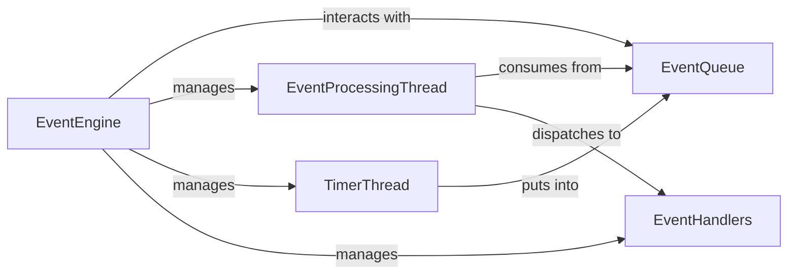

## Component Details

The `Event-Driven Core` subsystem, centered around the `EventEngine`, forms the backbone of the `vnpy` system's real-time communication and modularity. It implements a robust publish-subscribe pattern, allowing various components to interact asynchronously without direct coupling.

### EventEngine

The primary orchestrator of the event-driven architecture. It manages the lifecycle of events, from their reception to their dispatch to registered handlers. It ensures loose coupling between system components by acting as a central nervous system for inter-component communication.

**Related Classes/Methods**: _None_

### EventQueue

A thread-safe queue (implemented using Python's `queue.Queue`) that serves as a buffer for all incoming `Event` objects. It decouples event producers (e.g., gateways, other engines) from event consumers (the `EventProcessingThread`), ensuring that events are processed in an orderly and asynchronous manner.

**Related Classes/Methods**: _None_

### EventProcessingThread

A dedicated worker thread responsible for continuously monitoring the `EventQueue`. When an event is available, this thread retrieves it and dispatches it to all relevant registered handlers, ensuring that events are processed asynchronously without blocking the main application flow.

**Related Classes/Methods**: _None_

### TimerThread

A specialized thread that periodically generates `EVENT_TIMER` events at a predefined interval. These timer events are crucial for triggering time-based operations, such as data updates, heartbeat checks, or scheduled tasks across the system.

**Related Classes/Methods**: _None_

### EventHandlers

These are internal collections within the `EventEngine` that store references to callable functions (handlers). `_handlers` maps specific event types to lists of functions, while `_general_handlers` stores functions that should be called for *any* event type. They are the destinations for dispatched events.

**Related Classes/Methods**: _None_

### [FAQ](https://github.com/CodeBoarding/GeneratedOnBoardings/tree/main?tab=readme-ov-file#faq)