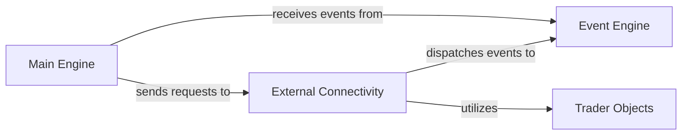

## Component Details

These four components are fundamental to the External Connectivity subsystem and the overall vn.py framework due to their direct and critical roles:

1.  **External Connectivity (BaseGateway)**: This is the primary component under analysis. It's fundamental because it serves as the direct bridge to external trading environments, abstracting away the complexities of different broker APIs and presenting a unified interface to the rest of the system. Without it, the system cannot interact with the market.

2.  **Event Engine**: The `Event Engine` is crucial because it provides the asynchronous, decoupled communication mechanism for all real-time data and updates within vn.py. The `External Connectivity` component relies heavily on it to broadcast market data and execution reports to other parts of the system (like the `Main Engine` and trading strategies). It ensures that the system remains responsive and scalable.

3.  **Trader Objects**: These standardized data objects are essential for consistent and clear communication across all components. The `External Connectivity` component uses them to format raw data from trading venues into a universally understood structure. This consistency simplifies development and integration of other modules, making the system robust and maintainable.

4.  **Main Engine**: While `External Connectivity` handles the low-level interaction, the `Main Engine` is its primary client and controller. It's fundamental because it orchestrates when and how `External Connectivity` connects, subscribes to data, and sends orders. It also consumes the events generated by `External Connectivity` (via the `Event Engine`) to manage the overall trading logic, risk, and UI updates. It represents the "brain" that directs the "eyes and hands" of `External Connectivity`.

### External Connectivity

This component, primarily embodied by the `BaseGateway` class within `vnpy.trader.gateway`, provides the standardized interface for connecting to various trading venues (brokers/exchanges). It handles real-time market data reception, order execution, and account/position queries. All incoming market data, order updates, trade confirmations, and account/position changes are processed and dispatched as events through the `Event Engine`. It acts as the system's "eyes and hands" in the market.

**Related Classes/Methods**:

- <a href="https://github.com/vnpy/vnpy/blob/master/vnpy/trader/gateway.py#L32-L271" target="_blank" rel="noopener noreferrer">`vnpy.trader.gateway.BaseGateway` (32:271)</a>

### Event Engine

The central nervous system of the vn.py framework, responsible for managing and dispatching all system events. It acts as a message bus, allowing different components to communicate asynchronously without direct coupling.

**Related Classes/Methods**:

- <a href="https://github.com/vnpy/vnpy/blob/master/vnpy/event/engine.py#L1-L1" target="_blank" rel="noopener noreferrer">`vnpy.event.engine` (1:1)</a>

### Trader Objects

This component defines the standardized data structures (e.g., `TickData`, `OrderData`, `TradeData`, `AccountData`, `PositionData`, `ContractData`) used throughout the vn.py framework. These objects ensure consistent data representation and communication between various components, including gateways, engines, and strategies.

**Related Classes/Methods**:

- <a href="https://github.com/vnpy/vnpy/blob/master/vnpy/trader/object.py#L1-L1" target="_blank" rel="noopener noreferrer">`vnpy.trader.object` (1:1)</a>

### Main Engine

The orchestrator of the entire trading system. It manages the lifecycle of gateways, loads strategies, handles risk management, and provides a unified interface for interacting with other core components. It initiates requests to external connectivity and processes events received from the `Event Engine`.

**Related Classes/Methods**:

- <a href="https://github.com/vnpy/vnpy/blob/master/vnpy/trader/engine.py#L1-L1" target="_blank" rel="noopener noreferrer">`vnpy.trader.engine` (1:1)</a>

### [FAQ](https://github.com/CodeBoarding/GeneratedOnBoardings/tree/main?tab=readme-ov-file#faq)