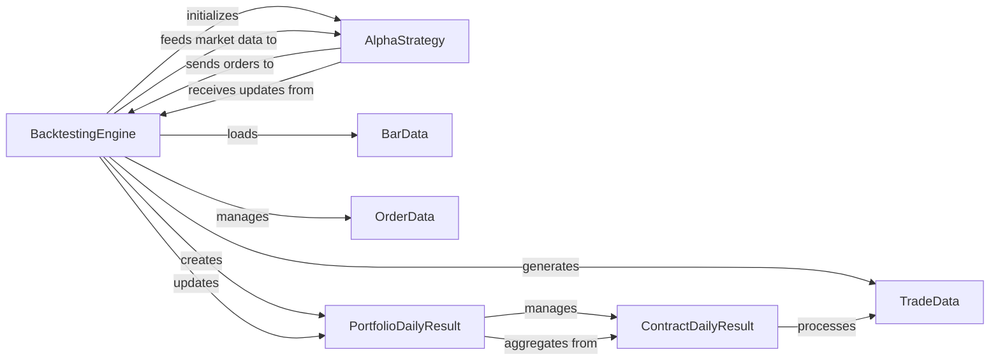

## Component Details

The `Strategy & Simulation` subsystem is the analytical and operational core of the trading system, focusing on the development, testing, and execution of trading strategies. It provides a robust environment for simulating trading logic against historical data, enabling strategy optimization and performance evaluation.

### BacktestingEngine

This is the central orchestrator for simulating trading strategies. It is responsible for loading historical market data, processing it bar by bar, matching orders, simulating trade executions, and calculating the overall performance metrics of a strategy. It acts as the simulated trading environment, providing market data to strategies and processing their order requests.

**Related Classes/Methods**:

- `BacktestingEngine` (0:0)

### AlphaStrategy

This is an abstract base class that serves as the blueprint for all user-defined trading strategies. Users inherit from this class to implement their specific trading logic, including how to react to market data (`on_bars`), handle trade executions (`on_trade`), and manage orders (send, cancel). It provides a standardized interface for strategy development.

**Related Classes/Methods**:

- `AlphaStrategy` (0:0)

### BarData

A fundamental data structure representing aggregated market data for a specific period (e.g., a candlestick bar), including open, high, low, close prices, and volume. It is the primary input for strategies to make trading decisions.

**Related Classes/Methods**:

- `BarData` (0:0)

### OrderData

A data structure encapsulating the details of a trading order, such as the symbol, exchange, unique order ID, type, direction, offset, price, volume, and current status. It is used by strategies to place orders and by the engine to track their lifecycle.

**Related Classes/Methods**:

- `OrderData` (0:0)

### TradeData

A data structure representing an executed trade (a fill of an order), containing details like the traded price, volume, direction, and a reference to the original order. It's crucial for tracking actual executions and calculating PnL.

**Related Classes/Methods**:

- `TradeData` (0:0)

### PortfolioDailyResult

This component is responsible for aggregating and calculating the daily profit and loss (PnL) and other key financial metrics for the entire portfolio during a backtesting run. It consolidates performance across all traded contracts.

**Related Classes/Methods**:

- `PortfolioDailyResult` (0:0)

### ContractDailyResult

This class holds the daily profit and loss (PnL) and position information specifically for a single contract within the overall portfolio during backtesting. It provides granular performance tracking at the individual instrument level.

**Related Classes/Methods**:

- `ContractDailyResult` (0:0)

### [FAQ](https://github.com/CodeBoarding/GeneratedOnBoardings/tree/main?tab=readme-ov-file#faq)