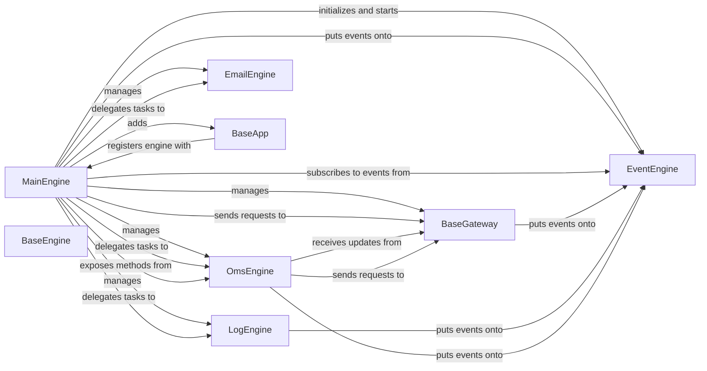

## Component Details

Analysis of the core components and their relationships within the VNPY Trading Orchestration system.

### MainEngine

The central orchestrator of the entire trading platform. It initializes and manages all other engines and gateways, serving as the primary interface for system operations, data retrieval, and event handling.

**Related Classes/Methods**:

- <a href="https://github.com/vnpy/vnpy/blob/master/vnpy/trader/engine.py#L72-L286" target="_blank" rel="noopener noreferrer">`vnpy.trader.engine.MainEngine` (72:286)</a>

### EventEngine

A dedicated event-driven engine that manages and dispatches events (e.g., market data, order updates, log messages) throughout the system. It enables asynchronous communication and loose coupling between components.

**Related Classes/Methods**:

- <a href="https://github.com/vnpy/vnpy/blob/master/vnpy/event/engine.py#L1-L1" target="_blank" rel="noopener noreferrer">`vnpy.event.engine.EventEngine` (1:1)</a>

### BaseGateway

An abstract base class that defines the interface for connecting to external trading exchanges and brokers. Concrete gateway implementations handle market data subscriptions, order placement, and trade reporting for specific venues.

**Related Classes/Methods**:

- <a href="https://github.com/vnpy/vnpy/blob/master/vnpy/trader/gateway.py#L32-L271" target="_blank" rel="noopener noreferrer">`vnpy.trader.gateway.BaseGateway` (32:271)</a>

### BaseEngine

An abstract base class for all specialized functional engines within the trading system. It provides a common interface for engines managed by the `MainEngine`.

**Related Classes/Methods**:

- <a href="https://github.com/vnpy/vnpy/blob/master/vnpy/trader/engine.py#L50-L69" target="_blank" rel="noopener noreferrer">`vnpy.trader.engine.BaseEngine` (50:69)</a>

### OmsEngine

A specialized engine responsible for managing and querying all trading-related data, including real-time ticks, active orders, executed trades, current positions, account balances, and contract details.

**Related Classes/Methods**:

- <a href="https://github.com/vnpy/vnpy/blob/master/vnpy/trader/engine.py#L324-L551" target="_blank" rel="noopener noreferrer">`vnpy.trader.engine.OmsEngine` (324:551)</a>

### LogEngine

A specialized engine dedicated to managing and processing system log messages. It ensures that all important events, errors, and operational information are recorded.

**Related Classes/Methods**:

- <a href="https://github.com/vnpy/vnpy/blob/master/vnpy/trader/engine.py#L289-L321" target="_blank" rel="noopener noreferrer">`vnpy.trader.engine.LogEngine` (289:321)</a>

### EmailEngine

A specialized engine that provides functionality for sending email notifications, typically used for alerts, critical system messages, or daily reports.

**Related Classes/Methods**:

- <a href="https://github.com/vnpy/vnpy/blob/master/vnpy/trader/engine.py#L554-L617" target="_blank" rel="noopener noreferrer">`vnpy.trader.engine.EmailEngine` (554:617)</a>

### BaseApp

An abstract base class for pluggable applications that extend the functionality of the trading system. Each `BaseApp` can register its own specialized `BaseEngine` with the `MainEngine`.

**Related Classes/Methods**:

- <a href="https://github.com/vnpy/vnpy/blob/master/vnpy/trader/app.py#L9-L20" target="_blank" rel="noopener noreferrer">`vnpy.trader.app.BaseApp` (9:20)</a>

### [FAQ](https://github.com/CodeBoarding/GeneratedOnBoardings/tree/main?tab=readme-ov-file#faq)