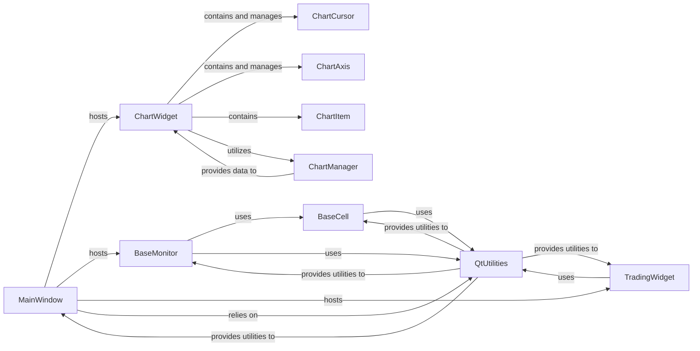

## Component Details

Overview of the User Interface (UI) subsystem of vnpy

### MainWindow

This is the central application window, serving as the primary container for all other UI elements. It orchestrates the overall layout, including dockable widgets, toolbars, and menus, and manages the application's window settings.

**Related Classes/Methods**:

- `MainWindow` (0:0)

### ChartWidget

The cornerstone for visualizing financial market data. This interactive widget displays various chart types (e.g., candlesticks) and handles data updates, user navigation (zooming, panning), and the integration of other chart-specific components.

**Related Classes/Methods**:

- `ChartWidget` (0:0)

### ChartCursor

An interactive element within the ChartWidget that allows users to precisely inspect data points on the chart. It renders cursor lines and labels, providing detailed information (e.g., price, time, indicator values) at the cursor's position.

**Related Classes/Methods**:

- `ChartCursor` (0:0)

### ChartAxis

Responsible for rendering and managing the axes (e.g., time axis, price axis) of the ChartWidget. It ensures that data is correctly scaled and labeled, providing context and readability to the chart.

**Related Classes/Methods**:

- `ChartAxis` (0:0)

### ChartItem

Represents the individual drawable elements within a chart, such as candlesticks, line plots, or custom indicators. It provides the base structure and rendering logic for various plot types.

**Related Classes/Methods**:

- `ChartItem` (0:0)

### ChartManager

Manages the underlying data and state for the ChartWidget. This includes handling historical bar data, processing real-time updates, and performing data transformations necessary for charting.

**Related Classes/Methods**:

- `ChartManager` (0:0)

### BaseMonitor

An abstract base class for UI widgets designed to display and monitor real-time or historical trading data (e.g., orders, trades, positions, quotes) in a tabular format. It provides common mechanisms for table structure initialization, settings management, and event-driven updates.

**Related Classes/Methods**:

- `BaseMonitor` (0:0)

### BaseCell

A foundational UI component that serves as the base class for individual cells within tables or data displays. It provides basic functionality for setting and displaying content, with specialized subclasses handling specific data types.

**Related Classes/Methods**:

- `BaseCell` (0:0)

### TradingWidget

A specialized UI widget dedicated to facilitating trading operations. It typically includes input fields for order parameters (e.g., symbol, price, volume, direction) and buttons for placing orders.

**Related Classes/Methods**:

- `TradingWidget` (0:0)

### QtUtilities

This module provides core Qt-related functionalities, helper functions, and base classes that are leveraged by other UI components within vnpy.trader.ui. It abstracts away some of the direct Qt interactions, promoting consistency and reusability.

**Related Classes/Methods**:

- `QtUtilities` (0:0)

### [FAQ](https://github.com/CodeBoarding/GeneratedOnBoardings/tree/main?tab=readme-ov-file#faq)