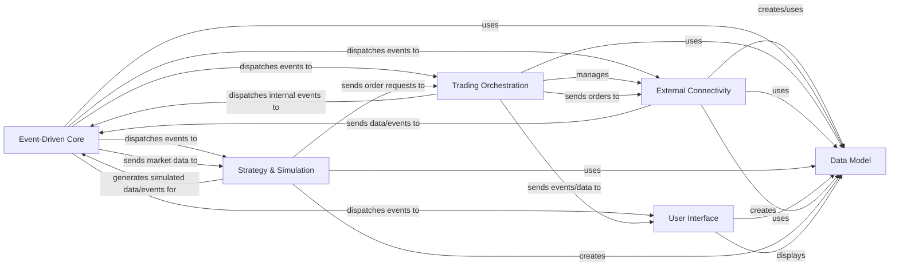

## Component Details

The `vnpy` architecture is built around an event-driven paradigm, ensuring high responsiveness and loose coupling between its various components. The analysis identifies six fundamental components that form the core of the system's functionality, from market interaction to strategy execution and user visualization.

### Event-Driven Core

The foundational event-driven architecture, managing event queues and dispatching events to registered handlers. It enables loose coupling and real-time communication across all system components, acting as the central nervous system.

**Related Classes/Methods**:

- <a href="https://github.com/vnpy/vnpy/blob/master/vnpy/event/engine.py#L0-L0" target="_blank" rel="noopener noreferrer">`vnpy.event.engine` (0:0)</a>

### Trading Orchestration

The central management component responsible for initializing and overseeing sub-engines, managing trading gateways, handling order flow, and providing a unified interface for system operations. It acts as the brain of the live trading system.

**Related Classes/Methods**:

- <a href="https://github.com/vnpy/vnpy/blob/master/vnpy/trader/engine.py#L0-L0" target="_blank" rel="noopener noreferrer">`vnpy.trader.engine` (0:0)</a>

### External Connectivity

Provides the standardized interface for connecting to various trading venues (brokers/exchanges). It handles real-time market data reception, order execution, and account/position queries, dispatching all updates as events. This component is the system's eyes and hands in the market.

**Related Classes/Methods**:

- <a href="https://github.com/vnpy/vnpy/blob/master/vnpy/trader/gateway.py#L0-L0" target="_blank" rel="noopener noreferrer">`vnpy.trader.gateway` (0:0)</a>

### Data Model

Defines the standardized data structures (e.g., TickData, OrderData, TradeData) used for consistent data representation and exchange throughout the entire `vnpy` framework. It is the common language understood by all components.

**Related Classes/Methods**:

- <a href="https://github.com/vnpy/vnpy/blob/master/vnpy/trader/object.py#L0-L0" target="_blank" rel="noopener noreferrer">`vnpy.trader.object` (0:0)</a>

### Strategy & Simulation

Encompasses the core trading logic (strategies) and the backtesting environment for simulating strategy execution with historical data. It consumes market data, generates trading signals, and sends order requests, representing the intelligence and development ground of the system.

**Related Classes/Methods**:

- <a href="https://github.com/vnpy/vnpy/blob/master/vnpy/alpha/strategy/template.py#L0-L0" target="_blank" rel="noopener noreferrer">`vnpy.alpha.strategy.template` (0:0)</a>

- <a href="https://github.com/vnpy/vnpy/blob/master/vnpy/alpha/strategy/backtesting.py#L0-L0" target="_blank" rel="noopener noreferrer">`vnpy.alpha.strategy.backtesting` (0:0)</a>

### User Interface

Provides the graphical user interface for interacting with the `vnpy` system, displaying real-time market data, order/trade information, account details, and interactive charts. It offers essential visibility and control for the user.

**Related Classes/Methods**:

- <a href="https://github.com/vnpy/vnpy/blob/master/vnpy/trader/ui/mainwindow.py#L0-L0" target="_blank" rel="noopener noreferrer">`vnpy.trader.ui.mainwindow` (0:0)</a>

- <a href="https://github.com/vnpy/vnpy/blob/master/vnpy/chart/widget.py#L0-L0" target="_blank" rel="noopener noreferrer">`vnpy.chart.widget` (0:0)</a>

- <a href="https://github.com/vnpy/vnpy/blob/master/vnpy/trader/ui/widget.py#L0-L0" target="_blank" rel="noopener noreferrer">`vnpy.trader.ui.widget` (0:0)</a>

### [FAQ](https://github.com/CodeBoarding/GeneratedOnBoardings/tree/main?tab=readme-ov-file#faq)