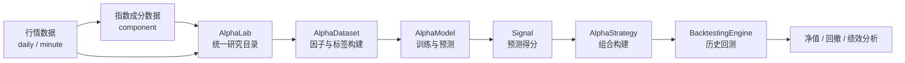
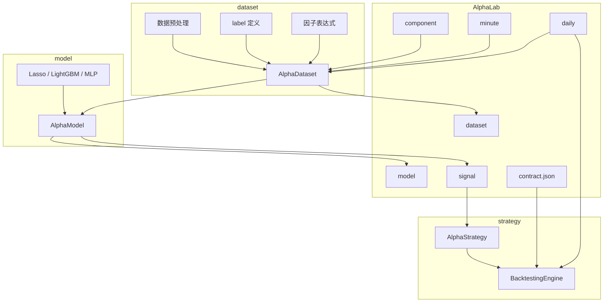

# VeighNa多因子入门系列1 - 模块总览与准备

在之前的文章中，我们已经介绍过 VeighNa 4.0 起新增的 `vnpy.alpha` 模块。它面向**多因子研究与机器学习建模**，把**特征工程、模型训练、信号生成、策略回测**串成了一条完整的投研链路。

对于已经会使用 Python、也做过一些截面因子或机器学习实验的读者来说，真正关心的问题往往是：

1. 行情数据和指数成分，应该如何组织起来？
2. 因子、标签、模型、回测，各自负责哪一段？
3. 官方有没有一套可以直接照着跑、再逐步替换的研究范例？

因此，我们准备写一个 `vnpy.alpha` 入门系列，按投研流程把整个模块串起来：从行情与指数成分入库，到因子与标签表构建，再到模型训练、信号生成和组合回测，逐步带大家走完整条研究链路。

这是系列的第一篇，主要回答三个问题：

1. **`vnpy.alpha` 整体是做什么的**
2. **它由哪些部分组成，各自承担什么职责**
3. **在运行官方示例之前，需要准备哪些基础环境和数据**

## 整体定位

如果只用一句话来概括，那么：

**`vnpy.alpha` = 本地数据 + 因子表 + 模型 + 信号 + 回测。**

它解决的是**投研端**的问题，而不是盘中交易端的问题。也就是说，`vnpy.alpha` 的重点不在交易接入、实盘委托和界面交互，而在于如何围绕一批股票构建因子、训练模型、输出预测信号，并用历史数据验证策略表现。

从研究流程看，可以先记住这样一条主线：

**行情与成分数据 -> 因子与标签 -> 模型训练 -> 预测得分 -> 策略回测**

这条链路也是整个 `vnpy.alpha` 最核心的使用方式。后续无论是替换因子、切换模型，还是调整调仓规则，基本都围绕这条主线展开。

为了更直观地理解这条链路，可以先看下面两张图。

### 整体研究链路

这张图可以帮助读者先建立一个整体印象：**`vnpy.alpha` 不是单独的模型模块，也不是单独的回测模块，而是一条从数据准备到策略验证的完整投研链路。**

### 模块关系图

如果只看模块之间的职责，可以把它理解为：

- **`AlphaLab` 负责统一管理研究输入和输出**
- **`dataset` 负责把原始数据整理成可训练的因子表**
- **`model` 负责把因子表变成预测得分**
- **`strategy` 负责把预测得分变成组合，并交给回测引擎验证**

## 四个组成部分

从功能划分上看，`vnpy.alpha` 大致可以分成四部分。

### 1. `lab`：研究工作区

`AlphaLab` 可以理解为一个**统一的投研工作目录**。它负责把研究过程中会反复用到的各类文件组织在固定位置，例如：

- 行情数据
- 指数成分数据
- 因子表或数据集快照
- 训练好的模型
- 预测信号
- 回测需要的合约配置

这样做的好处是，研究过程中的文件不会散落在各个脚本里，换电脑、换环境或隔一段时间重新复盘时，也更容易定位和复现结果。

可以先将它理解为：**`AlphaLab` 管“数据和结果放在哪里”。**

### 2. `dataset`：因子与标签数据集

`dataset` 层的核心类型是 `AlphaDataset`。它的任务是把多标的行情整理成统一面板，并在这个基础上完成：

- 因子构建
- 标签定义
- 训练 / 验证 / 测试区间划分
- 数据预处理

这里的“预处理”包括很多多因子研究中常见的步骤，例如：

- 缺失值处理
- 截面标准化
- 去极值
- 排名归一化

如果对传统的因子研究流程比较熟悉，可以把 `AlphaDataset` 看成是**因子工程 + 样本工程的承载层**。

内置的 Alpha 158、Alpha 101 等因子集，也都属于这一层的能力范围。它们的意义并不是替代自定义因子，而是帮助研究流程先快速建立一条可运行、可对照的基线。

### 3. `model`：预测模型

`model` 层对应的是 `AlphaModel`。它的职责比较直接：在训练区间上拟合模型，然后在指定区间上输出每个交易日、每只股票的预测值。

当前示例里常见的模型包括：

- Lasso
- LightGBM
- MLP

这些模型并没有改变研究主流程，只是分别代表了不同的建模思路：

- Lasso 更容易解释，适合作为线性基线
- LightGBM 是表格数据场景下常见的强基线模型
- MLP 则代表更高容量的非线性方法

这一层也可以理解为：**同一张因子表，换不同模型去做横截面预测。**

### 4. `strategy`：信号转组合，并完成回测

当模型输出预测得分后，接下来要解决的问题就是：**如何把得分变成组合持仓。**

这部分由 `strategy` 层负责。其中：

- `AlphaStrategy` 负责定义调仓逻辑
- `BacktestingEngine` 负责推进历史行情、撮合交易、计算盈亏和输出回测结果

例如，官方示例中的 `EquityDemoStrategy`，就展示了一类比较典型的做法：按预测得分排序，选出 Top-K 标的持有，并按设定节奏进行调仓。

因此，`strategy` 层回答的是另一个关键问题：

**模型“看多谁”是一回事，最终“怎么买、持有多久、什么时候换仓”又是另一回事。**

## 动手前要准备什么

在正式运行官方示例前，建议先对几个基础概念有一个初步印象。

### 基本环境

从系列定位来看，建议使用以下环境：

- **VeighNa Studio 最新版本**
- 或者使用 **Python 3.13** 自行安装 VeighNa 相关组件

如果只是跟着官方示例入门，优先使用 Studio 往往会更省事，因为很多常用依赖已经提前准备好了。

### 三个会反复出现的概念

后面文章里会频繁出现以下术语，这里先做一个简短说明。

- `vt_symbol`：VeighNa 体系下统一的标的编码，例如 `600000.SSE`。它的作用是让行情、成分股、因子表、信号表都能准确对齐到同一只股票。
- `Interval`：K 线周期。本系列默认使用**日频**，也就是 `Interval.DAILY`。
- `Segment`：样本区间划分，通常用于区分**训练集、验证集、测试集**。模型训练和样本外预测都会用到它。

这几个概念本身并不复杂，但它们是贯穿整个 `vnpy.alpha` 工作流的基础约定，**第一次接触时最好先建立清晰印象**。

### 常见依赖

跑通 `vnpy.alpha` 示例时，常见依赖通常包括：

- `polars`：面板数据与列表达式计算
- `scikit-learn`：如 Lasso 等基础模型
- `lightgbm`：梯度提升树模型示例
- `alphalens`：因子或信号分层分析
- `plotly`：结果可视化
- `tqdm`：进度显示

如果使用的是 VeighNa Studio，很多依赖通常已经具备；如果是自行搭建环境，则可以在实际运行时报错后按需补装。

需要额外提醒的是，因子批量计算往往会用到多进程。在 Windows 环境下，多进程采用 `spawn` 方式启动，**首次运行偏慢是正常现象**，不必一开始就误以为程序卡死。

## 官方示例地图

仓库 `examples/alpha_research/` 目录中，和入门最相关的 Notebook 主要有以下几类。

| 类型 | 文件 | 作用 |
|------|------|------|
| 数据准备 | `download_data_rq.ipynb` | 使用 RQData 下载指数成分和行情，并整理为 `AlphaLab` 可用格式 |
| 数据准备 | `download_data_xt.ipynb` | 使用迅投数据完成同类准备流程 |
| 完整工作流 | `research_workflow_lasso.ipynb` | 使用 Lasso 跑通完整研究链路 |
| 完整工作流 | `research_workflow_lgb.ipynb` | 使用 LightGBM 跑通完整研究链路 |
| 完整工作流 | `research_workflow_mlp.ipynb` | 使用 MLP 跑通完整研究链路 |
| 因子集示例 | `research_workflow_alpha101.ipynb` | 基于 Alpha 101 因子集完成完整投研流程 |

如果是第一次接触 `vnpy.alpha`，建议优先按下面的顺序阅读和实践：

1. 先看数据准备 Notebook，理解数据如何落到 `AlphaLab`
2. 再选一个完整工作流 Notebook 跑通全流程
3. 最后再去替换因子、模型或调仓规则

这样会比一开始就直接阅读源码更容易建立整体认识。

## 小结

这一篇的目标，不是立刻展开所有细节，而是先把 `vnpy.alpha` 的全貌建立起来。

可以先记住一句话：

**`vnpy.alpha` 提供的是一条完整的多因子投研链路：从本地数据组织开始，经过因子与标签构建、模型训练、信号生成，最终进入策略回测。**

如果把它拆开来看：

- `AlphaLab` 负责组织研究目录
- `AlphaDataset` 负责构建因子与标签数据
- `AlphaModel` 负责训练和预测
- `AlphaStrategy` 与 `BacktestingEngine` 负责把信号变成组合并完成回测

也就是说，它不是一堆彼此独立的工具类，而是一套围绕**“数据 -> 因子 -> 模型 -> 信号 -> 回测”**组织起来的研究框架。

**下一篇**，我们会进一步进入 `AlphaLab` 的目录结构，重点说明 `daily`、`minute`、`component`、`dataset`、`model`、`signal`、`contract.json` 各自存放什么内容，以及如何检查研究数据是否已经准备齐全。
