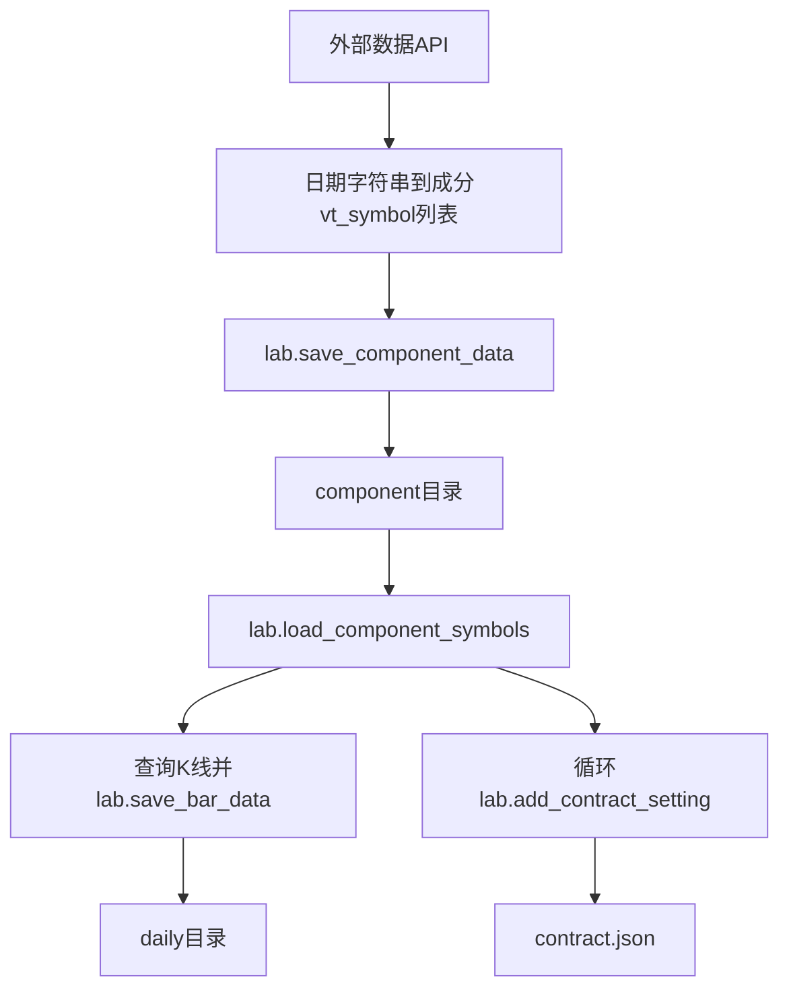
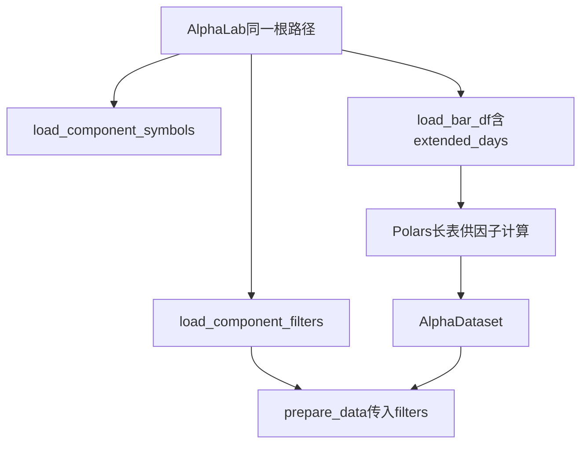

# VeighNa多因子入门系列2 - AlphaLab目录与数据就绪

在系列第一篇里，我们已经把 `vnpy.alpha` 的整体链路梳理为「行情与成分 → 因子与标签 → 模型 → 信号 → 回测」，并说明了 `AlphaLab`、`AlphaDataset`、`AlphaModel` 与策略回测各自管哪一段。真正动手跑官方 Notebook 时，下一个实际问题往往是：**数据在磁盘上应该长成什么样、怎样才算准备齐全？**

对于已经会用 Python、也能自己拉取行情与成分数据的读者来说，这一步通常最关心的是：

1. `AlphaLab` 根目录下的各个子路径，到底分别存放什么
2. 日频 K 线和指数成分，在本地应该按什么约定组织
3. 在进入 `AlphaDataset` 和回测之前，怎样判断数据已经准备齐全

因此，本篇聚焦 **`AlphaLab` 这一研究根目录**：子目录与 `contract.json` 各自存放什么；日频 K 线如何读写；指数成分如何与后续 `AlphaDataset.prepare_data` 衔接；回测前如何自检。把这一块讲清楚，后面读因子表、模型和回测代码时，就不容易在「文件找不到、成分对不齐、合约缺项」这类问题上反复踩坑。

## AlphaLab 目录结构

使用 `vnpy.alpha` 中的 **`AlphaLab`** 类，在构造时传入一个根路径，用于存放投研过程中的相关数据：

```python
lab = AlphaLab(".../你的研究根目录")
```

初始化时，若下列路径尚不存在，会**自动创建**子目录：`daily`、`minute`、`component`、`dataset`、`model`、`signal`。根目录下的 **`contract.json` 不会在构造时自动生成**，通常在首次调用 `add_contract_setting`（或手工放置文件）后出现。

可以先将它理解为：**`AlphaLab` 管“研究文件放在哪里”。**

各路径职责可以概括为下表。

| 路径/文件 | 用途（一句话） |
|-----------|----------------|
| `daily/`、`minute/` | 按 `vt_symbol` 命名的 `*.parquet` K 线 |
| `component/` | 指数成分（Python `shelve`，键为日期字符串） |
| `dataset/`、`model/` | `save_dataset` / `save_model` 写入的 `*.pkl` |
| `signal/` | `save_signal` 写入的 `*.parquet` |
| `contract.json` | 各标的的交易费率、合约乘数、最小变动价位等 |

## 官方示例 Notebook

数据准备类 Notebook（`download_data_rq.ipynb`、`download_data_xt.ipynb`）负责把数据**写入** `AlphaLab`；完整工作流 Notebook（如 `research_workflow_lgb.ipynb`）则假定目录中的数据已经准备就绪，从**同一 `lab` 根路径**读出并进入 `AlphaDataset`。二者衔接关系可以概括为下面两张图。

**数据准备：从外部拉数到本地目录**




**`download_data_*.ipynb`（写入侧参考）**

```python
from vnpy.alpha import AlphaLab

lab = AlphaLab(f"./lab/{task_name}")          # 先固定研究根目录

# 由数据源整理为「日期字符串 -> 当日成分 vt_symbol 列表」后：
lab.save_component_data(index_symbol, index_components)

component_symbols = lab.load_component_symbols(index_symbol, start_date, end_date)
# 通常还会包含指数本身：task_symbols = component_symbols + [index_symbol]
# 再逐标的查询日 K 并 lab.save_bar_data(bars)

# 设置回测过程中所使用的合约参数
for vt_symbol in component_symbols:
    lab.add_contract_setting(
        vt_symbol,
        long_rate=5 / 10000,
        short_rate=10 / 10000,
        size=1,
        pricetick=0.0001,
    )
```

**研究工作流：从同一 lab 读出面板**



下面两段代码与上述 Notebook **逻辑一致**，仅作缩略，便于对照正文。

**`research_workflow_*.ipynb` 开头（读出侧参考）**

```python
from vnpy.trader.constant import Interval
from vnpy.alpha import AlphaLab

lab = AlphaLab("./lab/csi300")                # 与准备阶段的 task_name 对应
index_symbol = "000300.SSE"
start, end = "2008-01-01", "2023-12-31"
extended_days = 100

component_symbols = lab.load_component_symbols(index_symbol, start, end)
df = lab.load_bar_df(component_symbols, Interval.DAILY, start, end, extended_days)

# 构建 AlphaDataset 之后，典型写法为：
filters = lab.load_component_filters(index_symbol, start, end)
dataset.prepare_data(filters=filters, max_workers=6)
```

## K 线量价数据的存取

**写入**上：

1. `save_bar_data` 函数接收 `BarData` 列表，日频 `Interval.DAILY` 写入 `daily/{vt_symbol}.parquet`，分钟线写入 `minute/`。
2. Parquet 中列为 `datetime`、`open`、`high`、`low`、`close`、`volume`、`turnover`、`open_interest`。
3. 若文件已存在，新数据会与旧表合并、按 `datetime` 去重并排序，便于增量更新下载结果。
4. 除 `DAILY` 与 `MINUTE` 外，其他 `Interval` 在保存时会**记录错误日志并直接返回、不写入文件**，使用时需与数据准备脚本保持一致。

**读取**上，则是有两种入口，可按下表对照。

| 方法 | 返回类型 | 价格与成交量尺度 | 单标的 parquet 不存在时 |
|------|----------|------------------|-------------------------|
| `load_bar_data(vt_symbol, interval, start, end)` | `list[BarData]` | **原始尺度**（与磁盘一致） | 错误日志 + 空列表 `[]` |
| `load_bar_df(vt_symbols, interval, start, end, extended_days)` | Polars 表格结果 | 经窗口内归一化等处理（见下文） | 该标的跳过，其余照常合并 |

`load_bar_data` 适合回测引擎等需要 VeighNa 标准 K 线对象的环节。`load_bar_df` 会把多只标的纵向合并，带 `vt_symbol` 列，并计算 **`vwap`**（`turnover / volume`），更适合后续因子与标签计算。

对于初学者来说，可以先记住一句话：**回测更常直接读取 `BarData`，因子研究更常读取表格结果。**

**`extended_days` 的含义**：在请求区间基础上，**起始日期向前多取 `extended_days` 个自然日**，以便因子或标签在样本区间左边界仍有足够历史窗口；**结束日期会再向后扩展 `extended_days // 10` 个自然日**，减轻右边界交易日因窗口不足而缺值的情况。

**停牌处理**：`load_bar_df` 中对除 `datetime` 外的数值列按行求和，若全为 0，则将该行视为停牌，对应数值置为**缺失值**，避免把「全零行」当成有效价量参与后续计算。

**价格归一化**：`load_bar_df` 在每只标的截取窗口内，会以**该窗口第一根 K 线的收盘价**为基准，对 `open`、`high`、`low`、`close` 做相对缩放。这样做的目的之一，是在固定窗口内构造**可比、相对**的价格序列，**减轻因子计算中直接沿用复权价格时，因复权重算或前视信息而容易出现的未来函数问题**（与 `load_bar_data` 的原始读法不同；面板内已是相对尺度，不可与原始行情表混用，数据源口径仍须自行与下载脚本保持一致）。

`load_bar_df` 加载返回的行情DataFrame数据列可对照下表理解（与 Polars 表头一致）：

| 列名 | 含义 |
|------|------|
| `datetime` | 交易日 |
| `open` / `high` / `low` / `close` | 经窗口内相对缩放后的价（非磁盘原始价） |
| `volume` / `turnover` / `open_interest` | 原始量纲下的成交与持仓类字段 |
| `vwap` | `turnover / volume` |
| `vt_symbol` | 标的编码，如 `600000.SSE` |

## 指数成分的使用方式

**成分存储**：`save_component_data(index_symbol, index_components)` 在 `component/` 下以指数为文件名写入 **Python 自带的键值存储 `shelve`**（磁盘上可能伴随同名附属文件，属正常现象）。

`index_components` 的语义是 **「日期字符串 → 当日成分 `vt_symbol` 列表」**。选用这种方式，便于按交易日增量写入成分变更，而不必每次重写整张宽表。`load_component_data` 在指定起止日期内读出 `dict[datetime, list[str]]`。方法带缓存，同一进程内重复按区间读取时可减少磁盘访问。

在此基础上：

- **`load_component_symbols`**：在研究区间内把所有交易日的成分取并集，得到曾进入过该指数的股票代码列表，常用于确定要准备哪些 `daily/*.parquet`。
- **`load_component_filters`**：对每只股票，把其在指数内的存续时间拆成若干 **闭区间 `(start, end)`**，返回 `dict[str, list[tuple[datetime, datetime]]]`。

**与因子计算流程的衔接**：`AlphaDataset.prepare_data` 在并行算完因子并合并结果后，若传入 **`filters`**，会按「每个 `vt_symbol` 的每一段 `(start, end)`」过滤面板，只保留 **该股票作为指数成分存续期内** 的行。典型写法与官方工作流一致：先 `filters = lab.load_component_filters(index_symbol, start, end)`，再 `dataset.prepare_data(filters=filters)`（或等价的位置参数写法）。上一节「读出侧」代码块已包含这一组合。

## 合约配置与回测

回测引擎会通过与之关联的 **`AlphaLab`** 读取 **`contract.json`**。写入接口为 **`add_contract_setting(vt_symbol, long_rate, short_rate, size, pricetick)`**：买入和卖出费率（卖出时额外涉及到印花税成本）、合约乘数、最小变动价位会合并写入 JSON，多次调用同一标的则覆盖更新。

在 **`BacktestingEngine.set_parameters`** 中，会对回测标的列表逐个查找配置。若某 `vt_symbol` 在 `contract.json` 中不存在，会输出 **告警日志**（文案大意：找不到该合约的交易配置，请检查），并**跳过**该标的的费率与乘数登记。其后果是后续撮合、手续费等可能异常。因此建议：**回测用到的每一只 `vt_symbol` 都在 `contract.json` 中有完整条目**，与数据准备 Notebook 里批量添加合约设置的做法保持一致。

## 数据就绪自检清单

在运行完整投研工作流前，可按下面几条逐项确认；建议与 Notebook 中 `lab_path`、指数代码、日期区间**使用同一套变量**，避免手写路径不一致。

1. **`component/`** 下对应指数的 shelve 文件存在，且日期覆盖你设定的研究 `start`–`end`。若区间超出成分库范围，后续 `load_component_filters` 得到的存续段会偏短或为空，因子结果与指数口径会对不齐。
2. **`daily/{vt_symbol}.parquet`**：对 `load_component_symbols` 得到的集合（或你实际回测池）检查文件是否存在；代码与成分、信号表一致（如 `600000.SSE`，与上篇 `vt_symbol` 约定相同）。`load_bar_df` 缺文件时通常只跳过该标的，不会中断整批，因此很容易出现「看起来流程还能继续、但股票已经少了」的情况；若缺失过多，后续流程也可能直接失败，自检时应用列表对照并保证至少有所需标的的数据文件。
3. **`contract.json`**：回测 `vt_symbols` 中每个标的都有 `long_rate`、`short_rate`、`size`、`pricetick`；启动回测后留意是否仍有「找不到合约…交易配置」类告警。A 股现货示例里乘数、费率常与数据准备脚本中批量写入的值一致，勿漏写新纳入回测池的代码。
4. 若主要使用 **`load_bar_df`**：确认数据左端是否比样本起点多出足够自然日，以满足 `extended_days` 与因子回看，避免训练段开头大面积 NaN；必要时适当拉长历史下载区间或在 Notebook 中调大 `extended_days` 再观察因子列缺失情况。

## 小结

`AlphaLab` 把研究输入输出固定在统一根目录：**日频（或分钟）parquet 行情**、**shelve 成分**、**合约 JSON** 与后续的 dataset、model、signal 文件各司其职。三者与官方示例目录结构对齐后，`AlphaDataset` 与回测引擎才有稳定、可复现的数据基础。也就是说，到这一步为止，我们解决的是**研究数据如何放对、查齐、对齐**的问题。

**下一篇**将进入 **`AlphaDataset`**：`Segment` 与训练/验证/测试区间、因子与标签列约定、`add_feature` / `set_label`、`prepare_data` 与 `process_data`、内置处理器，以及如何用 `show_feature_performance` 做因子视角分析（与回测收益评价区分）。
