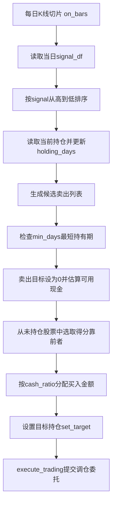

# VeighNa多因子入门系列5 - AlphaStrategy策略开发

在上一篇里，我们已经完成了 `AlphaModel` 的介绍：模型从 `AlphaDataset` 中取出训练样本，通过 `fit(dataset)` 完成拟合，再通过 `predict(dataset, Segment.TEST)` 输出指定区间的预测值。

到这一步，很多新手容易产生一个误解：**模型已经给出了预测值，是不是就等于策略已经验证完成？**

答案是否定的。模型预测只是多因子截面策略中的一环，它回答的是“哪些股票在横截面上更值得看好”；策略开发则要进一步回答“怎样根据这些分数形成持仓、控制换手，并在每天的行情到来时做出调仓动作”。

因此，本篇进入 **`AlphaStrategy` 策略开发**，重点说明三件事：

1. 预测模型训练和策略规则的不同定位
2. 信号表如何保存、评价，并传给策略使用
3. `EquityDemoStrategy` 如何把预测分数变成目标持仓

## 模型预测不是策略规则

在多因子截面策略开发中，模型阶段和策略阶段经常连在一起运行，但二者的目标并不相同。

**模型训练阶段**关注的是预测问题。它使用因子列去拟合 `label`，输出每个交易日、每只股票的预测分数。这个阶段更关心：

- 因子是否有稳定的解释力
- 模型是否过拟合
- 预测值在横截面排序上是否有效
- 样本内、验证集、测试集表现是否明显断裂

**策略开发阶段**关注的是组合规则。它拿到预测分数之后，还要决定买哪些、卖哪些、持有多少、多久换仓，以及怎样把目标仓位交给回测引擎执行。这个阶段更关心：

- 每天最多持有多少只股票
- 分数下降到什么程度需要卖出
- 是否设置最短持有期，避免过度换手
- 现金使用比例和单票买入金额如何分配
- 信号日期、行情日期、指数成分是否对齐

也就是说，模型输出的是一组**预测分数**；策略输出的是一组**目标持仓**。同一组信号，在不同 `top_k`、不同换仓速度、不同资金分配规则下，可能得到完全不同的回测结果。

可以把两者的关系理解为下面这条链路：


其中，本篇重点讲 `signal -> 策略规则 -> target` 这一段。下一篇再展开回测引擎如何推进行情、撮合委托和计算盈亏。

## 信号表的约定

模型预测完成后，需要把预测数组整理成统一的信号表。`vnpy.alpha` 中推荐的信号表字段很简单：

- `datetime`：信号对应的交易日
- `vt_symbol`：标的编码，例如 `600000.SSE`
- `signal`：模型输出的预测分数

典型写法可以理解为：先从 `dataset.fetch_infer(Segment.TEST)` 取出测试区间的日期和标的，再把模型预测结果作为 `signal` 列拼回去。

```python
infer_df = dataset.fetch_infer(Segment.TEST)
pred = model.predict(dataset, Segment.TEST)

signal_df = infer_df.select(["datetime", "vt_symbol"]).with_columns(
    pl.Series("signal", pred)
)
```

这里最重要的是顺序一致：`pred` 的顺序应当和 `infer_df` 的行顺序一致。官方模型内部预测前会按 `datetime`、`vt_symbol` 排序，因此生成信号表时也应使用同一段推理数据，避免日期或标的错位。

生成后，可以用 `AlphaLab` 保存到 `signal/` 目录：

```python
lab.save_signal("lasso_test", signal_df)
signal_df = lab.load_signal("lasso_test")
```

保存后的文件是 `signal/lasso_test.parquet`。这样做的好处是，模型训练、信号分析、策略开发和回测可以拆开运行：训练完成后先固化信号，后续调整策略参数时不必重复训练模型。

## 信号评价的作用

在进入策略开发前，可以先使用 `dataset.show_signal_performance(signal_df)` 查看预测信号本身的分层表现。它和第 3 篇介绍的 `show_feature_performance` 类似，都是基于 Alphalens 做前向收益分析。

二者的区别在于：

- `show_feature_performance(name)` 评价的是单个因子列。
- `show_signal_performance(signal_df)` 评价的是模型综合输出后的预测信号。

但它们仍然属于**信号视角**，不是完整策略结果。信号分析通常不关心持仓数量、换仓次数、交易费用、无法成交、现金比例等问题；而这些恰恰会影响真实组合表现。

因此，建议把信号评价看作进入策略开发前的一道检查：

1. 如果信号分层完全没有区分度，直接设计复杂策略意义不大。
2. 如果信号表现尚可，再考虑如何把它变成可执行的组合规则。
3. 如果信号分析不错但回测很差，问题往往出在换仓规则、成本、持仓约束或日期对齐上。

## AlphaStrategy模板

`vnpy.alpha` 中的策略基类是 `AlphaStrategy`。它不像模型那样负责拟合参数，而是定义了策略在回测过程中的响应方式。

最核心的三个回调是：

- **`on_init()`**：策略初始化时调用，适合准备状态变量。
- **`on_bars(bars)`**：每个交易日 K 线切片到来时调用，是日频截面策略的主要逻辑入口。
- **`on_trade(trade)`**：成交发生后调用，适合更新和成交相关的自定义状态。

此外，策略还可以通过模板提供的方法和回测引擎交互：

- **`get_signal()`**：获取当前回测日期对应的预测信号。
- **`get_pos(vt_symbol)`**：查询当前实际持仓。
- **`set_target(vt_symbol, target)`**：设置某个标的的目标持仓。
- **`execute_trading(bars, price_add)`**：根据目标仓位和当前仓位差额发出调仓委托。
- **`get_cash_available()`**：查询可用资金。

对于初学者来说，可以先记住一句话：**`AlphaStrategy` 不直接评价模型好坏，而是负责把“当日信号”翻译成“目标仓位”。**

## Demo策略的整体流程

官方示例中的 `EquityDemoStrategy` 是一个多头股票截面策略。它的核心逻辑集中在 `on_bars`：每来一个交易日的 K 线切片，就读取当日信号、更新持仓状态、生成卖出和买入目标，最后交给 `execute_trading` 发出调仓委托。

可以用下面的流水线理解：



拆开来看，主要分为四步。

**第一步：读取并排序信号。**

策略通过 `self.get_signal()` 向回测引擎取出当前交易日的信号。回测引擎内部会按当前 `datetime` 从 `signal_df` 中过滤当日行。因此，信号表日期必须和回测行情日期对齐，否则会出现找不到当日信号的日志。

取到信号后，策略按 `signal` 从高到低排序。分数越高的股票越靠前，代表模型越看好。

**第二步：生成卖出列表。**

策略先找出当前已有持仓，并更新每只持仓股票的持有天数。随后会构造一个活跃股票集合：既包括当日信号最高的 `top_k` 只股票，也包括当前已经持有的股票。

在这个集合中，策略会关注排名靠后的 `n_drop` 只股票。如果它们已经在持仓里，就加入卖出列表。与此同时，如果某只持仓股票已经不在当日信号股票池中，也会加入卖出列表。

真正卖出前，还会检查 `min_days`。持仓天数不足的股票即使进入卖出列表，也会暂时跳过，避免过于频繁地买卖。

**第三步：生成买入列表。**

卖出列表确定后，策略会从当前未持仓股票中选择新的买入标的。买入数量由下面这个直觉决定：

```python
buy_quantity = len(sell_symbols) + top_k - len(pos_symbols)
```

也就是说，如果当前持仓少于 `top_k`，就补足；如果本次卖出了一些股票，也用新的高分股票替换。买入标的来自未持仓股票中信号排名靠前的部分。

**第四步：设置目标仓位并执行。**

对于要卖出的股票，策略调用 `set_target(vt_symbol, target=0)`，表示目标仓位降为 0。对于要买入的股票，则按可用现金、`cash_ratio` 和买入数量计算每只股票的投入金额，再按 `min_volume` 取整得到买入数量。

最后，策略调用：

```python
self.execute_trading(bars, price_add=self.price_add)
```

`execute_trading` 会比较目标仓位和当前仓位的差额，并按 `price_add` 调整委托价格，生成买入或卖出委托。后续是否成交、成交价、手续费和资金变化，则由回测引擎处理。

## 参数直觉

`EquityDemoStrategy` 中几个参数非常直观，入门时可以先按组合行为来理解。

- **`top_k`**：最多持有多少只股票。数值越小，组合越集中，对信号排序更敏感；数值越大，组合越分散，单只股票影响更低。
- **`n_drop`**：每次从持仓相关股票中淘汰多少个低分标的。数值越大，换仓更激进；数值越小，组合调整更平滑。
- **`min_days`**：最短持有期。它可以降低高频换手，但也可能让已经变差的持仓多停留几天。
- **`cash_ratio`**：资金使用比例。低于 1 表示留出一定现金缓冲，避免所有资金都被买满。
- **`min_volume`**：最小交易单位。A 股示例中通常用于把买入数量取整到固定手数。
- **`price_add`**：委托价格调整比例。买入时提高委托价、卖出时降低委托价，用于提高回测撮合中的成交可能性。

这些参数并不是模型参数，而是**组合构建和交易执行假设**。同一组预测信号，在不同 `top_k`、不同换仓速度、不同费用设置下，可能得到完全不同的回测结果。这也是为什么不能只看模型预测指标，而必须单独做策略层验证。

## 写自定义策略时的注意点

在理解 `EquityDemoStrategy` 后，读者通常会开始修改自己的策略。建议先从以下几类改动开始：

1. **改选股数量**：调整 `top_k`，观察组合集中度和回撤变化。
2. **改换仓速度**：调整 `n_drop` 和 `min_days`，观察换手率和手续费变化。
3. **改资金分配**：从等权买入改成按信号强度或风险权重分配。
4. **改卖出规则**：不仅看排名靠后，也可以加入止损、行业约束或最大持仓天数。

但无论怎么改，都应保持一个原则：策略在 `on_bars` 中只能使用当前回测日期已经能看到的数据。不要把未来收益、未来成分变化或测试期整体统计结果混入当前调仓逻辑，否则回测会失真。

## 小结

这一篇的重点，是把 `AlphaStrategy` 在投研链路中的位置讲清楚：模型输出的是横截面预测分数，信号评价检查的是分数本身是否有排序能力；策略开发则进一步把分数翻译成目标持仓和调仓规则。

可以先记住这条顺序：

**模型预测 -> 信号表 -> 信号评价 -> 策略规则 -> 目标持仓**

到这里，我们已经知道 `EquityDemoStrategy` 如何在每天根据预测信号生成调仓目标。**下一篇**将进入事件驱动历史回测：`BacktestingEngine` 如何加载行情、按日期回放、触发 `on_bars`、撮合委托、计算逐日盈亏和统计指标。
