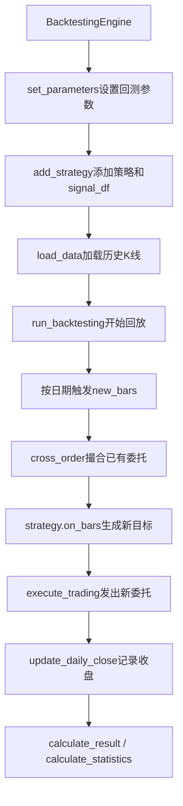

# VeighNa多因子入门系列6 - 事件驱动历史回测

在上一篇里，我们已经读懂了 `AlphaStrategy` 的基本职责：它从信号表中读取当日预测分数，根据策略规则生成目标持仓，并通过 `set_target` 和 `execute_trading` 把调仓意图交给回测引擎。

接下来要回答的问题是：**回测引擎如何把这套策略放进历史行情里逐日运行，并最终生成净值、回撤和统计指标？**

这就是本篇要讨论的 **事件驱动历史回测**。在 `vnpy.alpha` 中，`BacktestingEngine` 负责加载历史 K 线、按时间推进回放、触发策略回调、撮合委托、更新资金持仓，并计算最终回测结果。

对于已经理解前几篇内容的读者来说，本篇重点关注：

1. 为什么说回测是事件驱动的
2. `BacktestingEngine` 的典型使用顺序
3. 信号如何在回测过程中按日期进入策略
4. 委托撮合、手续费和每日盈亏如何形成
5. 回测结果应该怎么看，常见问题如何排查

本系列仍然只讨论 **A 股指数成分、日频、截面策略、历史回测**，不展开实盘交易和主程序网关对接。

## 什么是事件驱动回测

在事件驱动回测中，策略不是一次性拿到全部历史数据后直接计算最终收益，而是随着历史时间向前推进，逐日接收行情事件。

对日频截面策略来说，可以把每个交易日理解为一个事件：

1. 回测引擎推进到某个交易日。
2. 引擎取出该日所有标的的 K 线切片。
3. 已经挂出的委托先尝试撮合。
4. 策略收到 `on_bars(bars)` 回调。
5. 策略读取当日信号，设置目标仓位并发出委托。
6. 引擎记录当日收盘价，用于后续逐日盯市盈亏。

这和直接在 DataFrame 上算收益不同。事件驱动回测更接近真实交易流程：策略只能在当前时间点做决策，委托是否成交要看当时的行情，资金、持仓、手续费都会随着成交逐步变化。

可以先用下面这张图建立整体印象：



## 回测引擎使用顺序

一个典型的 `BacktestingEngine` 使用流程如下：

```python
from vnpy.trader.constant import Interval
from vnpy.alpha import BacktestingEngine
from vnpy.alpha.strategy.strategies.equity_demo_strategy import EquityDemoStrategy

engine = BacktestingEngine(lab)

engine.set_parameters(
    vt_symbols=component_symbols,
    interval=Interval.DAILY,
    start=start,
    end=end,
    capital=1_000_000,
)

engine.add_strategy(
    EquityDemoStrategy,
    setting={
        "top_k": 50,
        "n_drop": 5,
        "min_days": 3,
        "cash_ratio": 0.95,
    },
    signal_df=signal_df,
)

engine.load_data()
engine.run_backtesting()

daily_df = engine.calculate_result()
statistics = engine.calculate_statistics()
engine.show_chart()
```

各步骤的职责可以按顺序理解。

**`set_parameters`** 设置回测标的、K 线周期、起止日期、初始资金、无风险利率和年化交易日数量。同时，它会从 `AlphaLab` 的 `contract.json` 中读取各标的的费率、合约乘数和最小变动价位。

**`add_strategy`** 创建策略实例，并把策略参数和 `signal_df` 交给回测引擎。策略本身并不直接持有完整回测环境，而是通过模板方法向引擎查询信号、资金和持仓。

**`load_data`** 从 `AlphaLab` 中读取各标的历史 K 线，并缓存到回测引擎内部。若某些标的没有历史数据，会在日志中输出提示。

**`run_backtesting`** 按日期回放历史行情。每个交易日都会触发一次 `new_bars(dt)`，再由它推动撮合、策略回调和收盘记录。

**`calculate_result`** 根据成交和每日收盘价计算逐日盯市盈亏，生成 `daily_df`。

**`calculate_statistics`** 在 `daily_df` 基础上计算收益、回撤、手续费、成交金额、夏普比率等统计指标。

**`show_chart`** 使用图表展示资金曲线、回撤、每日盈亏和盈亏分布。

## 信号如何进入回测

上一篇已经说明，信号表通常包含三列：

- `datetime`
- `vt_symbol`
- `signal`

在回测中，信号表通过 `add_strategy(..., signal_df=signal_df)` 传入引擎。策略内部调用 `self.get_signal()` 时，实际会转到回测引擎的 `get_signal()` 方法。

这个方法会取当前回测时间 `self.datetime`，然后从 `signal_df` 中筛选出同一天的信号：

```python
signal = self.signal_df.filter(pl.col("datetime") == dt)
```

因此，信号日期和行情日期必须对齐。如果 `signal_df` 中没有当前日期对应的预测值，回测日志会提示找不到该日期的信号。常见原因包括：

- 模型预测区间和回测区间不一致
- `datetime` 类型或时区处理不一致
- 信号只覆盖测试集的一部分日期
- 回测标的池和信号标的池不是同一批股票

对于入门读者来说，可以先记住：**回测不是读取整张信号表一次性调仓，而是在每个交易日只取当天那一小片信号。**

## 回测内部流水线

`run_backtesting` 会把所有历史交易日排序，然后逐日调用 `new_bars(dt)`。`new_bars` 是理解事件驱动流程的关键。

它主要做四件事。

**第一步：准备当日 K 线切片。**

引擎会遍历所有 `vt_symbols`，从历史数据缓存中取出当前日期、当前标的的 `BarData`。如果某个标的当天没有新 K 线，但之前有缓存行情，引擎会用前一日收盘价构造填充 K 线，用于维持持仓盯市。

**第二步：撮合已有委托。**

策略上一日或之前发出的未成交委托，会先进入 `cross_order()` 尝试撮合。撮合时会根据当日 K 线的开高低收、委托价格、涨跌停约束等条件判断是否成交。

买入委托如果价格高于或等于可成交价格，并且当日不是整日涨停不可买入，就可能成交；卖出委托如果价格低于或等于可成交价格，并且当日不是整日跌停不可卖出，就可能成交。

**第三步：触发策略回调。**

撮合完成后，引擎调用：

```python
self.strategy.on_bars(bars)
```

这时策略会读取当日信号、更新持仓天数、生成卖出和买入列表、调用 `set_target`，最后通过 `execute_trading` 发出新的调仓委托。

需要注意的是，按当前实现，新委托是在 `on_bars` 中生成的，而撮合发生在同一个 `new_bars` 流程前半段。因此，策略当天根据收盘信息发出的委托，会在后续行情推进中再尝试撮合。理解这一点有助于避免把信号、价格和成交时点混在一起。

**第四步：记录每日收盘。**

策略回调结束后，引擎会调用 `update_daily_close`，把当日各标的收盘价记录下来。后续 `calculate_result` 会基于这些价格、成交记录和持仓变化计算逐日盯市盈亏。

## 委托、成交和成本

`AlphaStrategy.execute_trading` 会比较目标仓位和当前仓位：

```python
diff = target - pos
```

如果 `diff > 0`，说明需要买入或补回；如果 `diff < 0`，说明需要卖出或做空。对于当前的股票多头 Demo 策略，最常见的是买入开仓和卖出平仓。

委托价格会按 `price_add` 做调整：

- 买入：`close_price * (1 + price_add)`
- 卖出：`close_price * (1 - price_add)`

这样做是为了在回测撮合中提高成交概率。它不是实盘滑点模型，只是一种简单的委托价格假设。

成交发生后，回测引擎会根据 `contract.json` 中的配置计算资金变化：

- `long_rate`：买入费率
- `short_rate`：卖出费率
- `size`：合约乘数
- `pricetick`：最小变动价位

如果某个 `vt_symbol` 在 `contract.json` 中缺少配置，`set_parameters` 时会输出告警。此时手续费、乘数等计算可能不完整，因此建议回测前确保所有回测标的都有对应配置。

## 回测结果怎么看

回测结束后，通常先调用：

```python
daily_df = engine.calculate_result()
statistics = engine.calculate_statistics()
```

`calculate_result` 会生成逐日结果表，其中常见字段包括：

- `trade_count`：当日成交笔数
- `turnover`：当日成交金额
- `commission`：当日手续费
- `trading_pnl`：交易盈亏
- `holding_pnl`：持仓盈亏
- `total_pnl`：总盈亏
- `net_pnl`：扣除手续费后的净盈亏

`calculate_statistics` 则会进一步输出和返回统计指标，例如：

- 起止日期、总交易日、盈利/亏损交易日
- 起始资金、结束资金
- 总收益率、年化收益
- 最大回撤、百分比最大回撤、最长回撤天数
- 总手续费、总成交金额、总成交笔数
- 日均收益率、收益标准差、Sharpe Ratio、收益回撤比

图表方面，`show_chart` 会展示资金曲线、回撤、每日盈亏和盈亏分布。若需要和基准指数对比，还可以使用 `show_performance(benchmark_symbol)` 查看相对收益、超额收益和成本影响。

这里同样要注意：**回测统计指标不是模型指标。** 它已经包含了策略规则、成交假设、费用、持仓和资金曲线，是对完整组合流程的评价。

## 常见问题排查

事件驱动回测比单纯的信号分析多了行情、成交和资金环节，因此常见问题也更多。入门时可以优先检查下面几类。

**1. 找不到合约交易配置。**

如果日志提示找不到某个合约的交易配置，通常说明 `contract.json` 中缺少该 `vt_symbol`。需要回到数据准备阶段，确认对所有回测标的都调用过 `add_contract_setting`。

**2. 部分标的历史数据为空。**

`load_data` 会逐个标的读取历史 K 线。如果某些标的没有数据，回测仍可能继续，但实际股票池已经变小。应检查 `daily/{vt_symbol}.parquet` 是否存在，以及日期范围是否覆盖回测区间。

**3. 找不到某日信号预测值。**

这通常是 `signal_df` 的 `datetime` 与回测行情日期不一致，或者信号只覆盖了部分日期。建议检查 `signal_df["datetime"].min()`、`signal_df["datetime"].max()` 是否覆盖回测区间。

**4. 有信号但没有成交。**

可能原因包括没有对应行情、委托价格未满足撮合条件、涨跌停约束、目标仓位和当前仓位相同、可用资金不足等。可以先检查策略是否确实调用了 `set_target`，再看委托和成交记录。

**5. 回测结果和信号分析差异很大。**

信号分析只看预测分数和未来收益关系；回测还包含持仓数量、换手、费用、成交、现金比例等约束。若两者差异很大，应重点检查策略参数、交易成本和日期对齐。

## 小结

这一篇的重点，是把 `BacktestingEngine` 在投研链路中的位置讲清楚：它不是重新训练模型，也不是重新计算因子，而是把已经准备好的信号和策略规则放入历史行情中，逐日推进、撮合成交、计算资金曲线和统计指标。

可以先记住这条顺序：

**信号表 + 策略规则 -> 历史行情回放 -> 委托撮合 -> 持仓资金变化 -> 逐日盈亏和统计指标**

到这里，`vnpy.alpha` 入门系列已经串起了从 `AlphaLab` 数据准备、`AlphaDataset` 因子标签、`AlphaModel` 模型预测、`AlphaStrategy` 策略规则，到 `BacktestingEngine` 历史回测的完整主线。后续如果继续深入，可以围绕自定义因子、自定义模型、自定义策略参数优化和更严格的样本外验证展开。
