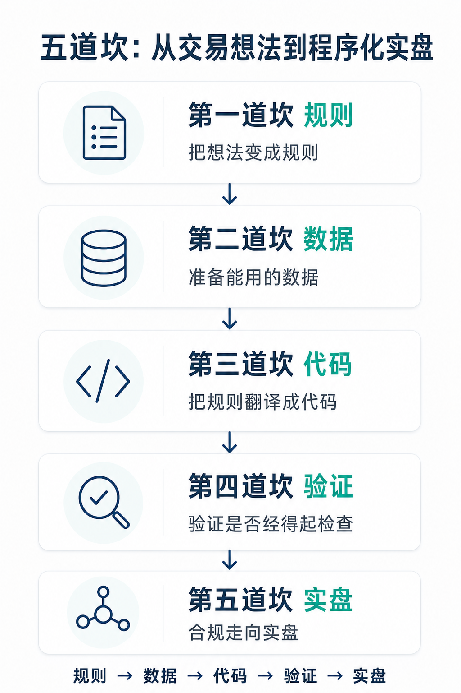
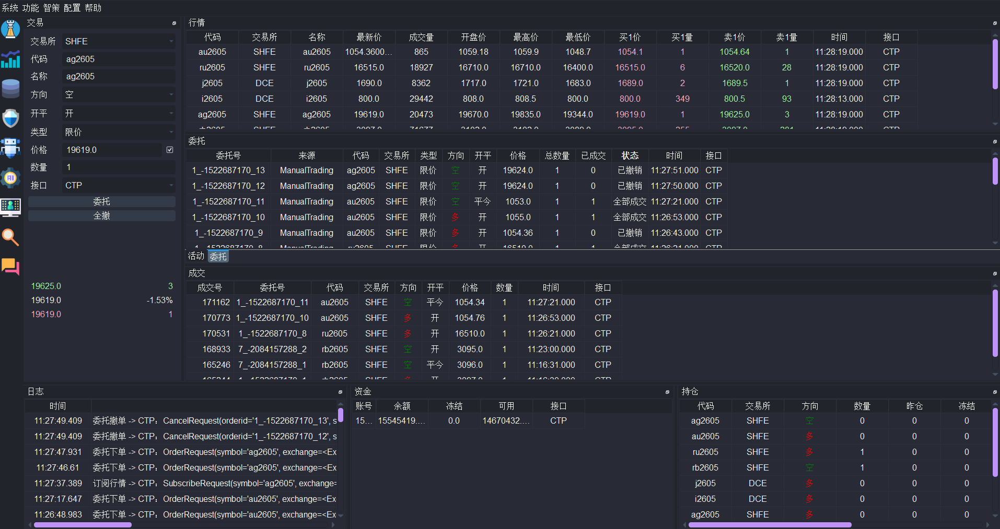
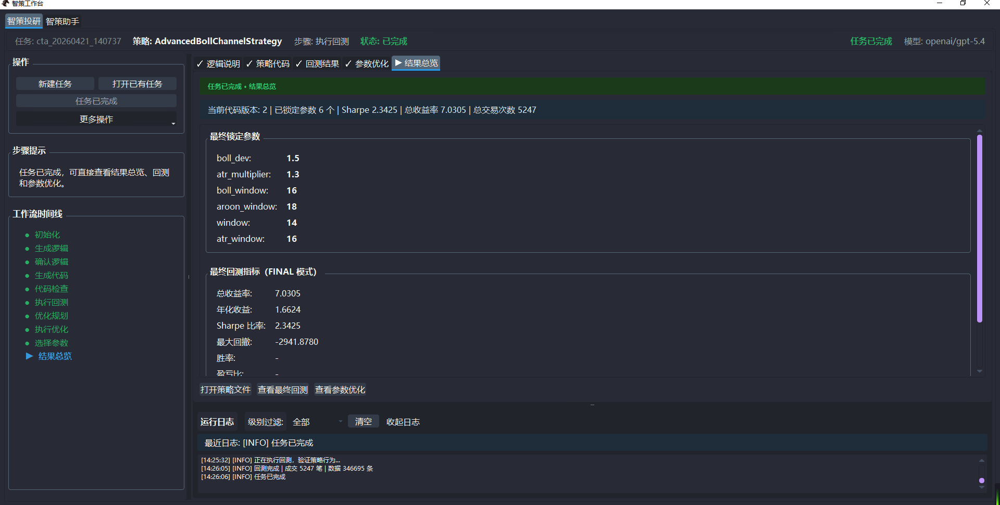
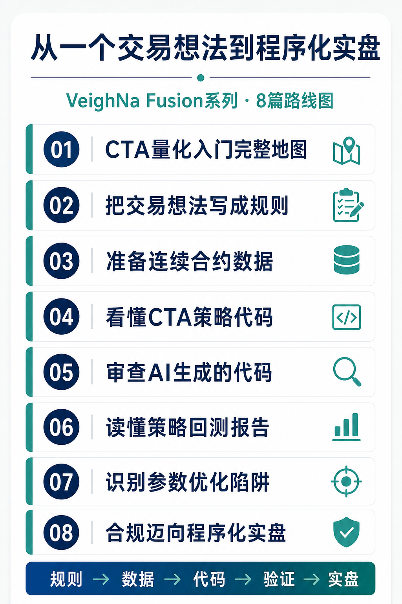

# 想做CTA量化，到底该从哪开始？一张完整路线图

夜盘进行到一半，你短暂离开屏幕。回来时，原本等待的突破已经走完。另一种情况也很常见：止损条件已经触发，临场却又想“再等等”。

这类经历会让人产生一个朴素的想法：能不能把交易条件提前写清楚，让程序负责盯盘和执行？

这就是CTA量化常见的起点。CTA策略在国内通常指以各交易品种自身的价格时间序列为主要研究对象的一类策略，趋势跟踪是其中最具代表性的路径。

随着研究方法演进，CTA策略也会结合多类时序因子和机器学习算法，已经远不止简单的规则组合。对于入门者，明确输入、判断和执行条件仍是理解CTA量化的合适起点，因此本系列先从规则化方法讲起。

从“有个想法”走到程序实盘，中间还隔着几道具体的坎。从我们在社区答疑中的观察看，新手遇到的问题虽各不相同，却大多能放进规则、数据、代码、验证和实盘这五个环节。

本篇只负责把地图画清楚，说明每道坎是什么、难在哪里。连续合约、代码审查、回测指标和实盘流程的具体做法，留到后面的文章逐项展开；这里也不讨论任何策略的收益。

> **做量化的第一道坎不是编程，而是把“我感觉能赚钱”翻译成机器能执行的规则。**

## 第一道坎：把想法变成规则

“均线金叉就做多”听起来已经很像一条规则，机器仍然无法直接执行。

用几分钟K线计算均线？金叉出现时立即进场，还是等待收盘确认？进场多少手？什么条件离场？连续出现信号时是否加仓？方向不清楚时又该怎么处理？

主观交易者会在盘中用经验补全这些空白，程序不会。每一个分支都要提前给出明确答案，“没有信号就不交易”也要写进规则。

策略规则化需要找出交易想法中隐藏的前提，单纯把一句话换成几行代码还远远不够。本系列第2篇文章会给出一套五要素框架，将一段大白话整理成可以执行、也可以核对的“策略逻辑说明书”。

## 第二道坎：准备能用的数据

规则写好以后，需要放到历史行情中检验。期货合约会到期退市，如果要回测一个品种过去三年的表现，通常不能只使用某一个交割月份的合约。

研究者需要按照一定规则，将不同月份的合约连接成连续序列。何时切换主力、新旧合约之间的价差如何处理，都会改变最终得到的K线。

直接拼接还可能在换月处产生虚假跳空。程序若把这段价差当作真实行情，就可能生成现实中不存在的交易信号和盈亏。

这也解释了为什么不同软件的“主力连续”数据有时对不上：差异可能来自构造规则，不能只凭价格不同就判断哪一方数据有误。本系列第3篇文章会讲清指数、前复权和后复权连续序列各自适合什么场景。

## 第三道坎：把规则翻译成代码

过去，交易者往往要先学习Python、配置开发环境，再熟悉量化框架，才能写出第一份策略。现在，AI辅助策略投研开发已经可以根据逻辑说明生成代码初稿，这道坎正在变矮。

实现更方便之后，确认责任仍然留在交易者手中。代码能够运行，只能说明它通过了基本的语法和接口要求，不能证明它忠实实现了原始想法。

例如，说明书要求使用1.5倍ATR移动止损，代码却可能写成固定止损。两者都能完成回测，交易行为却已经不同。

好消息是，阅读一份结构固定的CTA策略代码，通常比从零编写容易。本系列第4篇文章会介绍参数、K线合成、指标计算、信号判断和持仓管理这五个固定部件；本系列第5篇文章继续讨论AI生成代码的审查方法。

## 第四道坎：验证它是否经得起检查

代码能够运行，回测曲线向上，仍不足以说明策略可以投入实盘。

回测使用的是历史数据和简化的成交模型。如果代码引用了决策时尚未获得的信息，手续费和滑点设置得过低，或者参数被反复调整到恰好贴合某段历史，报告就会给出过于乐观的结果。

滑点，是下单时预期价格与实际成交价格之间的偏差。对交易频率较高的策略来说，即使每次只相差一个最小变动价位，累积影响也可能改变回测结论。

在我们看来，验证是整条路线中最需要耐心的一段。明显的程序错误通常会阻止策略运行，验证方法有缺陷却可能留下一份完整报告，让人带着错误信心继续向前。

因此，本系列第5至第7篇文章会依次讨论代码审查、回测报告阅读，以及参数优化中的过拟合。

## 第五道坎：合规走向实盘

策略经过初步验证后，还要完成程序化交易所涉及的报备、权限和系统接入等流程。选择不同的交易系统与接入路径，需要准备的事项也会有所不同。

这既是流程问题，也关系到交易系统的稳定和安全。回测跑通并不意味着可以立即连接真实账户。

本系列第8篇文章将依据公开规定梳理个人交易者需要了解的监管框架和落地路径。具体要求可能随机构和接入方式而异，发布前还需结合监管文件及合作期货公司的具体口径核对。

## 两条上手路径

地图有了，还要选择使用什么工具。常见路径可以归纳为两类：自行搭建开源工具链，或使用期货公司提供的标准化平台。

| 对比维度 | VeighNa 开源版 | VeighNa Fusion版 |
|---|---|---|
| 环境维护 | 需自行维护Python环境与依赖版本，使用VeighNa Studio亦然 | 关键依赖统一锁定版本并随平台维护，减少环境冲突 |
| 获取方式 | 可从www.vnpy.com下载并自行安装 | 向合作期货公司申请开通权限后获取 |
| 软件费用 | 软件本身免费 | 软件本身免费 |
| 投研数据 | 需自行购买并配置datafeed服务，如米筐RQData | 内置数据中心，支持本地期货连续数据合成 |
| 适合人群 | 希望深度开发，并愿意自行维护Python环境的用户 | 希望专注量化投研与交易，减少环境维护投入的用户 |

这两条路径面向不同阶段的需求。VeighNa 开源版适合希望自行配置环境和扩展功能的开发者；VeighNa Fusion版适合希望专注量化投研和交易本身、减少环境维护投入的交易者。

两个版本都采用标准`CtaTemplate`策略模板，策略结构与开发经验可以延续。区别主要在于环境、数据和工具链由谁维护。

本系列后续会使用Fusion展示实际操作，但文章中的规则化、数据处理和验证方法与具体工具无关。即使使用其他平台，也可以沿着同一张地图开展工作。

## 本篇小结

- 规则化是理解CTA量化的入门起点；更复杂的时序因子和机器学习策略，同样需要清晰的输入、验证与执行流程。
- 从想法到实盘要依次处理规则、数据、代码、验证和合规流程。
- AI降低了代码实现门槛，没有降低逻辑确认与结果验证的要求。
- 开源工具链和标准化平台服务于不同需求，可以按自身能力与阶段选择。

## 接下来讲什么

五道坎的顺序，也是本系列的连载顺序：

1. 想做CTA量化，到底该从哪开始？一张完整路线图（本篇）
2. 把“感觉能赚钱”写成交易规则：策略逻辑说明书
3. 回测之前，先把数据搞对：连续合约的常见陷阱
4. 看懂你的策略代码：CTA策略的五个固定部件
5. AI写的策略怎么审查：五类容易忽略的代码错误
6. 读懂回测报告：数字背后的真相与成本假设
7. 参数优化是在提升策略，还是让参数拟合历史
8. 策略准备好了，离合规实盘还要跨过几步

下一篇，我们从第一道坎动手。文章将使用布林带、Aroon和ATR组成的贯穿案例，演示如何把一段交易想法整理成机器能执行、人能逐项核对的策略逻辑说明书。

---

> VeighNa Fusion 是 VeighNa 团队面向期货公司推出的标准化CTA量化交易平台，由合作期货公司采购后提供给其客户使用。在合作期货公司开户并申请开通相关权限后即可使用，无需额外付费。文中演示均基于 Fusion 内置功能完成。如希望了解详情，可在公众号后台留言咨询。
