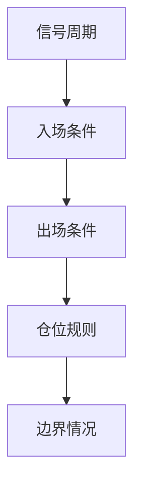
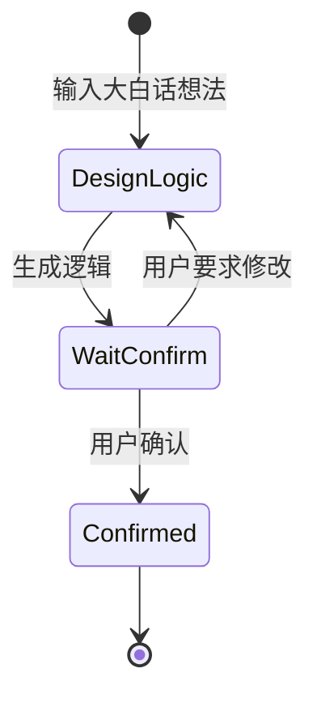

# 【CTA量化通关系列2 - 你的交易想法，机器看不懂】

上一篇我们说到，做 CTA 量化的第一道坎，是把交易想法翻译成机器能执行的规则。不少人其实已经有一条口头纪律，听起来也够具体——「均线金叉就做多」。

主观交易时，这句话背后往往还藏着一串默认前提：用哪根周期的均线、金叉当下进还是等收盘、进几手、什么条件离场。盘中靠经验，这些空白会被随手补上。程序不会补。把同样一句话交给机器，它未必当场报错，却可能用你从未同意过的默认假设继续往下跑。

> **AI 时代交易员的核心工作不是写代码，而是确认逻辑。**

本篇只做一件事：给出一套五要素框架，并用一个完整案例，演示如何把大白话整理成一份可执行、可核对的**策略逻辑说明书**。代码怎么写、这份策略能不能赚钱、布林带和 Aroon 的公式细节，分别留给后面的文章。

## 规则化的五要素

上一篇留下的那串问题——周期、确认时机、手数、离场、加仓、方向不明——归拢起来是五类。缺任何一类，机器仍然无法稳定执行。

信号周期回答的是：用什么级别的 K 线做判断。交易所公开推送的行情里，1 分钟 K 线往往是研究者能稳定拿到的较细粒度；策略若按 15 分钟决策，常见做法是用 1 分钟合成 15 分钟，再在合成后的序列上算指标、出信号。

这里容易混的一点是：合成周期描述的是「决策频率」，而非数据有多细。同一套进出场逻辑，放在 5 分钟和 15 分钟上，交易次数和持仓时间会差一截。先定多久做一次判断，再选合成方式，比先拍一个周期再倒推要清楚。

入场条件最好拆成两层：一层管方向，一层管触发。方向回答「只做多、只做空，还是都可以」；触发回答「什么价格动作才实际下单」。把两层糊成一句「看起来该买了」，回测和实盘都很难核对。趋势过滤器加突破触发，是 CTA 里很常见的组合——过滤器负责少做逆势单，触发条件负责给出具体动手的时点。

出场条件至少要有一条离场路径：固定止损、移动止损、止盈、反向信号平仓，都可以，但不能没有。只写进场、不写出场，规则只完成了一半。若同时有多条离场路径，还要写清谁优先，避免程序里两条规则抢着平仓。

仓位规则在入门阶段建议先写死手数。固定 1 手看起来笨，却能把「逻辑对不对」和「仓位大不大」分开。变量少了，后面回测和核对才有参照。等逻辑稳定了，再讨论按波动或资金比例加减仓也不迟。

边界情况专门写「没有信号时怎么办」。方向不明、条件未触发、已有持仓又看到重复信号——这些在主观交易里常被略过，程序却必须有答案。「不交易」「不加仓」本身就是规则，写进说明书，才算闭合。

我们在社区答疑里见过一种情况：口头规则只有进场，出场全靠「到时候看」。丢给 AI 也能生成能跑的代码，但离场逻辑往往是生成器自己补的默认值，和交易者心里想的并不是一回事。五要素的作用，就是在生成代码之前，先把这些空白逼到纸面上。

## 从大白话到逻辑说明书

下面用本系列的固定案例走一遍。后文讲读代码、审查、回测、参数时，都会回到同一份说明书，中途不更换。

先看交易者口头版：

> 用 1 分钟 K 线合成 15 分钟；布林带周期 20、宽度 1.7；Aroon 周期 20 判断多空——上升趋势强就等突破布林上轨做多，下降趋势强就等跌破下轨做空，方向不明就不做；固定 1 手；持仓后用 1.5 倍 ATR（周期 14）移动止损。

三个指标在本案例里的分工可以记成一句话：布林带用价格相对均值的偏离画通道，突破上下轨作触发；Aroon 比较近期最高价、最低价出现的先后，用来判断趋势方向；ATR 衡量近期波动幅度，用来设定止损距离。公式与变体不在本篇展开。

我们第一次把这段话按五要素逐项填空时，卡在「趋势强」三个字上——强到什么程度？说明书里必须落成可以比较的条件，不能停在语感。按上节框架翻译如下（若你之后用 AI 生成逻辑，以最终确认的版本为准；语义应与下表一致，表述可以更细）。

### 策略逻辑说明书（范例）

【信号周期】

- 数据：1 分钟 K 线，合成 15 分钟 K 线。
- 计算时点：布林带、Aroon、ATR 均在 15 分钟 K 线收盘后计算与更新。
- 信号判断：仅在该 15 分钟 K 线收盘后进行，不在分钟内抢跑。

【入场条件】

- 方向过滤（Aroon，周期 20）：
  - Aroon Up > Aroon Down：视为上升趋势较强，只允许考虑做多；
  - Aroon Down > Aroon Up：视为下降趋势较强，只允许考虑做空；
  - 两者相等：视为方向不明，不开仓。
- 多头触发：当前无持仓，且方向允许做多，且该 15 分钟收盘价突破布林上轨（周期 20、宽度 1.7）。
- 空头触发：当前无持仓，且方向允许做空，且该 15 分钟收盘价跌破布林下轨（周期 20、宽度 1.7）。

【出场条件】

- 持仓后启用移动止损，距离为 1.5 × ATR（周期 14）。
- 多头：止损价随行情上移，不随行情下移；价格触及或跌破止损价则平仓。
- 空头：止损价随行情下移，不随行情上移；价格触及或升破止损价则平仓。
- 本案例不设固定止盈，也不另设「反向信号立即平仓」规则；离场以移动止损为准。

【仓位规则】

- 每次开仓固定 1 手。
- 不加仓：持仓期间即使再次满足入场条件，也不增加手数。

【边界情况】

- 无持仓且未同时满足「方向过滤 + 突破触发」：不交易。
- 方向不明：不交易。
- 已有持仓：只管理出场，不新开同向或反向仓位。

对照口头版可以看出，大白话里没写、说明书里必须写死的，至少有这几处：在 15 分钟收盘后判断、Aroon 用 Up/Down 相对高低定义「趋势强」、突破看收盘价、移动止损只朝有利方向更新、持仓期间不加仓也不对锁。

你也可以拿自己的策略试一次同样的动作：先原样写下口头版，再按五要素逐项填空。填不满的格子，往往就是盘中靠经验临场发挥的地方；那些地方不补上，程序化走不远。

这份说明书有两个用途。对机器，它是执行规格；对人，它是后面读代码、做审查、看回测时的核对底稿。第 4 篇起我们会拿着它逐项问：代码里的翻译是否忠实。

## 在 Fusion 里走一步：生成逻辑，然后停住

把上面的口头想法交给 AI，通常也能得到一份结构化逻辑草稿。能生成只是起点；生成之后有没有人把关，才决定这份草稿能不能用。

在 VeighNa Fusion 的 CTA Agent 里，可以用同一段大白话作为任务输入。Agent 会先走「生成逻辑」——产出的结构，应能和上一节五要素说明书互相对照。

【配图 C：CTA Agent 输入大白话想法】

【配图 C：生成逻辑产物与说明书对照】

生成之后的动作更关键：流程会停在**等待你确认**，而不会自动写代码、自动回测。

【配图 C：等待你确认】

这一停，对应的正是本篇的钩子：整理和起草可以借助工具，交易规则有没有漏项、和你想的是否一致，确认权在人。若生成稿里「趋势强」仍是模糊说法，或出场只写了止损却没写更新方式，应在确认环节改到可执行，再进入后续步骤。

<!-- 发布前：用贯穿案例实跑 CTA Agent，替换三处【配图 C】为打码后的实机截图；若确认稿与上文说明书语义有出入，以确认稿为准回写说明书并同步第4～7篇。本篇无绩效图，无需收益免责图注。 -->

## 本篇小结

- 机器只执行写清楚的分支；口头规则里的隐藏前提，要用五要素逐项补全。
- **策略逻辑说明书**是可交付的产出：它既给执行用，也给后人（和未来的自己）核对用。
- AI 能降低「从想法到逻辑草稿」的成本，没有取消人工确认。
- 本系列后文的读代码、审查、回测与参数讨论，都基于本篇这份案例说明书。

## 接下来讲什么

规则写清楚以后，下一步是拿历史行情做检验。但期货合约会到期退市，回测常用的「主力连续」并不是市场上曾真实存在的一根合约——构造方式不同，结论就可能不同。

下一篇：连续合约没搞对，回测结论靠不住。

---

> VeighNa Fusion 是韦纳软件面向期货公司推出的标准化期货量化交易平台，本系列文中演示均基于 Fusion 内置功能完成，如希望了解详情，请扫描下方二维码添加小助手交流：

