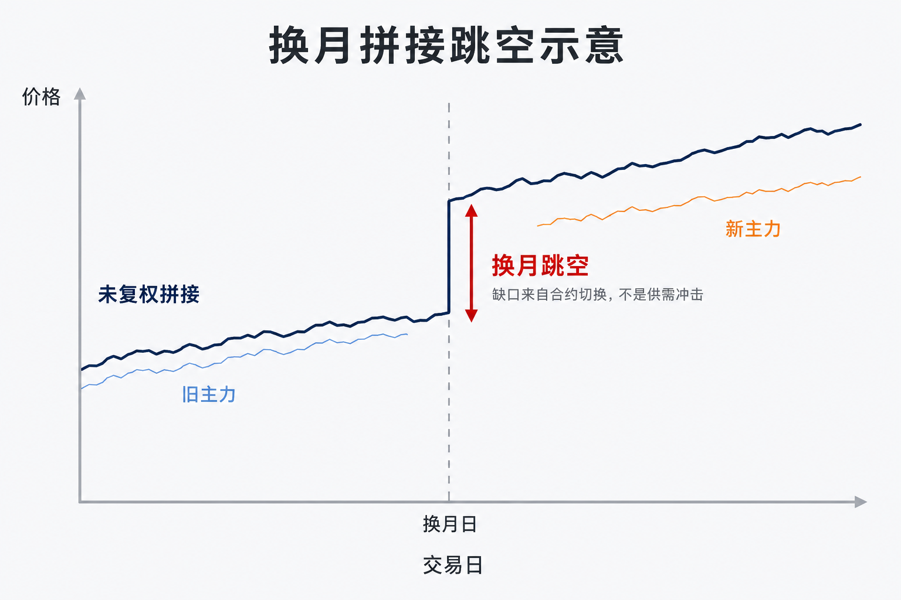
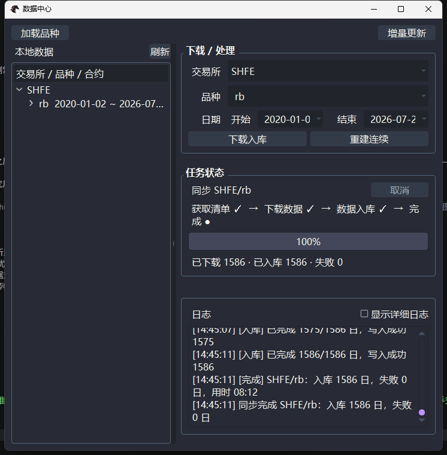
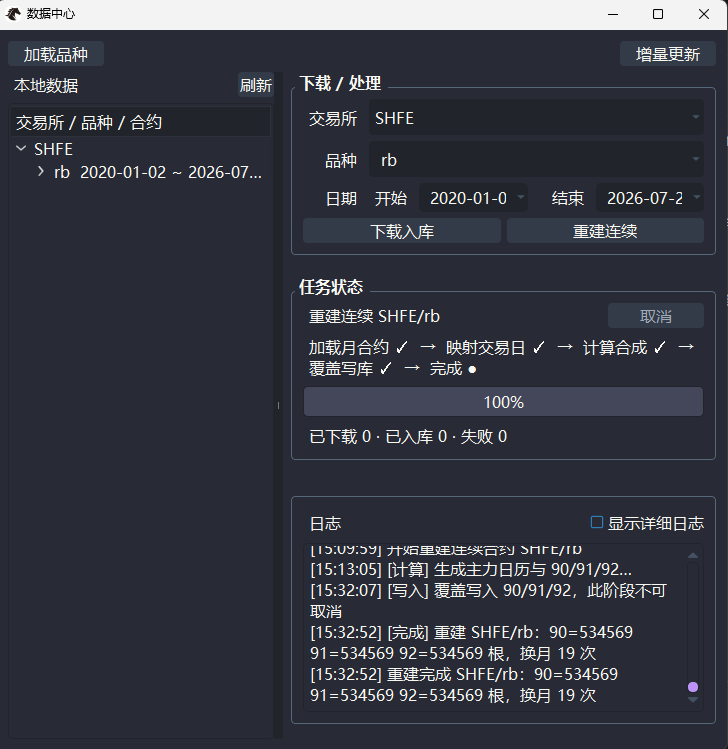
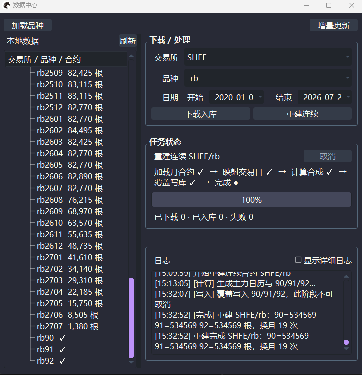

# 【CTA量化通关系列3 - 连续合约没搞对，回测结论靠不住】

上一篇我们把交易想法整理成了策略逻辑说明书。规则清楚之后，下一步是拿历史行情做检验。股票有一条相对完整的价格历史；期货则不同——每一张合约都会到期退市。

要回测某个品种过去三年，通常不能只用某一个交割月。研究者会把不同月份的合约，按规则接成一条更长的序列，行业里常叫它「主力连续」。它方便研究，却容易让人产生错觉：以为屏幕上那根 K 线，就是市场上某一张真实挂牌的合约。

> **你回测用的那根「主力连续」K 线，在真实市场上从来没有存在过。**

本篇只讲清这件事：为什么要连续合约、指数 / 前复权 / 后复权各自适合什么场景、为什么不同软件的数据常对不上。

## 换月一接，跳空可能是假的

主力合约，指同一品种里市场参与最集中、通常也更适合作为研究与交易参照的那张合约。持仓量是未平仓合约的数量，常用来衡量资金集中在哪一张合约上。随着交割临近，持仓与成交会迁到更远的月份，研究用的「当前主力」也要跟着换——这一步叫换月。

问题在于：旧主力与新主力在交接前后，价格往往不相等。若把两段行情直接首尾相接，换月处会出现一根「跳空」。这根缺口来自合约切换，不一定来自品种本身的供需冲击。

对趋势类规则来说，这种假跳空特别麻烦。突破跌破、均线穿越，本就对相邻两根 K 线的相对位置敏感；换月缺口一旦被当成真波动，信号可能在「不该下单的日子」被触发。若回测引擎再按跳空幅度记账，权益曲线还会多出一笔现实里对不上的盈亏。

我们在社区答疑里遇到过这类困惑：回测曲线在某个交易日突然多出一块，对着分月合约检查下来，那天并没有对应的真实波动，只是连续序列在换月处没处理好。

所以连续合约要同时回答两件事：月份如何拼出足够长的样本，以及换月缺口如何处理、处理后的价格还能不能用来发信号。

## 三类连续序列：用途不同，别混用

常见的连续序列可以分为三类：指数连续、前复权主力连续和后复权主力连续。

初学时不必急着记住这些名称。三类序列其实回答两个不同的问题：指数连续回答「怎样概括整个品种的价格走势」；前复权和后复权回答「换月产生价差后，保留今天的价格，还是保留过去的价格」。

### 指数连续：观察整个品种

指数连续不是依次拼接某一张主力合约，而是把同一品种的多个可交易合约，通常按照持仓量加权，合成一条价格序列。

它反映的是整个品种的大致价格水位，通常比较平滑，适合观察长期趋势和进行宏观研究。但这个价格是计算出来的，可能不等于任何一张实际合约的价格，因此不能直接把它当成可以挂单成交的价格。

可以把它理解为：

指数连续回答「这个品种整体在涨还是在跌」，但不回答「今天应该按什么价格下单」。

### 前复权主力连续：保留今天的真实价格

前复权主力连续始终跟踪主力合约。换月时，它保留新主力当前的真实价格，同时平移换月前的历史价格，把合约切换产生的假跳空消除（这种用价差做整体平移的做法，常称 Panama 加法复权）。

例如，旧主力换月前为 3500 点，新主力为 3600 点，两者相差 100 点。直接拼接会出现一个 100 点的跳空。前复权会把换月前的历史价格统一加上 100 点，使换月前后的走势衔接起来，而今天的 3600 点仍然对应真实可交易的主力合约。

因此，前复权适合需要让历史信号与当前盘面价格保持一致的场景。CTA 策略回测多数会优先使用这一类序列。

### 后复权主力连续：保留过去的真实价格

后复权主力连续同样跟踪主力合约，但选择保留较早的历史价格，把换月后的较新价格向历史价格平移。

仍以上面的换月为例，旧主力为 3500 点，新主力为 3600 点。后复权会保留旧主力的 3500 点，并把换月后的价格减去 100 点，使两段走势连续。

这种序列更适合观察长期路径、比较长区间的净值变化。但它最新端的价格经过了调整，未必等于当前主力合约的真实盘面价格，因此不适合直接拿来判断今天应该在哪个价位下单。

三者的区别可以归纳为：

| 类型 | 保留什么 | 更适合 | 不能直接用来做什么 |
|------|----------|--------|--------------------|
| 指数连续 | 品种整体价格水位 | 趋势观察、宏观研究 | 不能当成真实成交价 |
| 前复权主力连续 | 当前真实价格 | CTA 策略回测、当前信号判断 | 远端历史价格不再是真实报价 |
| 后复权主力连续 | 较早的历史价格 | 长期路径和区间对比 | 不能把最新价格当成当前报价 |

如果需要进一步理解它们的数学关系，记 \(t\) 为当前观察日，\(t_k\) 为第 \(k\) 次换月的生效日，换月价差定义为：

$$
\mathrm{Gap}_k=\text{新主力价格}-\text{旧主力价格}
$$

各家采用开盘价还是收盘价计算，规则可能不同。

前复权：

$$
P'_t=P_t+\sum_{t_k>t}\mathrm{Gap}_k
$$

后复权：

$$
P'_t=P_t-\sum_{t_k\le t}\mathrm{Gap}_k
$$

也就是说，前复权把观察日之后才发生的换月价差加到历史价格上；后复权则从较新价格中减去观察日当时已经发生的换月价差。

公式并不是重点。实际使用时，只需先记住：

- 前复权保留当前价格，调整历史价格；
- 后复权保留历史价格，调整后续价格；
- 指数连续反映品种整体，但不是任何一张真实合约。

前复权还有两个需要注意的特点。

第一，加法复权会让历次换月价差在远端历史中不断累积。如果价差长期同向，早期价格会被持续抬高或压低；当累计调整为负时，极端情况下可能逼近零，甚至变成负数。使用依赖绝对价格水平的指标时，需要特别留意。

第二，前复权历史并不是永久固定的。如果重新构建数据时，换月日期或换月价差发生变化，整段历史价格也会随之改变。因此，上周导出的前复权序列与本周重新构建的序列，同一天的收盘价可能不同。这是复权规则带来的正常结果，并不意味着数据库出了问题。

做 CTA 策略回测时，多数情况下会选择前复权主力连续，因为它回答的是：

按照今天的价格口径，历史上的策略信号是否应该触发？

选错序列，后面所有回测结论都会建立在错误的价格口径上。

## 主力怎么切换，决定连续长什么样

「谁算主力」本身就是一条规则。Fusion 数据中心采用双轨口径（与常见行业实践一致）：

- 商品期货：以日终持仓量为主要依据——持仓量最大，且达到原主力的 1.1 倍时，才切换；切换在次日生效，日内不换。
- 金融期货：以成交量、持仓量双第一为常见条件，同样次日生效。
- 滚动方向：只向更远的月份切换，避免在近月之间来回跳。

把倍数、生效时点、是否要求成交量同步最大写进规则之后，同一天「谁是主力」才会有唯一答案。规则改一点，换月日就可能错开，连续序列上的缺口位置与复权幅度也会跟着变。

因此有一条比「哪家数据更准」更管用的判断：

**主力判定、换月时点和缺口处理规则不同，不同软件的主力连续自然可能对不上——看到不一致，先查两边的构造规则。**

不能只凭价格不同就判断哪一方的数据有误。比较连续序列之前，首先要确认两边是否属于同一类型；如果都是主力连续，再核对主力判定、换月时点和复权规则。

## 在 Fusion 数据中心里准备可回测序列

前面把规则和序列类型讲清楚之后，下一步就是在数据中心里操作：先下载分月合约入库，再重建成本地连续序列。VeighNa Fusion 用固定后缀区分上述三类序列——这是平台内约定，不是交易所官方代码：

| 后缀 | 含义 | 螺纹钢示例 |
|------|------|------------|
| `90` | 指数连续 | `rb90.SHFE` |
| `91` | 前复权主力连续 | `rb91.SHFE` |
| `92` | 后复权主力连续 | `rb92.SHFE` |

连续序列的代码也是平台内部约定。以螺纹钢为例，Fusion 的指数连续使用 `rb90.SHFE`，米筐 RQData 使用 `RB99`；迅投研则将同类序列称为「加权合约」，代码为 `rbJQ00.SF`，本文将其归入指数连续一类。

三者都通过多个可交易合约反映品种整体价格，但纳入的合约范围、持仓量权重及计算时点可能不同，因此价格不一定完全一致。

本系列后文回测演示，会与螺纹钢同一品种对齐，策略侧常用前复权序列 `rb91.SHFE`。

第一步，在数据中心选择交易所、品种和日期范围，点击「下载入库」。任务完成后，分月合约数据会写入本地数据库。

第二步，分月数据入库后，点击「重建连续」。系统会识别主力换月日期，并按照对应规则生成三类连续序列。

第三步，重建完成后，在左侧合约列表中检查是否已经生成 `rb90`、`rb91` 和 `rb92`。

有一条容易漏的操作纪律：追加下载了更新的分月数据之后，需要手动触发重建，连续序列才会按最新合约与换月结果重算。**只下载、不重建**，回测仍可能跑在旧的连续结果上——分月库已经是新的，`91` 却还是上一次拼接的产物。

下载与重建拆开，是为了让你看清「原始分月」和「研究用连续」是**两层数据**。连续序列出问题，优先回到分月合约和换月记录排查，别急着先改策略参数。

## 本篇小结

- 主力连续是按规则构造出来的研究用序列，不等于任何一张在市场上真实挂牌交易的合约。
- 指数连续、前复权主力连续和后复权主力连续用途不同；CTA 策略回测通常优先选择前复权主力连续。
- 跨软件价格对不上时，先确认序列类型，再查构造规则，再谈数据对错。
- 在 Fusion 里用 `90` / `91` / `92` 区分三类序列，更新分月数据后记得重建。

## 接下来讲什么

数据就绪之后，可以把上一篇的策略逻辑说明书交给 AI 生成代码。实现门槛变低了，读懂代码、核对翻译是否忠实，反而成了更关键的一步。

下一篇：不会写代码，也要会读策略。

---

> VeighNa Fusion 是韦纳软件面向期货公司推出的标准化期货量化交易平台，本系列文中演示均基于 Fusion 内置功能完成，如希望了解详情，请扫描下方二维码添加小助手交流：

