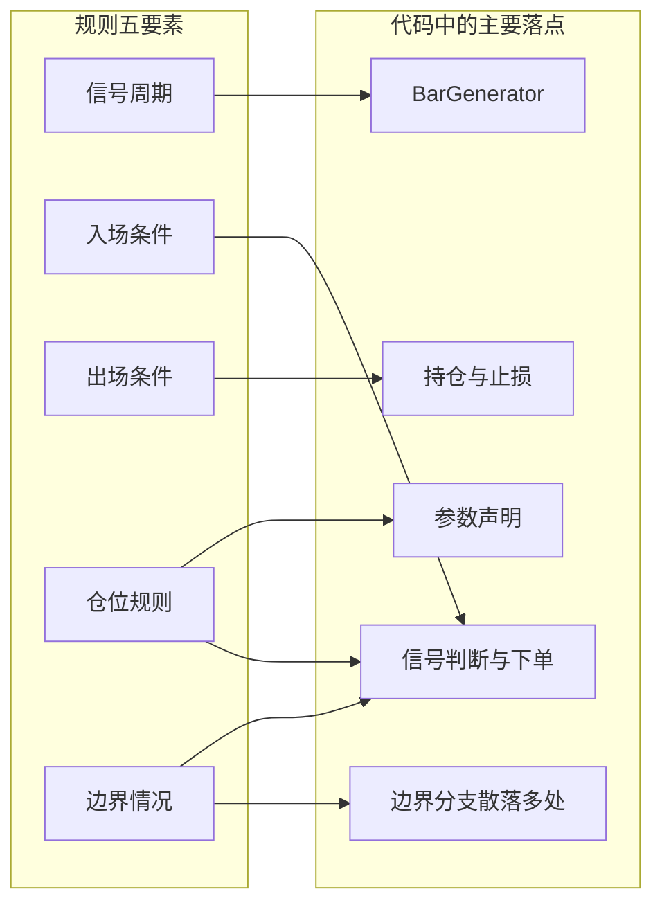
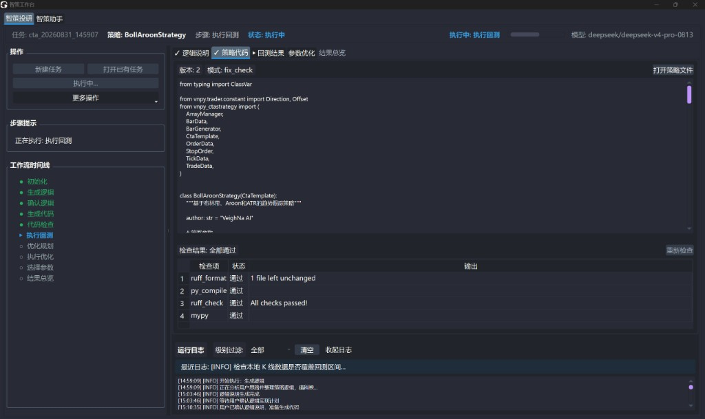
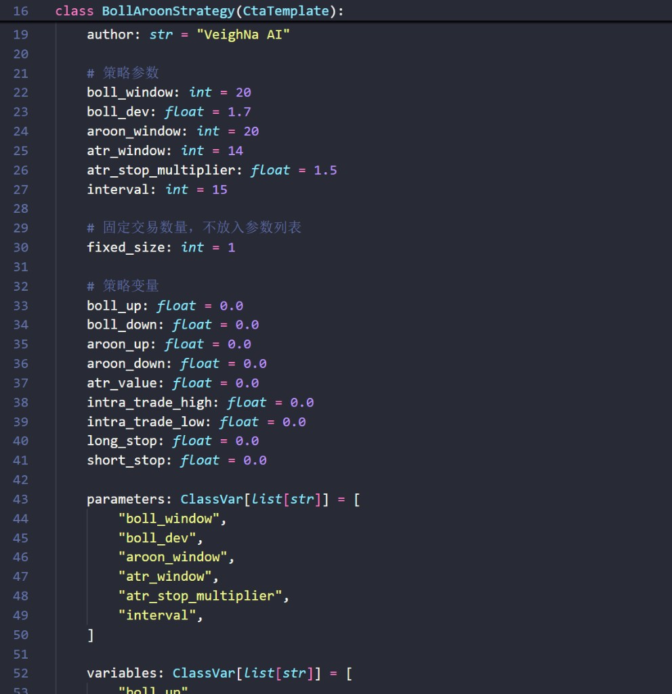

# 【CTA量化通关系列4 - 不会写代码，也要会读策略】

<!--
生产备忘（发布前删除）：
- 正文代码为按 2_logic.md 说明书整理的阅读示例，待正式任务生成文件按行替换；不得把阅读示例改称「智策本次输出」
- C 类图：起草可用文档界面；发布必须替换为与第 2、4～7 篇同一 task_id 的
  「生成代码」产物图 + 该策略代码预览（大纲第七节）。文档图不满足可追溯要求。
  占位文件名：pics/generate_code.png、pics/code_preview.png
- 逻辑底稿：2_logic.md「策略逻辑说明书（参考）」；不回写第 1–3 篇
- 对外只写智策工作台 / 智策投研
- 发布前用正式任务产物补两处可追溯的运行细节，替换文中「对照说明书和开源示例」的观察
- 正式代码审核：极值重置是在无仓分支、持仓切换，还是 on_trade 成交回报里；按实际位置改正文措辞
-->

上一篇把回测要用的连续序列讲清楚了。规则和数据都齐了之后，可以把第二篇确认过的策略逻辑说明书交给下一步，生成一份 CTA 策略代码。

代码可以借助工具写出来。它有没有忠实实现你确认过的规则，还是要人对照说明书去看。

> **你不需要会写代码，但你必须看得懂自己的钱按什么规则在交易。**

结构固定的 CTA 策略里，不必从第一行读到最后一行。优先核对的通常是五个位置：参数、K 线合成、指标计算、信号判断和持仓管理。有些函数只是框架在收行情，可以先跳过。

本篇继续用第二篇的布林带、Aroon 和 ATR 案例，带着那份说明书找落点。Python 语法、全部回调，以及这套规则能不能赚钱，本篇不展开。

## 五个固定部件

第 1 篇说过，阅读一份结构固定的 CTA 策略，通常比从零编写要容易。读的时候记住一句：**代码是逻辑说明书的翻译。** 五个部件告诉你翻译大概落在哪；说明书里的某一条，不一定只出现在其中一个部件里。

第 2 篇对照口头版时写过，大白话里没写、说明书里必须补上的，至少包括：在 15 分钟收盘后判断、突破看收盘价、移动止损只朝有利方向更新、持仓期间不加仓。这几条就是本篇最值得停下来对的地方。

边界情况——不加仓、方向不明不交易——尤其容易散落在好几处。仓位手数既出现在参数里，也会出现在下单数量上。下图只标主要落点，箭头不是一一对应。



下面每段摘录都对着说明书读。中间省略的行用注释标出。类名、变量名在不同生成稿里可能不一样，看的是它在做什么。

### 参数：说明书里的数字，先出现在这里

说明书里的周期 20、宽度 1.7、Aroon 20、ATR 14、倍数 1.5、固定 1 手，通常写在策略类开头，并收进 `parameters` 列表。这些是以后可以改的旋钮，第 7 篇优化时也会回到这里。

```python
boll_window = 20
boll_dev = 1.7
aroon_window = 20
atr_window = 14
sl_multiplier = 1.5
fixed_size = 1

parameters = [
    "boll_window",
    "boll_dev",
    "aroon_window",
    "atr_window",
    "sl_multiplier",
    "fixed_size",
]
```

先核对这些数字和说明书是否一致。名称叫 `boll_dev` 还是 `boll_width` 不重要，值对上，才算通过第一步核对。后面还要看计算和下单有没有用到这些参数。

同一段里常常还有 `boll_up`、`intra_trade_high`、`long_stop` 这类变量。它们跟参数不是一类：运行中会跟着行情和持仓变化，用来记住轨道、开仓后高点和当前止损价。

### K 线合成：15 分钟决策写进了哪里

说明书要求用 1 分钟合成 15 分钟，并且只在 15 分钟收盘后判断。对应位置一般是 `BarGenerator`（K 线合成器）和它后面的回调。

```python
self.bg = BarGenerator(self.on_bar, 15, self.on_15min_bar)

def on_bar(self, bar: BarData):
    self.bg.update_bar(bar)
```

第二个数字是 15，第三个是收到 15 分钟 K 线后要调用的函数。`on_bar` 里如果只做 `update_bar`，说明 1 分钟线只负责往上送，不下单。

若指标计算或 `buy` / `short` 写在 `on_bar` 里，决策频率就和说明书对不上。第 2 篇写过：不在分钟内抢跑。

### 指标计算：布林、Aroon、ATR 的数值从哪来

`ArrayManager`（K 线序列与指标计算）把合成后的 15 分钟 K 线收进去，再算出轨道、方向和波动。

```python
am = self.am
am.update_bar(bar)
if not am.inited:
    return

boll_up, boll_down = am.boll(self.boll_window, self.boll_dev)
aroon_up, aroon_down = am.aroon(self.aroon_window)
atr_value = am.atr(self.atr_window)
```

`if not am.inited: return` 的意思是：K 线还不够算指标时，先不算、也不下单。公式细节本篇不展开。要核对的是周期和宽度是否仍用上面的参数，以及 Aroon 的上、下两条有没有接反。后文摘录里的 `boll_up`、`atr_value`，都来自这一段。

### 信号判断：过滤、突破、当前有没有仓

说明书把入场拆成方向过滤和收盘价突破，并且要求当前无持仓才开仓。这几条通常写在 `pos == 0` 的分支里。

`pos` 是 CTA 引擎为该策略实例维护的逻辑净持仓：大于 0 为多，小于 0 为空，等于 0 为无仓。它和账户里看到的实际持仓不一定相同。状态对不上时怎么审查，留给第 5 篇。

```python
if self.pos == 0:
    self.intra_trade_high = bar.high_price
    self.intra_trade_low = bar.low_price
    if aroon_up > aroon_down and bar.close_price > boll_up:
        self.buy(bar.close_price, self.fixed_size)
    elif aroon_down > aroon_up and bar.close_price < boll_down:
        self.short(bar.close_price, self.fixed_size)
```

开仓前要同时成立三件事：Aroon 允许该方向、收盘价突破对应轨道、现在没有仓。两者相等时两条都不进，就是「方向不明不交易」。`fixed_size` 对应固定 1 手。

我们核对移动止损时，还要看最高价、最低价有没有按笔重新初始化。上一笔多单如果曾到过 4000，新一笔在 3500 附近开仓，若不重置，止损仍按 4000 算，会立刻失真。

核对时还要看极值是在无仓分支、逻辑持仓切换后，还是成交回报中重置。若重置早于实际成交，记录的高低价可能包含成交前行情。

有一种常见写法，是在轨道价格上挂停止单，例如 `self.buy(boll_up, self.fixed_size, True)`。它可能在 15 分钟还没收完时就被触发。说明书写的是收盘价突破，两种挂法跟说明书不是一回事。对的时候看比较的是 `bar.close_price`，还是轨道上的挂单价。

### 持仓管理：出场写在有仓的分支

说明书只保留一条离场路径：1.5 倍 ATR 移动止损，并且只朝有利方向更新。有仓时不应再走上面的开仓语句——这就是不加仓、不对锁。

说明书要的是「触及或跌破」。我们对照说明书和开源 CTA 示例时，发现收盘后拿同一根 K 线的最低价去判断，并不等于触及。

一根已经走完的 K 线里，高点和低点谁先出现，事后看不出来。常见写法是本根收盘后更新止损价，再挂停止单，让它在后续行情里等待触及。

```python
self.cancel_all()
# ... 中间省略：推入 ArrayManager、计算指标
elif self.pos > 0:
    self.intra_trade_high = max(self.intra_trade_high, bar.high_price)
    self.long_stop = self.intra_trade_high - atr_value * self.sl_multiplier
    self.sell(self.long_stop, abs(self.pos), True)
```

第三个参数 `True` 表示停止单。默认的限价单跟「触及后触发平仓委托」不是一回事：停止单的作用是价格触及后发出平仓委托，不能保证立即成交。

`max` 让多头跟踪的最高价只升不降，止损价因此只能上移。空头一侧通常用 `min` 跟踪最低价，止损价只能下移，平仓函数换成 `cover(..., True)`。

`cancel_all()` 出现在每根 15 分钟 K 线处理的开头，是在撤销上一轮还没成交的委托，避免旧价格的停止单和新单同时挂着。委托从下达到成交或撤销的完整过程，留到后面再讲。

## 把移动止损完整对一遍

五个落点找齐以后，用说明书里最容易写歪的一条，把核对动作走完。第 1 篇举过：口头要求 1.5 倍 ATR 移动止损，代码里却可能变成固定止损。两种都能跑完回测，交易行为已经不同。

说明书这一条是：

> 持仓后启用移动止损，距离为 1.5 × ATR（周期 14）。多头止损价随行情上移，不随行情下移；空头止损价随行情下移，不随行情上移。价格触及或跌破（升破）止损价则平仓。

对着代码按顺序问。ATR 周期是不是 14，倍数是不是 1.5——看参数，再看 `am.atr(...)` 和乘法。多头有没有用开仓后最高价更新止损，空头有没有用最低价——看 `max` / `min`。

最高价、最低价有没有按笔重新初始化，以及重置写在发单时还是成交之后。平仓用的是不是停止单（第三个参数为 `True`），多头是不是 `sell`、空头是不是 `cover`。有仓时会不会再次 `buy` / `short`。

如果开仓后只计算一次固定止损价，后面不再用极值更新，那就是固定止损。上面的阅读示例按说明书写成了移动止损；你拿到的生成稿若不一样，差异通常就在这几行。

> 假设示例：代码写成 `long_stop = 开仓价 - 1.5 × ATR`，之后不再改。回测仍能跑完，但已经不是说明书里的移动止损。

这一步的目的，是学会「拿说明书问代码」。生成稿还能不能信、还有哪些典型错误，下一篇再系统说。

## 在 Fusion 里看生成出来的文件

上面的读法，不依赖某一个软件。在 VeighNa Fusion 里，确认逻辑之后，智策投研会进入「生成代码」。产物是标准 `CtaTemplate`（CTA 策略模板）策略文件，和 VeighNa 开源版用的是同一套结构，生成之后可以继续自己读、自己改。

第一步，在智策工作台打开智策投研，等流程走到生成代码，确认已经产出策略文件。



第二步，打开代码预览，不要从文件顶上逐行读。先搜 `parameters`、`BarGenerator`、`ArrayManager`，再找 `pos == 0`、极值重置和止损相关的变量。



界面长什么样会随版本调整。读的顺序不变：先对参数和周期，再对开仓与止损。

## 本篇小结

- 读 CTA 策略，核心是核对说明书的翻译。
- 五个固定部件给出找落点的地图；边界情况要按说明书条目找，不要按部件凑数。
- 移动止损至少要核周期、倍数、极值是否按笔重置、更新方向、是否用停止单等待触及，以及持仓时还开不开新仓。
- 智策投研可以生成标准模板文件；翻译有没有走样，仍要人来看。

## 接下来讲什么

代码能生成、也能运行，只说明它通过了基本的格式和接口检查。逻辑写错、用了当时还拿不到的信息、状态和真实持仓对不上，回测照样能出一份完整报告。

下一篇：AI 写的策略，能运行不等于能信。

---

> VeighNa Fusion 是韦纳软件面向期货公司推出的标准化期货量化交易平台，本系列文中演示均基于 Fusion 内置功能完成，如希望了解详情，请扫描下方二维码添加小助手交流：


