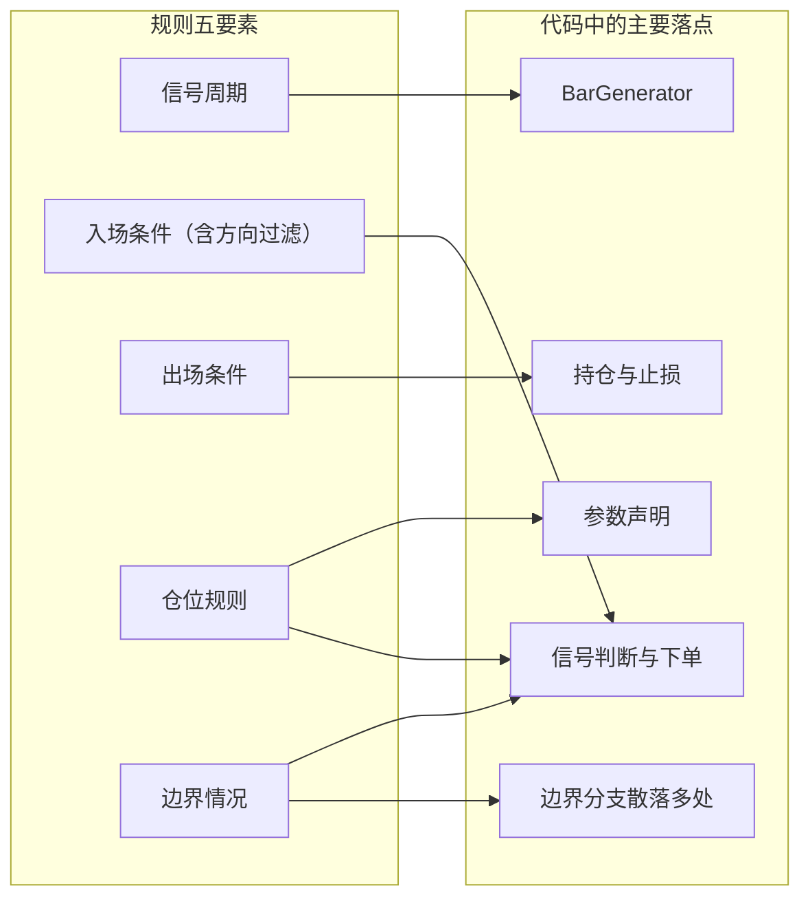

# 【CTA量化通关系列4 - 不会写代码，也要会读策略】

上一篇我们把回测要用的连续序列讲清楚了。规则清楚、数据就绪之后，可以把策略逻辑说明书交给 AI 生成一份 CTA 策略代码。实现门槛低了，核对有没有完整还原说明书，还是要人来做。

> **你不需要会写代码，但你必须看得懂自己的资金按什么规则在交易。**

本篇只做一件事：带着第 2 篇的布林带、Aroon 和 ATR 案例，对着说明书把落点找齐。

## 规则落在代码的哪五处

第 1 篇说过，阅读一份结构固定的 CTA 策略，通常比从零编写要容易。读的时候可以先记住一句：**代码是逻辑说明书的翻译。**

落点就是说明书某一条在代码里的对应位置。代码里有五个固定部件，对照时通常对到这五处，但是要注意：说明书里的某一条，不一定只落在一个部件里。

这五个部件具体是：参数、K 线合成、指标计算、信号判断和持仓管理。`on_tick`、`on_order`、`on_stop_order` 在本案例里只有空的函数壳，里面没有交易逻辑判断，可以先跳过——但要确认它们本来就是空的。

说明书里跟代码直接相关的内容，摘成六条放在这里，后面每一段都回到这张单子：

- 信号周期：1 分钟合成 15 分钟，指标和信号都在 15 分钟收盘后算。
- 方向过滤：Aroon 上升指标大于下降指标才做多，反过来才做空。
- 入场触发：无持仓时，以布林带上轨为多头触发价、下轨为空头触发价，价格触及即入场。
- 出场：1.5 倍 ATR 移动止损，开仓后极值只朝有利方向更新。
- 仓位：每次 1 手，持仓期间不加仓。
- 边界：方向不明不交易；已有持仓只管出场。

后两条尤其容易散落在好几处：手数既在参数里，也在下单数量上。下图只标主要落点，箭头不是一一对应。



生成出来的策略基于标准 `CtaTemplate`（CTA 策略模板），核心逻辑拆进了几个辅助函数。下面按这五处逐个对照。

### 参数：说明书里的数字，先出现在这里

布林带周期 20、宽度 1.7，Aroon 周期 20，ATR 周期 14，止损 1.5 倍，每次 1 手，合成周期 15 分钟，都写在策略类开头。

```python
# 策略参数
boll_window: int = 20       # 布林带周期
boll_dev: float = 1.7       # 布林带宽度
aroon_window: int = 20      # Aroon 周期
atr_window: int = 14        # ATR 周期
sl_multiplier: float = 1.5  # 止损的 ATR 倍数
fixed_size: int = 1         # 每次下单手数
interval: int = 15          # K 线合成周期（分钟）
```

先核对这几个数字和说明书是否一致。这一步花不了多少时间，也不该省。

紧跟着是 `parameters` 列表，收进去的参数可以在添加策略时由外部配置，后面选参时也会动到这些名字。

```python
# 参数名称列表：收进这里的参数可由外部配置
parameters = [
    "boll_window",
    "boll_dev",
    "aroon_window",
    "atr_window",
    "sl_multiplier",
    "interval",
]
```

列表里只收进六个参数名，比上面声明的参数少一个。

第一，`fixed_size` 不在其中。手数属于仓位管理，实盘由风控模块控制，不放进这份名单，后面选参也不会动它。

第二，`interval` 列在里面，但它决定的是合成周期，选参时也应固定。

除了参数，策略类开头还有 `boll_up`、`intra_trade_high`、`long_stop` 这类列在 `variables` 里的变量。它们跟参数不是一类，运行中会随行情和持仓变化，记住实时轨道、开仓后极值和当前止损价。

### K 线合成：15 分钟决策写进了哪里

第一条要求用 1 分钟合成 15 分钟。对应位置有两处：`on_init` 里创建的 `BarGenerator`（K 线合成器），以及 `on_bar` 回调。

```python
# on_init 中创建 K 线生成器：将 1 分钟 K 线合成 15 分钟 K 线
self.bg = BarGenerator(
    self.on_bar,
    window=int(self.interval),
    on_window_bar=self.on_15min_bar,
    interval=Interval.MINUTE,
)

def on_bar(self, bar: BarData) -> None:
    # 1 分钟 K 线只负责推入合成器，不在此处下单
    self.bg.update_bar(bar)
```

`window` 指定合成周期，`on_window_bar` 指定每走完 15 分钟调用哪个函数。`on_bar` 里只做 `update_bar`，说明 1 分钟线只负责送进合成器；若指标计算或发单写在这里，决策频率就和说明书对不上了。

### 指标计算：布林、Aroon、ATR 的数值从哪来

15 分钟 K 线回调 `on_15min_bar` 是策略主干：先把 K 线收进 `ArrayManager`（K 线序列与指标计算），算完指标，再按持仓状态分别处理。

```python
def on_15min_bar(self, bar: BarData) -> None:
    self.update_am(bar)
    if not self.am.inited:
        return

    self.calculate_indicators()

    if self.pos == 0:
        self.handle_no_position()
    elif self.pos > 0:
        self.update_long_position(bar)
    elif self.pos < 0:
        self.update_short_position(bar)

    self.put_event()    # 通知界面刷新策略状态
```

`pos` 是 CTA 引擎为该策略实例维护的逻辑净持仓：大于 0 为多，小于 0 为空，等于 0 为无仓，需要注意它和底层账户的实际持仓不一定一致。

这三个分支是仓位和边界这两条规则的主要落点：只有无持仓才会走到开仓函数，有仓时只更新止损。「不加仓」靠的就是这个结构，代码里没有专门写它的那一行。

`if not self.am.inited: return` 常被读成「K 线不够算指标」。其实是 `ArrayManager` 的缓存还没填满，填满之前不算指标也不下单。

这里容量设为 100，比最长的指标窗口大得多。`on_init` 里的 `load_bar(10)` 就是为此预加载历史 K 线。

```python
def calculate_indicators(self) -> None:
    # 布林带上下轨
    self.boll_up, self.boll_down = self.am.boll(
        int(self.boll_window), self.boll_dev
    )
    # Aroon 指标
    self.aroon_up, self.aroon_down = self.am.aroon(int(self.aroon_window))
    # ATR 指标
    self.atr_value = self.am.atr(int(self.atr_window))
```

要核对的是计算函数有没有传入前面声明的参数，以及 Aroon 的上、下两条有没有接反。

### 信号判断：方向过滤与入场触发

说明书把入场拆成方向过滤和入场触发。无持仓时，主干会调用 `handle_no_position`。

```python
def handle_no_position(self) -> None:
    # 取消上一周期可能残留的旧委托
    self.cancel_all()

    # 上升趋势更强，以布林带上轨为触发价开多
    if self.aroon_up > self.aroon_down:
        self.buy(self.boll_up, self.fixed_size, stop=True)

    # 下降趋势更强，以布林带下轨为触发价开空
    if self.aroon_down > self.aroon_up:
        self.short(self.boll_down, self.fixed_size, stop=True)
```

只有无持仓且 Aroon 给出明确方向时，策略才会往对应轨道挂单。两个指标数值相等时，多空两个分支都不会执行，这就是「方向不明不交易」。

参数 `stop=True` 表示发的是停止单：先在本地记着一个触发价，等价格真的触及才报出去。所以这里有两层时点——决策在 15 分钟收盘完成，成交可能落在下一根 15 分钟的盘中。

每根 K 线的轨道都在变，所以函数开头先 `cancel_all()` 撤掉旧单，再按新轨道挂出。

### 持仓管理：移动止损与成交极值

说明书只保留一条离场路径：1.5 倍 ATR 移动止损。多头持仓时调用 `update_long_position`。

```python
def update_long_position(self, bar: BarData) -> None:
    # 更新持仓期间最高价（只升不降）
    self.intra_trade_high = max(self.intra_trade_high, bar.high_price)

    # 按最新极值与 ATR 重算止损价，发送平仓停止单
    self.long_stop = self.intra_trade_high - self.sl_multiplier * self.atr_value
    self.cancel_all()
    self.sell(self.long_stop, self.fixed_size, stop=True)
```

`max` 让多头跟踪的最高价只升不降。空头一侧在 `update_short_position` 里用 `min` 跟踪最低价，平仓同样发停止单。止损价每根 K 线按最新极值和 ATR 重算一次，下一节把这一条完整对一遍。

有一条容易漏的细节：`intra_trade_high`（开仓后最高价）从哪里开始记？看成交回调 `on_trade`：

```python
def on_trade(self, trade: TradeData) -> None:
    # 开仓成交，把极值起点设为真实成交价
    if trade.direction == Direction.LONG and trade.offset == Offset.OPEN:
        self.intra_trade_high = trade.price
    elif trade.direction == Direction.SHORT and trade.offset == Offset.OPEN:
        self.intra_trade_low = trade.price
    # 平仓成交，重置极值记录
    elif trade.offset in (Offset.CLOSE, Offset.CLOSETODAY):
        self.intra_trade_high = 0.0
        self.intra_trade_low = 0.0

    self.put_event()
```

只有收到开仓成交回报时，才把成交价作为跟踪起点，平仓后归零。如果过早用发单前的 K 线高点初始化，或者平仓后不重置，上一笔的极值就会带到新一笔止损里。

## 把移动止损完整对一遍

部件找齐以后，用一条容易对不上的，把核对做完。第 1 篇举过例子：策略说明要求 1.5 倍 ATR 移动止损，代码里可能变成固定止损，两种写法都能跑完回测，交易行为却已经不是一回事。

说明书这一条是：持仓后启用移动止损，距离为 1.5 × ATR（周期 14），多头跟踪开仓后最高价、空头跟踪最低价，价格触及则平仓。

对着代码按顺序检查：
- ATR 周期是不是 14、倍数是不是 1.5——看参数声明与 `calculate_indicators`。
- 极值起点是不是从开仓成交算起——看 `on_trade` 用没用 `trade.price`。
- 多头用最高价、空头用最低价——看 `max` 与 `min`。
- 平仓用的是不是停止单，多头 `sell`、空头 `cover`。
- 每根新 K 线更新时，有没有先撤掉旧止损单——看 `cancel_all()`。

这几处对上了，说明书这一条就算落到代码里了。先看极值有没有顺势更新；止损价按「极值 − 1.5 倍 ATR」每根重算，就够了。

对不上时，常见的走样就是第 1 篇那个例子：极值不再更新，或者开仓后只算一次、后面不再改，虽然看起来仍然有止损，但跑的已经是固定止损。

## 在 Fusion 里打开生成代码

前面找落点的读法，换一个编辑器也一样。下一步就是在智策投研里打开生成出来的文件。确认逻辑之后，流程会生成一份和开源版同一套结构的 `CtaTemplate` 策略文件。

第一步，在智策工作台打开智策投研。确认逻辑之后，流程会接着生成代码，并可能自动往下走；打开「策略代码」页，确认文件已经出来即可。


第二步，点「打开策略文件」，不要从文件顶上逐行读。先找参数与 `parameters`，再看 `on_15min_bar` 的主干，最后看 `handle_no_position`、`update_long_position` 与 `on_trade`。

止损倍数这个参数，正文摘录里叫 `sl_multiplier`，有的生成稿会写成 `atr_stop_multiplier`。对的是数字 1.5，不是名字本身。


## 本篇小结

- 读 CTA 策略，核心是核对说明书的翻译。对之前先把准备核对的规则摘成一张单子。
- 五个部件给出找落点的地图；边界规则按单子逐条找，不要按部件凑条目。
- 移动止损至少要核周期、倍数、成交初始化、极值方向，以及更新前有没有撤旧单。
- 智策投研能生成标准 `CtaTemplate` 文件；翻译有没有走样，仍要人来看。

## 接下来讲什么

说明书对完了，代码写得出来，回测也能跑。接下来要当心的，是那些不会报错的坑——曲线好看，实盘却对不上。

下一篇：AI 写的策略，能运行不等于能信。

---

> VeighNa Fusion 是韦纳软件面向期货公司推出的标准化期货量化交易平台，本系列文中演示均基于 Fusion 内置功能完成，如希望了解详情，请扫描下方二维码添加小助手交流：


