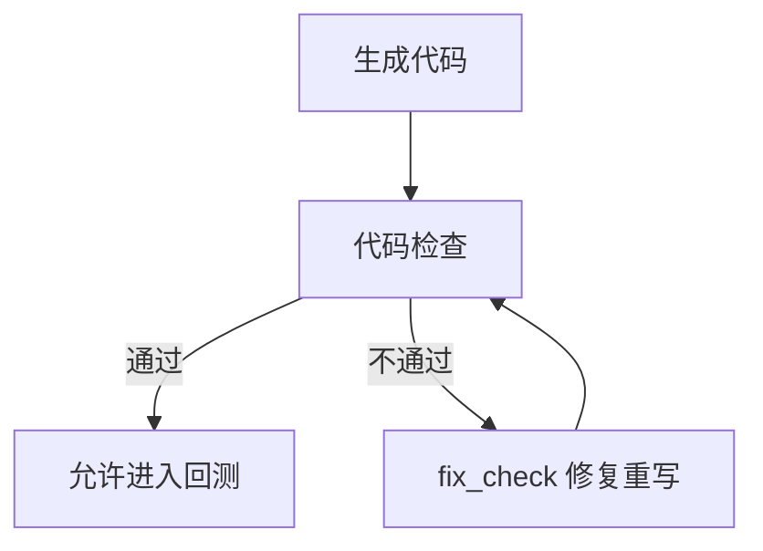

# 【CTA量化通关系列5 - AI写的策略，能运行不等于能信】

<!--
生产备忘（发布前删除）：
- 检查项事实来自 vnpy_fusion/agent/cta/checker.py：run_all() 依次执行 ruff format →
  py_compile → ruff check → mypy（--ignore-missing-imports），四项全为静态检查，
  无任何交易逻辑校验。软件改版后须复核本段与截图。
- 门禁循环事实来自 workflow/policy.py：CHECK_CODE 不通过 → WRITE_CODE(fix_check) → 再检；
  通过后才进入 RUN_BACKTEST；重试次数有上限（MAX_RETRIES）。
- 协议引用出自 fusion_terms.md「特别提示」第 3 条与「四、AI功能特别说明」。正文为转述加短引，
  发布前请合规确认引用方式与措辞。
- 开篇承接第 4 篇核对示范（能跑完 ≠ 翻译对；常见走样是移动止损变固定止损），
  不再使用「ATR 放大导致止损价下移」作为偏差例。
- 平昨（CLOSEYESTERDAY）是第 4 篇留下的扣子，本篇兑现；事实见 vnpy/trader/converter.py。
- 两处代码为教学用反面示例，已在正文明确标注，不得写成或暗示为 AI 生成产物。
- 配图：A 门禁图 1 张 + B 清单卡 1 张 + C 3 张，合计 5 张（不含文末二维码），已到上限，
  再加图须先删 A。C 类须与第 2、4 篇同一 task_id。
  待产出：pics/review_checklist.png（B，提示词见系列大纲第十一节，留公众号水印位）、
  pics/check_code.png、pics/fix_check.png、pics/check_passed.png。
- 若「检查通过进入回测」那张截图带绩效数字，图注须加「历史回测结果不代表未来表现」。
-->

上一篇对着说明书把移动止损对了一遍：对得上，翻译就在；对不上，常见走样是变成固定止损。回测两种都能跑完，资金按的已经不是同一套规则。

这类问题有个特点——它们不报错。格式规范，类型正确，回测跑得完，报告该有的数字一个不少。想找出它们，只能靠人拿着规则一条条比对。

> **AI 生成的策略代码，最危险的不是跑不起来的，而是跑得起来但逻辑是错的。**

Fusion 的用户协议把这件事写成了条款：AI 输出可能存在错误、遗漏、偏差，「即使相关逻辑、代码、检查结果、回测结果……能够被软件展示、保存、运行或通过部分校验，亦不当然代表其正确、完整、合规或适用于实盘」。翻成大白话是：能跑、能存、能通过检查，都不是「对」的证据。

本篇把这类问题归成五类，再收成一份可以照着走的审查清单。每类错误怎么改代码不展开，哪个 AI 模型更聪明也不比较。

## 五类典型错误

### 未来函数：提前看到了答案

考试时如果能提前看到答案，成绩一定很好，但那个成绩不代表你会做题。回测里也有这种事：策略用了当根 K 线走完之后才知道的信息，去决定这根 K 线里怎么下单。

第 4 篇那份代码把布林带上轨作为触发价提前挂出停止单，等价格自己撞上来。如果改成下面这种写法，就成了未来函数。

```python
# 反面示例，不要这样写
if bar.high_price > self.boll_up:      # 用这根 K 线的最高价判断
    self.buy(bar.open_price, 1)        # 却按这根 K 线的开盘价成交
```

一根 K 线的最高价，要等它走完才知道；开盘价出现在最前面。判断用的是后来才有的信息，成交用的是最早的价格，等于先看答案再下注。回测曲线会好得不像话，实盘一分钱也赚不到。

这类错误在实盘不会报错，只会安静地失效——你以为策略退化了，其实它从来没有过那个能力。

**判断用到的数据，必须在下单那一刻已经存在。** 停止单之所以不算未来函数，是因为触发价在上一根 K 线收盘时就挂出去了，价格触及才成交，先后顺序是对的。

### 逻辑翻译偏差：和说明书差一层

第 4 篇整篇讲的就是这一类，这里只把它归位。移动止损写成固定止损、大于写成大于等于、「触及」写成「突破」，都属于这一类：代码本身没毛病，它执行的只是另一条规则。

这类偏差最难靠工具发现，因为工具不知道你想要什么。办法只有拿说明书逐条问代码，一条对一处落点。上一篇那份六条单子，就是为此准备的。

### 撮合假设错误：以为这个价一定能成交

回测引擎的撮合是简化模型。限价单只要后续价格碰到就算成交，不排队、不看对手盘有多少；涨跌停时盘口可能有价无量，回测照样给你成交。

一个常见写法是把限价单挂在刚刚收盘的那个价上，回测成交率接近百分之百，实盘经常挂不上。要核对的是下单方式和取价：用的是限价、市价还是停止单，价格取自哪一根 K 线。另外看一眼回测设置里的滑点是不是留成了 0，滑点该设多少，下一篇细说。

### 指标误用：参数张冠李戴，数据不够就算

一种情形是窗口参数接错了对象，比如把布林带的周期传给了 ATR。

```python
# 反面示例，不要这样写
self.atr_value = self.am.atr(int(self.boll_window))   # 应该是 atr_window
```

代码照跑，数值全错，回测也出得来。核对办法很朴素：把每个指标和它自己的参数名一个个对上。

另一种是数据还不够就开始算。指标库在样本不足时返回 `nan`（非数值），而 `nan` 参与任何比较都为假——`if self.aroon_up > self.aroon_down` 永远不成立，策略于是安静地不交易，日志里也看不出异常。

第 4 篇提过的 `if not self.am.inited: return` 就是这道保护。除了确认它在，还要确认缓存容量和预加载的历史 K 线够不够把它填满。

### 状态管理错误：策略记的和实际发生的不一样

策略靠几个变量记住「我现在是什么状态」，只要有一个分支没被覆盖，后面就全错。

第 4 篇留了个扣子：那份代码在成交回调里重置极值时，只处理了「平」和「平今」两种情形。上期所的持仓分今仓和昨仓，平昨的成交回报带的是另一种标记，这个分支不会被执行。

后果是上一笔交易的最高价留在了变量里，下一笔开仓后的止损位置从第一根 K 线起就偏了。回测里通常碰不到，实盘会。

同类的还有重复下单：每根 K 线都挂新的停止单，却忘了先撤旧的，活跃委托越堆越多。还有策略记的持仓和账户实际持仓对不上——`pos` 是引擎维护的逻辑净持仓，实盘遇到部分成交、撤单失败、手工平仓时，两者可能分道扬镳。

找这类问题要反着问：每个状态变量，在什么情况下不会被更新。

## 一份可以照着走的清单

把五类错误收敛成九个问题。拿到一份生成的策略代码，从上往下问一遍。

1. 每一处判断用到的数据，在下单那一刻是否已经存在。
2. 下单价格取自哪根 K 线的哪个价，它是否早于判断依据。
3. 说明书的每一条，能不能在代码里指出对应位置。
4. 边界怎么取：大于还是大于等于，触及算不算。
5. 每个指标传进去的窗口参数，是不是它自己的那一个。
6. 数据不足时有没有 return 保护，缓存容量和预加载够不够。
7. 下单用的是限价、市价还是停止单，回测滑点是否留成了 0。
8. 状态变量在所有分支下都会被更新吗，包括平今和平昨。
9. 每次发新单之前，旧委托撤了吗。

有一条答不上来，就先别让它碰实盘资金。这九问不要求你会写代码，只要求你能指着代码回答「这一条落在哪」——第 4 篇的五个落点，就是这张清单的地图。


## 把检查做进流程里

九问是人做的事。工具能做的那一部分，也该有人替你做掉。

在 VeighNa Fusion 里，智策投研生成代码之后不会直接去回测，中间有一道「代码检查」门禁：不通过就退回上一步重写，改完再检，通过了才允许进入回测。



我们把这道门禁实际检的项目数了一遍，一共四项：`ruff format` 统一代码格式，`py_compile` 确认语法能编译，`ruff check` 查代码规范，`mypy` 查类型标注对不对。四项里没有一项在看交易逻辑。

这道门禁的职责很清楚：只回答这份代码能不能正常跑起来。它跑的是不是你要的那条规则，门禁看不出来，也不该由它来判。前面那九问，仍然要人来过。两道关各管一段，谁也替不了谁。

第一步，在智策工作台等流程走到「代码检查」，看清检查了哪几项、结论是什么。


第二步，若某一项不通过，流程会自动回到生成代码环节做修复重写，再回来重检。


第三步，检查全部通过之后，流程才允许进入回测。


把验证做成流程里的一道关卡，好处是它不依赖人的自觉。

## 本篇小结

- 能运行、能通过检查、能出回测报告，三件事都不能证明逻辑是对的。
- 五类错误里未来函数最隐蔽：判断用到的数据，必须在下单那一刻已经存在。
- 九问清单不要求会写代码，只要求能指着代码说出每条规则落在哪。
- 工具管能不能跑，人管对不对，两道关不能互相替代。

## 接下来讲什么

代码过了门禁，逻辑也人工核对过，接下来就是看回测。可回测报告自己也会骗人：区间挑得巧、成本设得松，一条平庸的策略照样能画出漂亮的资金曲线。

下一篇：回测很好看，先别急着相信。

---

> VeighNa Fusion 是韦纳软件面向期货公司推出的标准化期货量化交易平台，本系列文中演示均基于 Fusion 内置功能完成，如希望了解详情，请扫描下方二维码添加小助手交流：


