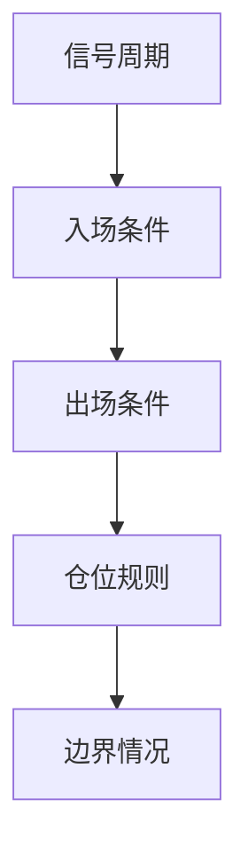
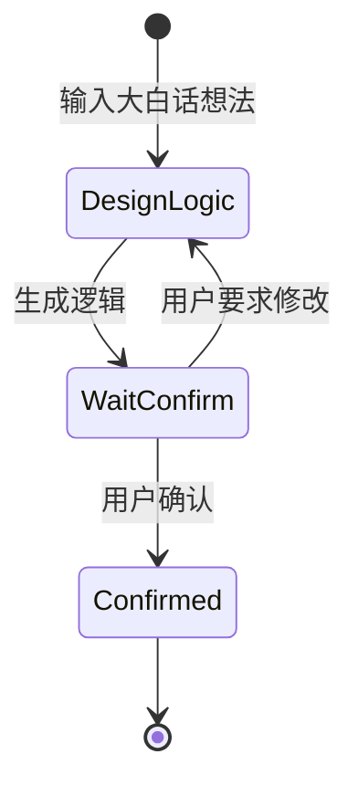
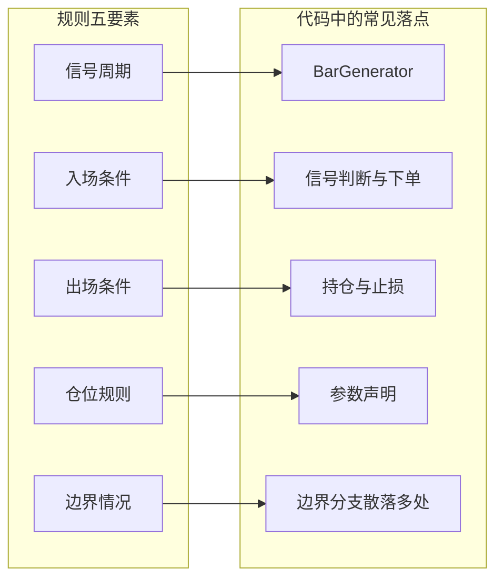
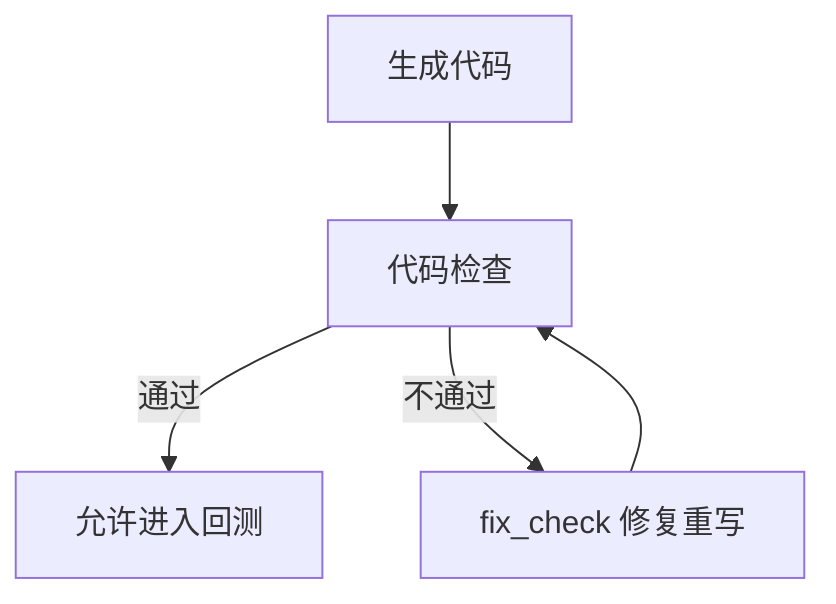
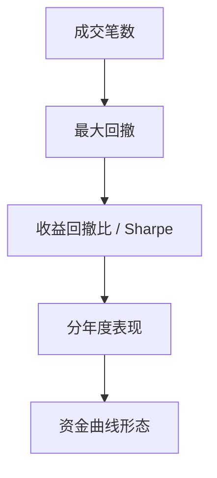
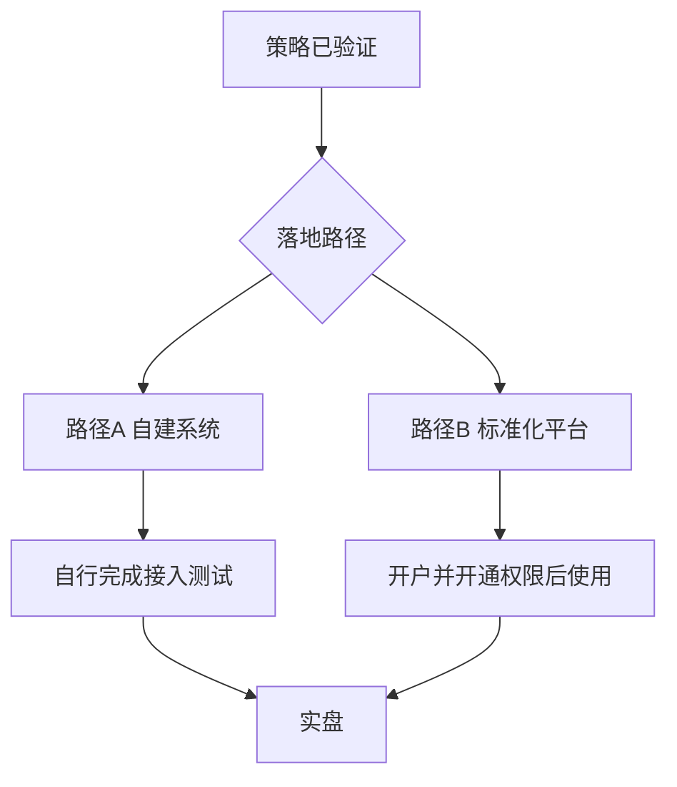

# 《CTA量化通关》系列文章大纲

> 本文档是系列文章的整体写作指导，面向后续执笔的同事。请在动笔前通读全文，动笔时逐篇对照「各篇详细大纲」执行。配图一律按「十一、配图生产规范」标注 A/B/C 三类来源。有疑问先查本文档的「素材与代码锚点」，再向产品团队确认。
>
> **规范来源**：通用文风与用语规范以 `article/alpha/outline.md`（「反 AI 味与用语规范」及验收清单）为**唯一来源**；本大纲只保留 Fusion 产品命名、贯穿案例、各篇知识结构与配图专项。两边冲突时，先同步规范再继续写作，不得各写各的。

---

## 一、系列定位与目标

### 商业目标

配合公司业务推广重点 **VeighNa Fusion**（期货公司采购后提供给其经纪客户的标准版期货量化平台），通过公众号内容吸引更多潜在用户关注并尝试 Fusion。

### 内容目标（写作时的第一优先级）

**每一篇文章必须让读者在量化知识上有实际收获，即使他不使用 Fusion。** 这是软文成立的前提：知识是主菜，产品是餐具。读者判断一篇文章是不是广告，看的是"删掉产品部分后文章还成不成立"——我们要求删掉后依然是一篇合格的量化科普。

### 目标读者画像

- 有期货交易经验（主观交易为主），对量化/程序化感兴趣但没入门；
- 编程能力弱或为零，被"要先学 Python"劝退过；
- 会被"AI 帮你写策略"吸引，但同时对 AI 半信半疑；
- 关心"到底怎么开始"：数据哪来、代码怎么写、回测怎么看、实盘要办什么手续。

### 系列主线（贯穿所有篇目）

**"从一个交易想法到程序化实盘"的完整旅程 + "每一步如何验证、如何不骗自己"的可信度视角。**

这条主线有一个天然优势：Fusion 内置**智策工作台**（投研流程页为**智策投研**）的工作流步骤（生成逻辑 → 确认逻辑 → 生成代码 → 代码检查 → 执行回测 → 优化规划 → 执行优化 → 选择参数）本身就是一条标准的量化方法论教学路线。系列按这条路线推进，产品演示自然嵌入，无需硬性插入。

### 产品正式命名（对外强制）

| 层级 | 对外名称 | 说明 |
|------|----------|------|
| 菜单 | 智策 | 主菜单文案 |
| 窗口 / 入口 | 智策工作台 | `setWindowTitle` / 菜单项 |
| 投研流程 Tab | 智策投研 | 生成逻辑→确认→代码→回测→优化 |
| 问答 Tab | 智策助手 | 辅助问答 |

正文、图注、配图说明一律使用上表；`Agent` / `workflow` / `CTA Agent` **仅**出现在第八节内部代码锚点，不对读者使用。

---

## 二、软文写作总原则

1. **80/20 结构**：每篇约 80% 篇幅讲通用量化知识（工具中立口吻，"无论你用什么平台"），约 20% 篇幅是"这一步在 Fusion 里实际操作长这样"的演示段（仅用第十一节 **C 类** Fusion 实机截图）。演示段集中出现，不要把产品名撒满全文。
2. **产品作为案例载体，不作为论点**：正文论证只依赖量化知识本身；Fusion 只在"落地演示"环节出现。禁止出现"Fusion 比 XX 更好"式的比较句。
3. **不贬低开源版**：统一口径为两条路径——开源版 VeighNa 适合想自己掌控全栈的开发者；Fusion 适合想先跑通流程的交易者。策略代码同为 CTA 模板（`CtaTemplate`），两边互通，用户可以随时进阶。这样既不伤害开源社区读者感情，也给 Fusion 用户"不会被锁死"的安全感。
4. **反"AI 躺赚"叙事**：全系列的差异化人设是"负责任的量化教育者"。反复传递：AI 降低的是实现门槛，不是思考门槛；AI 的输出必须验证（这也与 Fusion 用户协议中"AI 输出需独立审查验证、未经充分验证不得直接实盘"的条款一致，可以正面引用为知识点）。
5. **观念钩子**：每篇设计一句可被单独转发的观点句（详见各篇大纲的「钩子句」），用于文章开头或加粗强调，提升转发率。
6. **篇末固定产品段 + 预告**：见下文「统一产品说明文案」。连载读者第二次看到会自动跳过，不反感；新读者恰好需要。

---

## 三、文风与格式规范

句式配额、加粗≤5、单段≤150、用语对照表、活人感禁虚构、朗读测试等：**全部以 `article/alpha/outline.md` 为准**，本大纲不重复抄写，以免双端漂移。

本系列额外强制：

- **单篇不超过 3000 字**（不含代码块与图注）。硬上限，不放宽。
- 开篇 2～3 段交代背景 + 承接上一篇 + 本篇任务；语气正式、可读，避免口号堆砌。
- 产品名、模块名保留英文（VeighNa Fusion、`CtaTemplate`、`ArrayManager` 等），首次出现紧跟中文解释；AI 投研入口用「智策工作台 / 智策投研」。
- 术语首次出现给一句话定义；**系列已定术语见下文「三·附」**。
- **品类术语口径**：正文以「CTA量化」「CTA量化策略」为主；「期货」仅用于机构名、合约知识、法规表述。CTA 定义在第 1 篇给出，后篇直接使用。
- **人称**：统一「我们」；读者内心独白中的「我」不受限。
- 每篇写清「本篇不展开什么」；篇末小结 + 下一篇预告 + 统一产品说明段。
- 统一对外链接（按需）：<https://www.vnpy.com/docs/cn/index.html>、<https://www.vnpy.com/forum/>。
- 生产纪律放 HTML 注释，**成稿发布前删除**；操作截图除 `![alt]` 外须有读者可见的步骤说明句。

### 三·附、系列已定术语

| 宜用 | 禁用或不对外使用 |
|------|------------------|
| 智策 / 智策工作台 / 智策投研 / 智策助手 | CTA Agent（读者可见文案） |
| 指数连续 | 指数合约（易与股指期货混淆） |
| 迅投「加权合约」（正文说明：本文归入指数连续一类） | 将 `JQ00` 与主力连续 `00` 混为一谈 |
| 前复权主力连续 / 后复权主力连续 | 含糊统称「复权数据」而不分前后 |
| \(\mathrm{Gap}=\text{新主力价格}-\text{旧主力价格}\) | 未说明方向的「价差」；勿把开盘/收盘升格为系列通用口径 |
| 翻译成、写清楚、下单 | 译成、写死、动手（下单义） |
| 主力连续 ≠ 任何一张真实挂牌交易的合约 | 与第 1/3 篇已发布口径冲突的近义改写 |

### 三·附、成稿状态（截至第 3 篇）

| 篇 | 状态 | 成稿路径 |
|----|------|----------|
| 1 | 已定稿 | `article/fusion/1_introduction.md` |
| 2 | 文字定稿；智策投研 C 类截图待实跑替换 | `article/fusion/2_logic.md` |
| 3 | 已定稿 | `article/fusion/3_continuous.md` |
| 4～8 | 未成稿；须遵守本大纲与第 2 篇确认稿基线 | — |

### 统一产品说明文案（每篇文末固定段，克制、不展开）

> VeighNa Fusion 是韦纳软件面向期货公司推出的标准化期货量化交易平台，本系列文中演示均基于 Fusion 内置功能完成，如希望了解详情，请扫描下方二维码添加小助手交流：

（后接 `pics/qrcode.png`。与第 1 篇成稿口径一致；若商务/合规另有定稿，全系列同步替换，不逐篇改写。）

---

## 四、合规红线（全系列强制）

1. **禁止任何收益承诺或暗示**：不出现"稳定盈利""跑赢""年化 XX%"等表述；展示回测结果时必须注明"历史回测结果不代表未来表现"。
2. **回测演示数据口径**：所有截图中的回测结果只用于说明"报告怎么读"，不用于证明"策略赚钱"。优先选择结果平庸甚至亏损的案例——这反而强化"验证"主题的可信度。
3. **AI 表述**：不写"AI 自动帮你赚钱"，统一为"AI 辅助策略投研开发"；明确 AI 输出需人工确认与验证（与用户协议一致）。
4. **监管相关内容（第 8 篇重点）**：涉及《期货程序化交易管理办法》、程序化交易报备、系统接入测试等表述，发布前必须过合规审核；"Fusion 免去接入测试环节"的准确口径必须与合作期货公司确认后才能成文，写作时先用占位标注 `【口径待确认】`。
5. **不冒用期货公司名义**：不点名任何具体期货公司，统一说"合作期货公司"。

---

## 五、系列结构总览（8 篇）

| 篇 | 标题方向 | 知识主体 | Fusion 落点 | 角色 |
|----|----------|----------|-------------|------|
| 1 | 想做量化，到底从哪开始 | 量化入门路径总览 | 全景一瞥（轻） | 引流开篇 |
| 2 | 你的交易想法，机器看不懂 | 策略想法规则化方法论 | 生成逻辑 → 确认逻辑 | 方法论 |
| 3 | 连续合约没搞对，回测结论靠不住 | 期货连续合约知识 | 数据中心 | 数据 |
| 4 | 不会写代码，也要会读策略 | CTA 策略标准结构 | 生成代码产物 | 代码 |
| 5 | AI写的策略，能运行不等于能信 | AI 代码审查方法 | 代码检查 + 自动修复 | 验证 |
| 6 | 回测很好看，先别急着相信 | 回测指标与成本假设 | 执行回测产物 | 验证 |
| 7 | 参数越调越完美，越要警惕过拟合 | 过拟合与参数选择 | 优化规划/执行/选参 | 验证 |
| 8 | 策略准备好了，实盘还有合规门槛 | 监管流程与通道知识 | 免接入测试、开户即用 | 转化收口 |

**递进逻辑**：第 1 篇负责拉新和立人设；第 2～7 篇严格按「想法 → 数据 → 代码 → 验证 → 优化」的投研流程推进，同时对应智策投研工作流步骤，形成连载节奏；第 8 篇在信任建立后才亮出最硬卖点（免接入测试、开户即用），完成转化。

**合规回写依赖**：第 8 篇「接入测试 / 权限 / Fusion 路径」口径一经确认，必须回写进第 1 篇工具路径表述与成稿 `1_introduction.md`，不得只改终篇。

**发布节奏建议**：每 1～2 周一篇，全系列跨度约 2～4 个月；第 8 篇可配合业务推广节点（如期货公司渠道活动）灵活调档。

**若需压缩为 6 篇**：合并第 4、5 篇（"看懂并审查 AI 生成的代码"），合并第 6、7 篇（"读懂回测与参数优化"）。第 1、8 篇不可删。

---

## 六、各篇详细大纲

### 第 1 篇：想做量化，到底从哪开始

**一句话定位**：给"想做量化但不知道从哪开始"的期货交易者一张全景路线图，顺带预告整个系列。

**读者带走的东西**：知道做程序化交易需要跨过哪几道坎（想法规则化、数据、代码、回测验证、合规实盘），以及每道坎的难度到底在哪。

**钩子句**：做量化的第一道坎不是编程，而是把"我感觉能赚钱"翻译成机器能执行的规则。

**发布标题**：【CTA量化通关系列1 - 想做量化，到底从哪开始】

**章节展开（约 2500 字）**：

1. **开篇（约 400 字）**：从一个典型场景切入——手动盯盘的交易者错过行情/扛单被套，萌生"让程序帮我执行"的念头；点出"量化不神秘，它就是把纪律交给机器"。
2. **五道坎（约 1200 字，本篇核心）**：本节开头配【配图 B：五道坎路线图收藏卡】（规则 → 数据 → 代码 → 验证 → 实盘；适合转发收藏；源码草稿见第十一节，也可先用 A 类 flowchart 导出再美化）；随后逐条展开，每条 200 字左右，只讲"这道坎是什么、难在哪"，不讲怎么过（留给后篇）：
   - 坎一：把想法变成规则（多数人卡在这，不是卡在代码）；
   - 坎二：搞到能用的数据（期货合约会到期，回测数据没那么简单）；
   - 坎三：把规则变成代码（AI 时代这道坎在快速变矮）；
   - 坎四：验证它真的有效（回测会骗人，这是最容易自欺的一步）;
   - 坎五：合规上实盘（程序化交易有监管要求和接入流程）。
   - 每条结尾用一句话预告"本系列第 X 篇展开"。
3. **工具路径的选择（约 500 字）**：介绍两条路径——自己搭开源工具链（VeighNa 开源版，适合有开发能力者）vs 使用期货公司提供的标准平台（Fusion，适合先跑通流程者），两条路径的差异用对比表格呈现（环境搭建 / 获取方式 / 费用 / 自由度 / 适合人群），中立陈述；本系列演示将基于 Fusion，但知识本身与工具无关。**一个产品演示段、两张实机图**：【配图 C：Fusion 主界面】（成稿 `pics/main.png`）+ 【配图 C：智策工作台 / 智策投研工作流全景】（成稿 `pics/agent.png`）。
4. **小结 + 系列预告（约 300 字）**：列出全系列篇目清单，配【配图 B：系列 8 篇目录卡】利于收藏转发，预告第 2 篇。

**Fusion 落点**：仅在第 3 节出现一次；该演示段内 **C 类实机图 2 张**（主界面 + 智策工作台全景）。**本篇克制是全系列成立的关键，产品露出不得超过此范围（一个演示段，勿再增段）。**

**不写什么**：不展开任何单个知识点的细节；不讲收益案例；不做开源版与 Fusion 的功能对比表。

**执行注意**：五道坎的排序就是系列目录，写作时必须与后篇实际内容对齐；若后篇结构调整，本篇需同步修改。第 8 篇合规口径确认后，本节「路径 B / 开户即用」表述须与终篇及成稿同步回写。

---

### 第 2 篇：你的交易想法，机器看不懂

**一句话定位**：教读者把主观交易思路拆解成机器可执行的规则；确认逻辑是 AI 时代交易员的核心工作。

**读者带走的东西**：规则化五要素框架（信号周期、入场、出场、仓位、边界情况）+ 一份可模仿的「策略逻辑说明书」范例。

**钩子句**：AI 时代交易员的核心工作不是写代码，而是确认逻辑。

**发布标题**：【CTA量化通关系列2 - 你的交易想法，机器看不懂】

**成稿**：`article/fusion/2_logic.md`（文字定稿；智策投研 C 类截图待实跑替换）

**章节展开（约 2800 字）**：

1. **开篇**：承接第 1 篇「坎一」；反例——「均线金叉就做多」看似规则，实则漏掉周期、确认时机、手数、离场等隐藏前提；程序可能用你从未同意过的默认假设继续跑。
2. **规则化五要素框架（本篇核心）**：配【配图 A：规则化五要素 flowchart】。
   - 信号周期：决策频率 vs 数据粒度；1 分钟合成 15 分钟的常见做法。
   - 入场：过滤（方向）与触发（价格动作）分层；趋势过滤 + 突破触发。
   - 出场：至少一条离场路径；多条时写清优先级。
   - 仓位：入门固定手数，控制变量。
   - 边界情况：「不交易 / 不加仓」本身就是规则。
3. **贯穿案例 → 说明书**：口头版（布林带 20/1.7 + Aroon 20 + ATR14×1.5 移动止损，1m→15m，1 手）→ 按五要素填满的说明书；点明说明书是第 4～7 篇唯一核对底稿。
4. **Fusion 演示段（C 类 2～3 张）**：智策工作台 → 智策投研；输入大白话 → 生成逻辑 → **等待你确认**（必截）。可选【配图 A：生成逻辑→确认 stateDiagram】。对外一律称智策，不称 Agent。
5. **小结 + 预告**：预告第 3 篇数据坎。

**不写什么**：不讲代码（第 4 篇）；不论案例是否赚钱（第 6 篇）；指标原理各一句话即可。

**执行注意**：五要素命名与顺序全系列锁定。智策投研确认稿若与说明书语义有出入，**以确认稿为准回写说明书，并同步第 4～7 篇**。第 4～7 篇不得另起一套逻辑基线。

---

### 第 3 篇：连续合约没搞对，回测结论靠不住

**一句话定位**：讲清为何需要连续合约，以及指数连续 / 前复权 / 后复权的用途差异与跨平台对不上的原因。

**读者带走的东西**：能按用途选序列类型；明白跨软件价格不一致时先查类型与构造规则；会在 Fusion 数据中心完成「下载 → 重建 → 核验 `90/91/92`」。

**钩子句**：你回测用的那根「主力连续」K 线，在真实市场上从来没有存在过。

**发布标题**：【CTA量化通关系列3 - 连续合约没搞对，回测结论靠不住】

**成稿**：`article/fusion/3_continuous.md`（已定稿；大纲以下结构须与成稿一致）

**章节展开**：

1. **开篇**：承接第 2 篇；股票有较完整价格史，期货合约到期退市——回测三年用什么？点明主力连续是研究用构造序列，不是真实挂牌合约。
2. **换月跳空**：旧/新主力价差 → 直接拼接的假跳空 → 对趋势信号与权益记账的干扰。配【配图 B：换月拼接跳空示意】（成稿用 `pics/rollover_gap_schematic.png`）。连续合约须同时回答：如何拼出长样本、如何处理缺口。
3. **两类问题 → 三类序列（本篇核心）**：
   - 指数连续：多合约持仓量加权概括品种整体；**勿称「指数合约」**；不可当成交价。
   - 前复权主力连续：保留当前真实价、平移历史（Panama）；CTA 回测优先；3500/3600 示例。
   - 后复权主力连续：保留较早历史价、平移较新价格；适合长期路径，最新端未必是盘面价。
   - 对比表（保留什么 / 更适合 / 不能直接做什么）。
   - 短公式：先定义 \(t,t_k\)，再以独立公式块给出 \(\mathrm{Gap}_k=\text{新}-\text{旧}\)，随后前/后复权 \(P'_t\)；白话注释即可。开盘/收盘取价属平台细节，不升格为系列通用口径。开篇不写「复权只给必要公式」类边界句（与正式发表稿一致）。
   - 负价：写「价差同向累积；累计为负时才可能近零/负」；**禁止**「升水→负价」简化因果。并说明重建后全历史数值可变。
4. **主力怎么切换**：只解释为何各家主力连续可能不同（商品 1.1 倍持仓、金融双第一、次日生效、只向远月）。关键句：先确认是否同一类型；若都是主力连续，再核主力判定 / 换月时点 / 复权规则。**不要用「切换频率」解释跨平台指数代码差异。**
5. **Fusion 数据中心演示**：
   - `90` 指数 / `91` 前复权 / `92` 后复权表；后文回测对齐 `rb91.SHFE`。
   - 跨平台指数连续对照：`rb90.SHFE` / RQData `RB99` / 迅投「加权合约」`rbJQ00.SF`（正文归入指数连续一类）。**大纲与正文均不引入 `889`。**
   - 三步须有读者可见步骤句 + C 类图：①下载入库 ②重建连续 ③列表核验 `rb90/91/92`。
   - 纪律：只下载、不重建 → 可能仍跑旧连续；分月与连续是两层数据。
6. **小结 + 预告**：预告第 4 篇读代码。

**不写什么**：不展开 Panama 证明；不讲 Tick；不做数据商评测；不把 `JQ00` 与主力连续 `00` 混谈。

**执行注意**：`90/91/92` 是平台内约定，首次须说明。已定稿后改口径须先改成稿再改本大纲。

---

### 第 4 篇：不会写代码，也要会读策略

**一句话定位**：以贯穿案例生成代码为教材，讲清 CTA 模板结构；让不会编程的读者能按图核对翻译是否忠实。

**读者带走的东西**：知道参数、信号、下单与止损分别落在代码何处；心智模型——「代码是逻辑说明书的翻译」。

**钩子句**：你不需要会写代码，但你必须看得懂自己的钱按什么规则在交易。

**发布标题**：【CTA量化通关系列4 - 不会写代码，也要会读策略】

**章节展开（约 2800 字）**：

1. **开篇**：承接第 3 篇；写代码可借助工具，读代码与确认责任不能外包（呼应第 2 篇钩子）。
2. **CTA 策略的五个固定部件（本篇核心）**：对照第 2 篇确认稿 / 说明书与真实生成代码逐块讲解；节首配【配图 A：规则五要素在代码中的落点对照】（源码见第十一节）。讲解落点，不要求「部件与要素机械一一对应」：
   - 参数与变量声明 → 可调旋钮（第 7 篇优化对象）；也承载仓位手数等；
   - `BarGenerator` → 信号周期（1m→15m）；
   - `ArrayManager` → 指标数值（布林/Aroon/ATR）；
   - 信号判断与下单 → 入场（及部分边界：无持仓才开仓等）；
   - 持仓管理与止损 → 出场；边界中的「不加仓 / 方向不明不交易」可能散落多处，核对时按说明书条目找，不按部件凑数。
   - 教学主线：**规则五要素在代码中的落点对照**——读代码 = 核对翻译是否忠实。
3. **核对示范**：拿说明书核对「1.5×ATR 移动止损」落点。翻译偏差优先取自统一实验档案真实生成产物中的实际出入；若产物无明显偏差，仅可使用**明确标注为「假设示例」**的偏差作教学，**不得**改真实代码后冒充 AI 输出。可为第 5 篇留扣，但留扣材料须遵守同上纪律。
4. **Fusion 演示段（C 类 2 张）**：【配图 C：智策投研「生成代码」产物】、【配图 C：代码预览】；说明产物为标准 `CtaTemplate`，与开源版通用。
5. **小结 + 预告**：预告第 5 篇典型错误。

**不写什么**：不逐行讲完全部代码；不教 Python 语法；不展开全部回调。

**执行注意**：代码截取必须来自第七节统一实验档案中的真实产物；每段 ≤15 行。逻辑基线以第 2 篇确认稿为准，不得另起炉灶。

---

### 第 5 篇：AI写的策略，能运行不等于能信

**一句话定位**：系统讲解 AI 生成策略代码的典型错误类型和人工审查清单，是全系列"验证"主题的第一篇。

**读者带走的东西**：一份可执行的"AI 策略代码审查清单"（【配图 B：审查清单卡】，利于传播收藏）；理解"能运行 ≠ 正确"。

**钩子句**：AI 生成的策略代码，最危险的不是跑不起来的，而是跑得起来但逻辑是错的。

**发布标题**：【CTA量化通关系列5 - AI写的策略，能运行不等于能信】

**章节展开（约 2900 字）**：

1. **开篇（约 300 字）**：承接第 4 篇留下的"翻译偏差"扣子；引用行业共识与 Fusion 用户协议的表述——AI 输出可能存在错误、遗漏、偏差，必须独立审查验证后才能用于实盘。把合规条款转述为知识点，树立负责任形象。
2. **AI 策略代码的五类典型错误（约 1400 字，本篇核心）**：每类给"是什么 + 一个具体例子 + 怎么发现"：
   - 未来函数：用了当根 K 线收盘后才知道的信息做当根决策（如用收盘价判断信号却假设能以开盘价成交），回测无敌、实盘失效——这是必讲的头号错误，解释要通俗；
   - 逻辑翻译偏差：说明书与代码不一致（移动止损变固定止损、大于写成大于等于），靠第 4 篇的核对方法发现；
   - 撮合假设错误：默认限价单一定成交、忽略停板与流动性；
   - 指标误用：周期参数张冠李戴、指标数据不足时（启动初期）未做保护；
   - 状态管理错误：持仓变量与实际仓位脱节、重复下单。
3. **审查动作清单（约 500 字）**：把五类错误收敛成 8～10 条"拿到代码后依次核对"的清单条目，做成【配图 B：AI 策略代码审查清单卡】（留公众号名称水印位）。
4. **Fusion 演示段（约 400 字 + 【配图 C】2～3 张）**：智策投研内可先配【配图 A：代码检查门禁循环】（源码见第十一节）；再截【配图 C：代码检查】、【配图 C：fix_check 修复后再检】、【配图 C：检查通过进入回测】。强调——**把"验证"做进流程里，而不是靠用户自觉**。同时明确：机器检查不能替代人工确认逻辑，两道关各管一段。总配图超过 5 张时优先保留 B 清单卡与 C，删减 A。
5. **小结 + 预告（约 300 字）**：预告第 6 篇——"代码过关了，回测报告里的数字又该怎么读？"

**不写什么**：不展开每类错误的代码级修复方法；不讨论具体 AI 模型的能力差异；不做"AI vs 人工写码"的优劣论。

**执行注意**：未来函数的例子必须打磨到零基础读者能懂，建议用"考试时提前看到答案"类比；【配图 B：审查清单卡】是本篇的传播资产。

---

### 第 6 篇：回测很好看，先别急着相信

**一句话定位**：教读者正确解读一份回测报告：核心指标各自回答什么问题、哪些数字容易骗人、成本假设如何影响结论。

**读者带走的东西**：看回测报告的固定动线（先看什么后看什么）；知道总收益是最不重要的数字之一；理解手续费、滑点假设对结论的影响量级。

**钩子句**：一份回测报告里，总收益率是最先看到、也最不值得看的数字。

**发布标题**：【CTA量化通关系列6 - 回测很好看，先别急着相信】

**章节展开（约 2900 字）**：

1. **开篇（约 300 字）**：承接第 5 篇；用贯穿案例的真实回测结果开场（有意选取平庸或亏损的区间结果，呼应合规红线第 2 条）。
2. **指标解读动线（约 1200 字，本篇核心）**：节首配【配图 A：回测报告阅读动线】（源码见第十一节）；按推荐阅读顺序讲解，每个指标回答一个问题：
   - 成交笔数：样本够不够？几十笔交易的回测统计上说明不了任何事；
   - 最大回撤：你拿不拿得住？把回撤换算成资金金额和回本所需涨幅，给读者体感；
   - 收益回撤比 / Sharpe：赚得稳不稳？一句话解释即可，不展开公式；
   - 分年度/分阶段表现：是不是靠某一段行情撑起来的？
   - 资金曲线形态：阶梯式、平滑式、过山车式各说明什么。
3. **成本假设：回测与实盘之间的鸿沟（约 700 字）**：
   - 手续费：按真实费率设置，讲清高频交易策略对费率的敏感度；
   - 滑点：什么是滑点、为什么必须设、设多少合理（按品种最小变动价位给经验值）；
   - 演示"同一策略，滑点从 0 调到 1 跳"的结果对比——【配图 C：滑点 0 回测报告】与【配图 C：滑点 1 跳回测报告】对照；这个对比实验是本篇最有传播力的部分；
   - 提醒：回测撮合是简化模型（不考虑排队、部分成交），回测通过只是必要条件。
4. **Fusion 演示段（约 300 字 + 上节 C 类图复用或补【配图 C：执行回测统计页】）**：指出智策投研任务创建时设定费率、滑点、合约乘数；鼓励用统一实验档案只改滑点跑两次对照。
5. **小结 + 预告（约 400 字）**：给出"回测报告阅读清单"，可选【配图 B：阅读清单卡】；预告第 7 篇——"回测不理想，调参数就好了吗？"

**不写什么**：不展开统计显著性检验；不讲组合层面的绩效归因；不给任何"好策略的指标标准值"（只给阅读方法，不给及格线，避免误导）。

**执行注意**：滑点对比必须真实跑出两份【配图 C】；所有回测截图统一加"历史回测结果不代表未来表现"图注。

---

### 第 7 篇：参数越调越完美，越要警惕过拟合

**一句话定位**：讲清参数优化的正确用法与过拟合陷阱：优化的目的是找稳健区域，不是找历史最优点。

**读者带走的东西**：理解过拟合的直觉（参数越调越好 = 越来越像在背答案）；掌握"参数平原 vs 参数尖峰"的判断方法；知道选参数的正确标准。

**钩子句**：如果一组参数只在回测里表现完美，那它大概率只是最懂历史的参数，而不是最懂市场的参数。

**发布标题**：【CTA量化通关系列7 - 参数越调越完美，越要警惕过拟合】

**章节展开（约 2800 字）**：

1. **开篇（约 300 字）**：承接第 6 篇；场景切入——回测平庸，把布林带周期从 20 调到 23 突然变好了，这是发现还是幻觉？
2. **过拟合的直觉（约 700 字）**：用"考试背答案"类比讲透：参数组合越多、数据越短，撞上"恰好完美"参数的概率越高;强调这不是 AI 或工具的问题，是所有回测优化的固有陷阱。
3. **参数平原 vs 参数尖峰（约 800 字，本篇核心）**：
   - 尖峰：周期 23 很好、22 和 24 都很差 → 大概率过拟合，不可用；
   - 平原：周期 18～26 表现都不错 → 策略逻辑对参数不敏感，相对可信；
   - 配参数-绩效分布图——优先【配图 C：根据优化结果整理的参数分布图】（从贯穿案例优化产物导出后自行绘图，图注写「根据优化结果整理」）；若暂无数据可用【配图 B：平原 vs 尖峰示意】并注明「示意图」；
   - 引申：选参数时选平原中央，而不是全局最高点。
4. **优化的操作纪律（约 500 字）**：
   - 只优化少数关键参数（3 个以内），参数越多过拟合越快；
   - 优化目标用收益回撤比等综合指标，别用总收益；
   - 留出一段没参与优化的数据做样本外检验（讲直觉即可，不展开 walk-forward 的完整方法论，注明属于进阶话题）。
5. **Fusion 演示段（约 300 字 + 【配图 C】2～3 张）**：智策投研内可先配【配图 A：优化规划→执行→选参】（源码见第十一节）；再截【配图 C：优化规划】、【配图 C：执行优化结果】、【配图 C：选择参数与推荐理由】——强调选参逻辑是找稳健组合，最终确认权在用户。总张数超 5 则删 A 或减 C。
6. **小结 + 预告（约 200 字）**：预告第 8 篇（终篇）——"策略准备好了，实盘的手续和门槛怎么过？"

**不写什么**：不展开遗传算法等优化算法原理；不讲多参数联合优化的高级技巧；不给"最优参数"的任何具体推荐值。

**执行注意**：参数分布图优先真实优化产物；不得用 B 类假 UI 冒充 Fusion 优化界面。

---

### 第 8 篇：策略准备好了，实盘还有合规门槛（转化收口篇）

**一句话定位**：讲清个人投资者做期货程序化交易的监管要求与落地流程，并自然引出 Fusion"开户即用"的路径价值。

**读者带走的东西**：知道《期货程序化交易管理办法》对个人程序化交易者的核心要求（报备、权限、系统接入）；理解"系统接入测试"是什么、为什么自建系统时它是最繁琐的一环；知道两条落地路径怎么选。

**钩子句**：从回测到实盘，最后一公里不是技术问题，是流程问题。

**发布标题**：【CTA量化通关系列8 - 策略准备好了，实盘还有合规门槛】

**章节展开（约 2800 字）**：

1. **开篇（约 300 字）**：承接第 7 篇，本系列旅程走到最后一步；点明本篇是流程与合规科普。
2. **监管框架科普（约 900 字）**：《期货程序化交易管理办法》（2025 年施行）对个人程序化交易者的核心要求，逐条通俗解释：程序化交易报备（报什么、向谁报）、交易权限申请、技术系统要求。**本节全部内容发布前必须过合规审核**，写作时以官方文件和期货业协会公开材料为依据，标注来源。
3. **系统接入测试是什么（约 600 字）**：解释自建/自装量化系统接入期货公司柜台前需要完成的测试流程（功能测试、连通性验证等）、大致周期和需要投入的精力;客观陈述这是监管对交易系统安全性的合理要求，但对非技术背景的个人投资者构成实际门槛。`【口径待确认：接入测试的具体流程描述需与合作期货公司核对】`
4. **两条实盘路径（约 600 字，转化核心段）**：节首配【配图 A：两条实盘路径】（源码见第十一节）。
   - 路径 A：自建系统（开源 VeighNa + 自行完成接入测试）——适合有开发能力、想完全掌控的用户；
   - 路径 B：使用期货公司提供的标准化平台（Fusion）——平台由期货公司统一采购部署，用户开户并申请开通程序化交易权限后即可使用，无需单独走系统接入测试流程，也无需额外付费。`【口径待确认：免接入测试的表述以合作期货公司及合规确认为准】`
   - 中立陈述后给出建议：新手先走路径 B 跑通全流程，有了实践经验后再决定是否自建。策略代码两边通用，路径切换成本低。
   - 【配图 C】本篇非必须；若需要最多 1 张，且不得挤占科普篇幅。
5. **实盘前的最后检查（约 400 字）**：给一份"实盘前自检清单"收束全系列——逻辑经过人工确认（第 2 篇）、数据正确（第 3 篇）、代码经过审查（第 4/5 篇）、回测含真实成本（第 6 篇）、参数取自平原（第 7 篇）、权限与报备完成（本篇）。做成【配图 B：实盘前自检清单卡】，同时作为全系列内容总结。
6. **系列小结（约 300 字）**：回顾八篇旅程;引导语——"如果你想按本系列的流程亲手走一遍，可以了解你所在期货公司是否提供 VeighNa Fusion"；欢迎留言交流。

**不写什么**：不解读监管条文细节与罚则；不点名具体期货公司；不承诺开通时效。

**执行注意**：本篇是全系列唯一以转化为主要目的的文章，但写法上仍保持"流程科普为主体"；两处 `【口径待确认】` 未确认前不得发布；发布时间可配合业务推广节点调整。

---

## 七、贯穿案例与统一实验档案

全系列使用同一个策略案例，保证连载连续感。

### 逻辑基线（唯一）

- **口头版**：1 分钟合成 15 分钟；布林带（20，1.7）；Aroon（20）判方向——升势强等突破上轨做多，降势强等跌破下轨做空，方向不明不交易；固定 1 手；持仓后 1.5×ATR（14）移动止损。
- **说明书定稿**：以第 2 篇成稿 `2_logic.md` 中的五要素说明书为准；若智策投研确认稿与之冲突，先回写第 2 篇说明书，再同步第 4～7 篇。
- **第 4～7 篇禁止**另起策略逻辑、另换指标组合或另换核对底稿。
- 案例来源：Fusion 仓库 `README.md` 测试用想法（内部已验证智策投研全流程可跑通）。

### 统一实验档案（第 2、4～7 篇共用同一智策任务）

执笔前用贯穿案例在智策投研完整跑通（逻辑 → 代码 → 检查 → 回测 → 优化），归档下列字段；第 2、4～7 篇中来自智策投研的截图与数字必须可追溯到**同一任务**。

| 字段 | 约定 |
|------|------|
| 策略版本 | 与第 2 篇确认稿一致的那次生成代码（记下 task_id / 文件哈希或保存路径） |
| 回测合约 | `rb91.SHFE`（前复权主力连续；与第 3 篇同品种） |
| 合约乘数 | 写作前锁定并记入档案（如螺纹钢 10 吨/手，以当时合约规格为准） |
| 最小变动价位 | 写作前锁定（如螺纹钢 1 元/吨）；滑点「1 跳」按此换算 |
| K 线周期 | 1 分钟入库，策略内合成 15 分钟（与说明书一致） |
| 样本内区间 | 用于回测主报告与第 7 篇优化的起止日期（写作前锁定） |
| 样本外区间 | 未参与优化的预留区间（写作前锁定；第 7 篇样本外检验用） |
| 手续费 | 记清计费方式（按手数 / 按成交金额比例等）与具体数值；全系列同一套 |
| 滑点 | 基准设置写入档案；第 6 篇对照实验只改滑点、其余不变 |
| 初始资金 | 全系列统一（写作前锁定） |
| 第 7 篇优化参数及范围 | 列出拟优化参数名、搜索范围与步长（≤3 个关键参数）；与说明书参数名一致 |
| 任务产物目录 | `~/.cta_agentic/tasks/<task_id>/`（或当时环境等价路径） |
| C 类截图（智策） | 第 2、4～7 篇按第十一节清单存档；操作步骤须有读者可见「第 N 步」说明句 |

**C 类来源分流（验收强制）**

| 篇 | C 类来源 |
|----|----------|
| 2、4～7 | 上表统一实验任务（智策投研产物） |
| 1、3 | 真实 Fusion 环境实机截图，**单独留存来源说明**（路径/拍摄日期/环境）；不要求落入智策 task 目录 |

第 1 篇成稿示例：`pics/main.png`、`pics/agent.png`。第 3 篇成稿示例：数据中心三步截图（见 `3_continuous.md`）。

A/B 类图可并行准备，**不得用 B 替代 C**。

---

## 八、素材与代码锚点（内部备忘，不出现在文章中）

- 智策投研工作流（代码层仍名 agent）：`vnpy_fusion/agent/workflow/model.py`（`FlowStep`：DESIGN_LOGIC / CONFIRM_LOGIC / WRITE_CODE / CHECK_CODE / RUN_BACKTEST / PLAN_PARAMS / RUN_OPTIMIZE / SELECT_PARAMS；`CodeMode`：create / fix_check / fix_backtest；状态文案「等待你确认」）
- UI 命名：`智策` / `智策工作台` / `智策投研` / `智策助手`（对外文案以此为准）
- 测试用策略想法：Fusion 仓库根目录 `README.md`
- 参考策略：`vnpy_fusion/agent/reference/`（`boll_channel_strategy.py` 等）
- 数据中心：`vnpy_fusion/datahub/README.md`（`90/91/92`、主力切换双轨、Panama、仅手动重建）；跨平台指数连续对照见第 3 篇成稿（`rb90` / `RB99` / `rbJQ00`），**勿在正文引入 `889`**
- Gap（**Fusion 实现，已按代码/README 核实**）：`vnpy_fusion/datahub/continuous.py` 在生效日取双方 `first_open`，`gap = open_new - open_old`；旧侧缺失时回退判定日 open / 此前 last close（见 `datahub/README.md`）。**系列对外只写** \(\mathrm{Gap}=\text{新主力价格}-\text{旧主力价格}\)，开盘/收盘不得写入正文或术语表升格为通用口径
- 用户协议 AI 条款：`fusion_terms.md`「特别提示」与「四、AI功能特别说明」
- 无 UI 调试：`vnpy_fusion/agent/debug/README.md` → `~/.cta_agentic/tasks/<task_id>/`
- 监管背景：2025 年第 5 次社区活动【期货程序化交易管理办法详解】

---

## 九、反「AI 味」与用语（本系列不重复维护）

**唯一来源**：`article/alpha/outline.md` 中「反「AI 味」与用语规范」及「篇末验收清单」。

本大纲仅补充 Fusion 专项：

- 对外产品名见第一节「产品正式命名」；句式/加粗/段长/活人感等配额以 alpha 大纲为准；
- 活人感细节须来自真实运行：第 2、4～7 篇优先用统一实验档案；第 1、3 篇可用各自 Fusion 实机操作中的真实细节。禁虚构「第一次跑」故事；
- 配图 A/B/C 规则见第十一节；正文不得照搬本大纲的规格书排版。

---

## 十、质量验收清单（每篇发布前逐条核对）

通用句式、加粗、段长、朗读测试等与 alpha 大纲验收清单对齐；本系列另核：

1. 删掉所有 Fusion 相关段落后，文章仍是一篇完整成立的量化科普；
2. 单篇 ≤3000 字（硬上限）；产品演示段占比 ≤20%；
3. 钩子句出现在开头或显著位置；对外无「CTA Agent」等内部名；
4. 术语符合「三·附、系列已定术语」；首次出现有一句话解释；
5. 有「本篇不展开什么」的边界说明；
6. 篇末有小结 + 下一篇预告 + 统一产品说明段；
7. 回测相关截图带「历史回测结果不代表未来表现」图注；
8. 无收益承诺/暗示；无贬低开源版或其他工具；
9. 涉及监管内容已过合规审核；第 8 篇口径确认后已回写第 1 篇（若适用）；
10. C 类来源符合第七节分流：第 2、4～7 篇可追溯统一实验 task；第 1、3 篇有单独 Fusion 实机来源说明；操作截图有读者可见步骤句；
11. 第 2、4～7 篇逻辑/合约/区间/费率等与第 2 篇确认稿 + 统一实验档案一致；
12. alpha 大纲中的句式配额、加粗≤5、单段≤150、活人感、朗读测试均已勾选；
13. 配图 3～5 张且标注 A/B/C；A 类 Mermaid 已 Preview 通过；B 未冒充 UI；演示段只用 C；
14. 生产用 HTML 注释已在发布前删除。

---

## 十一、配图生产规范（全系列强制）

正文配图只有三种合法来源。知识讲解优先 A/B；Fusion 演示段只用 C；**禁止用生成图冒充软件界面**。

### 1. 三类来源总表

| 类型 | 适用内容 | 生产方 | 正文落稿形态 |
|------|----------|--------|--------------|
| **A. Mermaid 流程图** | 流程、分支、状态机、步骤对照 | 执笔人在 `.md` 写源码；Cursor Preview 核对 | 公众号发图前导出为 PNG/SVG（微信不渲染 Mermaid） |
| **B. 多模态生成图** | 概念卡、路线图、清单卡、示意对比（非软件 UI） | Cursor 或其他多模态模型按提示词生成 | 直接插图；统一风格、去掉无关水印 |
| **C. Fusion 实机截图** | 产品演示段、回测报告、智策投研步骤、数据中心 | 见第七节「C 类来源分流」 | 必须来自真实 Fusion 环境；第 2、4～7 篇另须落入统一实验任务 |

占位写法：`【配图 A：五道坎路线】` / `【配图 B：审查清单卡】` / `【配图 C：等待你确认】`。

**操作截图纪律（读者可见）**：凡分步操作的 C 类图，`![alt]` 之外须另有正文步骤句（如「第一步……」「第二步……」）；`alt` 不等于可见图注，不能只靠 alt 交代步骤。

### 2. A 类：Mermaid（须能在 Cursor 渲染）

**硬性约束**

1. 只用 Cursor Markdown Preview 稳定支持的图种：`flowchart`、`sequenceDiagram`、`stateDiagram-v2`；少用 `gitGraph`、`C4`、复杂 `classDiagram`。
2. 节点 ID 用英文/拼音短词（如 `step1`、`confirm_logic`）；展示文字用中文，放在 `[]` / `()` 内。
3. 避免：大段 `style` 主题色、复杂 `%%{init:...}%%`、HTML 嵌套、emoji、过长边标签；`<br/>` 可偶用。
4. 单图节点建议 ≤12；分支超过 3 条则拆成两张图。
5. 大纲或正文写「【配图 A：…】」时，**须附完整可渲染的 Mermaid 源码**，不能只写文字描述。
6. 验收：Cursor 打开该 md → Markdown Preview → 无报错再定稿；发布前再导出为位图插入公众号。

**源码模板（flowchart）**

````markdown

````

**全系列推荐 A 类图与源码草稿**

**第 1 篇｜五道坎路线（可与 B 类收藏卡二选一；若要和后文智策投研对照则用本图）**


**第 2 篇｜规则化五要素**



**第 2 篇｜智策投研：生成逻辑后停下来等人确认**



**第 4 篇｜规则五要素在代码中的落点对照**



**第 5 篇｜代码检查门禁循环**



**第 6 篇｜回测报告阅读动线**



**第 7 篇｜优化三步**


**第 8 篇｜两条实盘路径**



### 3. B 类：多模态生成图

**适合**：转发收藏卡、概念示意、清单海报、换月跳空示意、参数平原 vs 尖峰示意（非真实数据时图注须写「示意图」）。

**禁止**：Fusion 窗口、回测数字、智策投研对话框、任何可被当成「实机界面」的假 UI；假收益率；仿冒品牌 Logo。

**提示词固定字段（生成时逐项填写）**

```text
用途：公众号配图 / 收藏卡
画幅：竖版 3:4 或方图 1:1（手机阅读）
风格：简洁信息图，白底或浅灰，少装饰，无杂乱 K 线
必须出现的文字：……（钩子句或清单条目原文，与正文一致）
禁止：假 UI、假收益率、品牌 Logo 仿冒、复杂仪表盘
```

**全系列推荐 B 类图**

| 篇 | 图名 | 说明 |
|----|------|------|
| 1 | 五道坎路线图收藏卡 | 规则→数据→代码→验证→实盘；适合转发；可与 A 类五道坎图二选一或 A 导出后美化 |
| 1 | 系列 8 篇目录卡 | 标题与大纲一致，利于收藏 |
| 3 | 换月拼接跳空示意 | 旧合约/新合约价格线 + 缺口标注 |
| 5 | AI 策略代码审查清单卡 | 本篇传播资产；设计留公众号名称水印位 |
| 6 | 回测报告阅读清单卡 | 与阅读动线条目一致 |
| 7 | 参数平原 vs 尖峰示意 | 若无真实优化可视化时使用；有真实产物则优先实绘并注明来源 |
| 8 | 实盘前自检清单卡 | 串联第 2～8 篇检查项，收束全系列 |

### 4. C 类：Fusion 实机截图

来源分流见第七节：第 2、4～7 篇与统一实验任务合并存图（不便时从 `~/.cta_agentic/tasks/<task_id>/` 取产物）；第 1、3 篇在真实 Fusion 环境单独截取并留存来源说明。

| 篇 | 必截张数 | 必截内容 |
|----|----------|----------|
| 1 | **2** | **一个产品演示段内两张实机图**：主界面（`main.png`）+ 智策工作台/智策投研全景（`agent.png`）；**本篇唯一产品露出段** |
| 2 | 2～3 | 智策投研：输入大白话 → 生成逻辑 → **「等待你确认」**（重点）；来自统一实验任务 |
| 3 | 2～3 | 数据中心三步（正文须有步骤句）：下载入库；重建连续；`rb90`/`rb91`/`rb92` 列表；单独留存来源 |
| 4 | 2 | 智策投研「生成代码」产物；代码预览（与正文代码截取互补） |
| 5 | 2～3 | 「代码检查」；`fix_check` 修复后再检；通过后才进入回测 |
| 6 | ≥2 | 回测统计页；**滑点 0 vs 1 跳** 对照两份报告（实验档案其余字段不变） |
| 7 | 2～3 | 优化规划 → 执行优化 → 选择参数（含推荐理由） |
| 8 | 0～1 | 可选；本篇以流程科普为主，截图非必须 |

**截图纪律**

1. 一律真实 Fusion 环境；第 2、4～7 篇另须可追溯统一实验 task。回测合约与第 3 篇对齐为 `rb91.SHFE`（数据中心演示可用同品种 `rb90/91/92`）。
2. 打码账户号、客户号等敏感信息。
3. 凡含回测绩效的截图，统一图注：「历史回测结果不代表未来表现」。
4. 优先选用结果平庸或亏损的区间（呼应第四节合规红线第 2 条）。
5. 不得用 B 类生成图替代本表中的 C 类必截项。
6. 分步操作图须配套读者可见的「第 N 步」说明句。

### 5. 各篇配图配额速查（写作时对照）

| 篇 | 建议构成（合计 3～5 张） |
|----|--------------------------|
| 1 | B 五道坎卡 + **C 实机 2 张**（主界面+智策全景，同一演示段）+ B 目录卡（可选再加 A；总张数控制在 3～5） |
| 2 | A 五要素 flowchart 必选；状态图可选；C 2～3 张；两张 A 都用时总计不超 5，超则先删状态图 |
| 3 | B 跳空示意 1 张 + C 2～3 张 |
| 4 | A 对照图 1 张 + C 2 张（代码以正文截取为主） |
| 5 | B 审查清单卡 1 张 + A 门禁图 1 张 + C 2～3 张（总张数超 5 则删 A 或减 C） |
| 6 | A 阅读动线 1 张 + B 清单卡可选 + C ≥2 张（含滑点对照） |
| 7 | A 优化三步 1 张 + B/实绘平原尖峰 1 张 + C 2～3 张（控制总张数） |
| 8 | A 双路径 1 张 + B 自检清单卡 1 张 + C 可选 0～1 张 |
