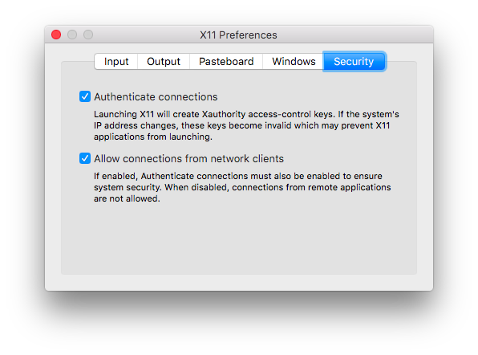

# VNPY GUI Docker 镜像

该镜像提供编译及运行 vnpy 的环境。

# 编译镜像

~~~sh
$ docker build . -t vnpy
~~~

# 运行镜像

执行 [run.sh](./run.sh) 以 vnpyuser 用户启动容器并且把 vnpy 项目目录挂载到容器的 /srv/vnpy 目录。

~~~sh
$ ./run.sh
vnpyuser@e6ad42871a34$ cd /srv/vnpy
vnpyuser@e6ad42871a34:/srv/vnpy$ bash ./install.sh
vnpyuser@e6ad42871a34:/srv/vnpy$ cd examples/VnTrader/
vnpyuser@4abb3834d129:/srv/vnpy/examples/VnTrader$ python run.py
~~~

# Mongodb 支持

// TODO : 数据保存到本地磁盘

* 容器内启动方法

~~~sh
$ docker exec -u 0 -it vnpy /bin/bash
$ mongod --smallfiles --config /etc/mongodb.conf
~~~

# Windows 支持

Windows 使用 [Xming](http://www.straightrunning.com/XmingNotes/) 作为 X11 服务器，安装配置网络连接之后启动 docker 容器。

# OS X 支持

由于 OS X 没有自带 X11 服务器，需要手动安装后并配置允许网络客户端连接.

* 安装 xquartz 作为 X11 服务器

~~~sh
$ brew cask install xquartz
~~~

* 打开 xquartz 并配置允许网络连接

* 执行脚本启动 docker

~~~sh
$ ./run.sh
~~~

参考博客 ： [docker-for-mac-and-gui-applications](https://fredrikaverpil.github.io/2016/07/31/docker-for-mac-and-gui-applications/)

