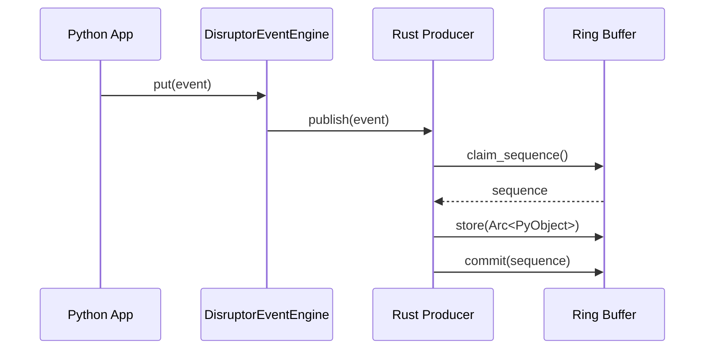
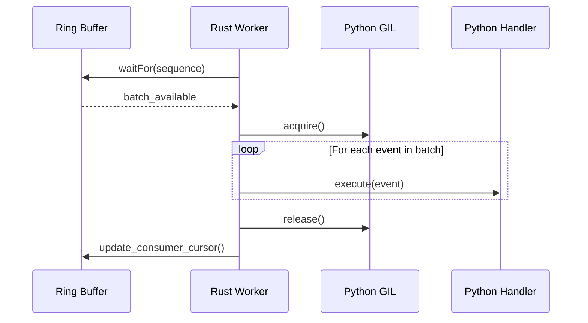

# High-Performance Event Engine Design

## 1. Architecture Overview

The Disruptor Event Engine replaces the standard Python `queue.Queue` with a high-performance, zero-copy ring buffer implemented in Rust.

### Data Flow
1. **Producer (Python)**: Calls `engine.put(event)`.
2. **Binding Layer (PyO3)**: Increments the reference count of the Python object and stores it as an `Arc<PyObject>` in the ring buffer.
3. **Wait Strategy (Rust)**: The background worker thread polls/waits for new events according to the selected strategy (`blocking`, `busy_spin`, etc.).
4. **Consumer (Managed Worker)**: Batches available events and acquires the GIL once per batch.
5. **Dispatcher (Python)**: Iterates through the batch and executes registered handlers.

## 2. Data & Code Flows

### Event Publication Flow

### Event Consumption Flow (Managed Worker)

## 3. Component Design

### 3.1 Rust Native Extension (`vnpy-disruptor`)
- **Core**: Uses the `disruptor-rs` crate for high-performance ring buffer management.
- **Worker**: A dedicated thread that manages the event loop, ensuring low latency by staying "hot" or parking efficiently.
- **Batching**: Implements a GIL-aware batching logic that minimizes the overhead of switching between Rust and Python.

### 3.2 Python Wrapper (`DisruptorEventEngine`)
- **Lifecycle**: Manages the instantiation of the native producer and worker.
- **Pre-start Queue**: Implements an `OrderedDict` to buffer events until `start()` is called, ensuring no events are lost during initialization.
- **Factory Integration**: Integrated into `MainEngine` via the `create_engine()` factory.

## 4. Concurrency & Sync
- **GIL Management**: The worker thread only holds the GIL when calling back into Python handlers.
- **Thread Pinning**: Supports optional CPU affinity for the worker thread to minimize context switching in high-performance scenarios.
 
+## 5. Queue Pattern & Concurrency Model
+
+| Pattern | Application in VeighNa | Rationale |
+| :--- | :---: | :--- |
+| **MPSC** | **Primary** | **Multi-Producer**: Gateways, Timer, and Apps. **Single-Consumer**: Sequential worker thread for state consistency. |
+| **MPMC** | **Capability** | Technically supported by the underlying Disruptor architecture, enabling future parallel consumption models. |
+
+### Producer-Consumer Analysis
+- **Producers**: Multiple independent threads (Gateways, MainEngine, Timer) publish events simultaneously. Lock-free `MultiProducer` ensures non-blocking publication even under high contention.
+- **Consumer**: A single managed worker thread dispatches events to Python handlers. This maintains the sequential consistency required by legacy trading logic while offloading the queue management to native Rust.

+## 6. Interface Parity: `try_put` vs. `put`
+
+The Disruptor implementation introduces a non-blocking `try_put()` method, which has been backported to the standard `EventEngine` for interface parity.
+
+### 6.1 Rationale: The "Log Sinking" Problem
+Standard `put()` operations block when the ring buffer (or queue) is full. This is desirable for market data (providing backpressure) but catastrophic for logging in two specific scenarios:
+
+1. **Self-Deadlock**: If a registered handler (running in the EventEngine worker thread) generates a log message while the buffer is saturated, a blocking `put()` will wait for space to be cleared. However, space can only be cleared by the worker thread itself, resulting in a permanent deadlock.
+2. **UI Responsiveness**: If the Main/GUI thread attempts to write a log during a high-volatility tick burst, a blocking `put()` will freeze the user interface until the engine catches up.
+
+### 6.2 Solution
+`try_put()` provides a non-blocking alternative that returns `False` if the buffer is full. Components like `MainEngine.write_log()` use this to safely drop non-critical logs or redirect them to `stderr`, ensuring the system remains responsive and deadlock-free under extreme load.

+## 7. Comparative Analysis: Unbounded Queue vs. Bounded Ring Buffer
+
+A critical distinction between the standard `EventEngine` and the `DisruptorEventEngine` lies in how they handle buffer saturation.
+
+### 7.1 Standard Engine (`queue.Queue`)
+- **Behavior**: The standard engine uses an **unbounded queue** (`maxsize=0`).
+- **Why no `try_put` was needed**: Since the queue is unbounded, `put()` technically never blocks. It will continue to allocate memory dynamically until the system runs out of RAM.
+- **Risks**: Under high-frequency bursts, the queue can grow silently to millions of items, leading to extreme "buffer bloat" (latency increases to seconds or minutes) and eventual OOM (Out of Memory) crashes.
+
+### 7.2 Disruptor Engine (`disruptor-rs`)
+- **Behavior**: The Disruptor engine uses a **bounded ring buffer** (fixed size, e.g., 65,536).
+- **Why `try_put` is mandatory**: When the ring buffer is full, the producer **must block** until the consumer (worker thread) processes events. This "backpressure" is essential for system stability but requires an explicit non-blocking path (`try_put`) for non-critical telemetry (logs) to prevent the self-deadlock and UI freeze scenarios described above.
+- **Benefits**: Deterministic memory usage, hardware-level cache locality, and explicit visibility into system saturation.
