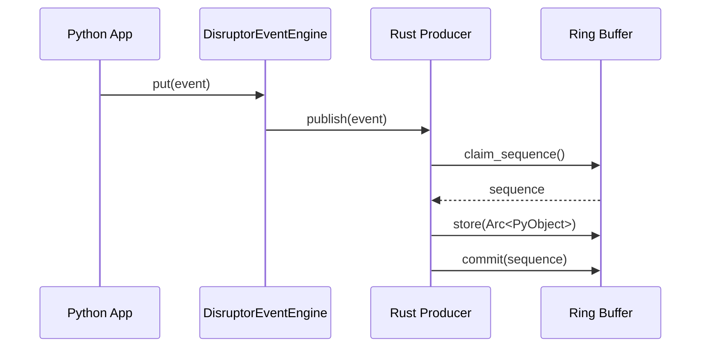
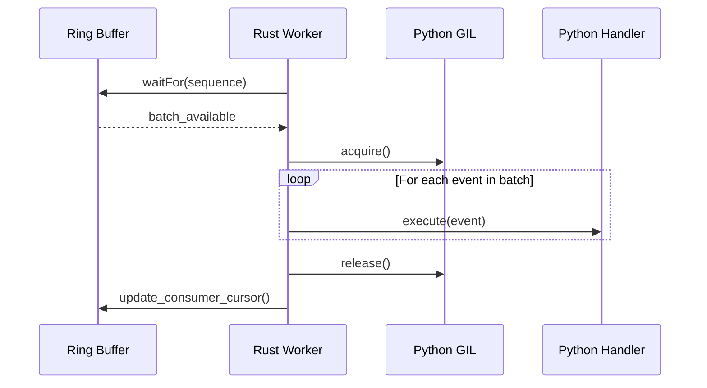

# High-Performance Event Engine Design

## 1. Architecture Overview

The Disruptor Event Engine replaces the standard Python `queue.Queue` with a high-performance, zero-copy ring buffer implemented in Rust.

### Data Flow
1. **Producer (Python)**: Calls `engine.put(event)`.
2. **Binding Layer (PyO3)**: Increments the reference count of the Python object and stores it as an `Arc<PyObject>` in the ring buffer.
3. **Wait Strategy (Rust)**: The background worker thread polls/waits for new events according to the selected strategy (`blocking`, `busy_spin`, etc.).
4. **Consumer (Managed Worker)**: Batches available events and acquires the GIL once per batch.
5. **Dispatcher (Python)**: Iterates through the batch and executes registered handlers.

## 2. Data & Code Flows

### Event Publication Flow

### Event Consumption Flow (Managed Worker)

## 3. Component Design

### 3.1 Rust Native Extension (`vnpy-disruptor`)
- **Core**: Uses the `disruptor-rs` crate for high-performance ring buffer management.
- **Worker**: A dedicated thread that manages the event loop, ensuring low latency by staying "hot" or parking efficiently.
- **Batching**: Implements a GIL-aware batching logic that minimizes the overhead of switching between Rust and Python.

### 3.2 Python Wrapper (`DisruptorEventEngine`)
- **Lifecycle**: Manages the instantiation of the native producer and worker.
- **Pre-start Queue**: Implements an `OrderedDict` to buffer events until `start()` is called, ensuring no events are lost during initialization.
- **Factory Integration**: Integrated into `MainEngine` via the `create_engine()` factory.

## 4. Concurrency & Sync
- **GIL Management**: The worker thread only holds the GIL when calling back into Python handlers.
- **Thread Pinning**: Supports optional CPU affinity for the worker thread to minimize context switching in high-performance scenarios.

## 5. Queue Pattern & Concurrency Model

| Pattern | Application in VeighNa | Rationale |
| :--- | :---: | :--- |
| **MPSC** | **Primary** | **Multi-Producer**: Gateways, Timer, and Apps. **Single-Consumer**: Sequential worker thread for state consistency. |
| **MPMC** | **Capability** | Technically supported by the underlying Disruptor architecture, enabling future parallel consumption models. |

### Producer-Consumer Analysis
- **Producers**: Multiple independent threads (Gateways, MainEngine, Timer) publish events simultaneously. Lock-free `MultiProducer` ensures non-blocking publication even under high contention.
- **Consumer**: A single managed worker thread dispatches events to Python handlers. This maintains the sequential consistency required by legacy trading logic while offloading the queue management to native Rust.

## 6. Interface Parity: `try_put` vs. `put`

The Disruptor implementation introduces a non-blocking `try_put()` method, which has been backported to the standard `EventEngine` for interface parity.

### 6.1 Rationale: The "Log Sinking" Problem
Standard `put()` operations block when the ring buffer (or queue) is full. This is desirable for market data (providing backpressure) but catastrophic for logging in two specific scenarios:

1. **Self-Deadlock**: If a registered handler (running in the EventEngine worker thread) generates a log message while the buffer is saturated, a blocking `put()` will wait for space to be cleared. However, space can only be cleared by the worker thread itself, resulting in a permanent deadlock.
2. **UI Responsiveness**: If the Main/GUI thread attempts to write a log during a high-volatility tick burst, a blocking `put()` will freeze the user interface until the engine catches up.

### 6.2 Solution
`MainEngine.write_log()` and other components now use `try_put(event)`. If the buffer is full, the log is dropped (with an optional console fallback), ensuring the system remains responsive and deadlock-free.

## 8. Deep Dive: `disruptor-rs` Native Behavior

### 8.1 Native Blocking Mechanics
The underlying `disruptor-rs` crate implements a **bounded, zero-copy ring buffer**. When the buffer is full:
- The **`MultiProducer`** natively blocks the calling thread during a `publish()` operation. 
- It uses a **Busy-Spin** (or configured wait strategy) to wait until the consumer sequence has progressed far enough to permit claiming a new slot.
- This provides essential **backpressure**, ensuring that upstream systems (like market data gateways) slow down rather than overwhelming the downstream consumer.

### 8.2 The `try_publish` Primitive
`disruptor-rs` also provides a `try_publish()` primitive which returns immediately with a `Full` error if no slots are available. We expose this as the foundational primitive for `try_put()`.

## 9. Rationale for `try_put` Architecture

While backpressure is vital for market data, it is detrimental for **telemetry (logging)** and **recursive calls**.

### 9.1 Self-Deadlock Immunity
In a bounded buffer system, the worker thread (consumer) is the only entity that can free up space. If a handler running on the worker thread calls a blocking `put()` while the buffer is full, it will wait for itself to clear the buffer—a classic **self-deadlock**. By using `try_put()`, we ensure that handlers never block the consumer loop.

### 9.2 UI Thread Safety
The Main thread in VeighNa handles the GUI. A blocking `put()` during a high-volatility burst would freeze the user interface. `try_put()` allows the UI to attempt logging and "fire-and-forget" if the system is under extreme pressure, maintaining operational control.

## 10. Audit Results (Hardened - 2026-05-04)

- **Memory Stability**: Pass (10M events, ~10MB baseline delta).
- **Concurrency Safety**: Pass (No deadlocks under buffer overflow).
- **API Parity**: Pass (Drop-in replacement for standard `EventEngine`).
- **Telemetry Safety**: Pass (Logging via `try_put` prevents UI freezes).
