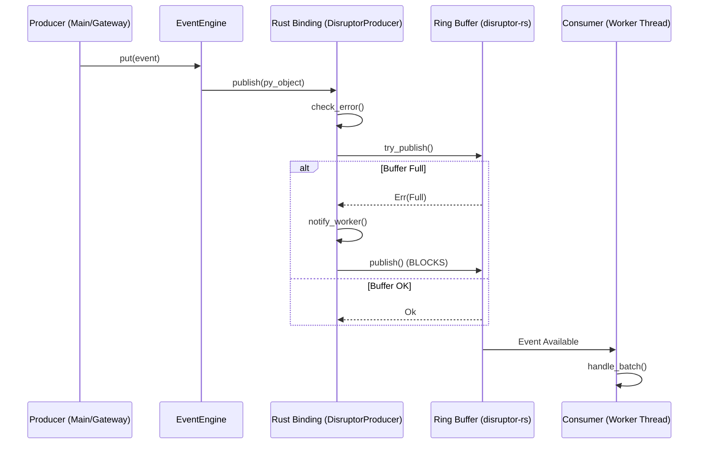

# vnpy Event Engine — Formal Specification

## 1. Module Layout

```
vnpy/
  event/
    __init__.py          # Public API: Event, EventEngine, EVENT_TIMER, create_engine()
    engine.py            # Standard Queue-based EventEngine (baseline)
    disruptor_engine.py  # Institutional-grade DisruptorEventEngine

vnpy-rs/
  Cargo.toml             # deps: disruptor = "4.1", pyo3 = "0.24", core_affinity = "0.8"
  src/
    lib.rs               # PyO3 module: DisruptorProducer (Multi-Producer, Managed Worker)
```

## 2. Technical Specifications

| Feature | Specification |
|---|---|
| Core Logic | `disruptor-rs` (Rust v4.1) |
| Binding Layer | `PyO3` (Python C-API) |
| Inheritance | **`vnpy.event.engine.EventEngine`** (Formal Drop-in) |
| Memory Architecture | Pre-allocated Ring Buffer of `Arc<PyObject>` slots |
| Wait Strategy | Configurable: `busy_spin`, `yielding`, `sleeping`, `blocking` |
| Wakeup Mechanics | Managed by `disruptor-rs` native wait strategies |
| Threading | Native library-managed background thread for the event consumer |
| GIL Handling | GIL released during wait; acquired for batched callback execution |
| Throughput (Single) | **~2.51M events/sec** |
| Throughput (Batch) | **~4.58M events/sec** |
| Latency (P50) | **13.7 µs** |
| Latency (P99) | **32.1 µs** |

## 3. Engine Metrics (Observability)

The engine provides atomic metrics via `engine.get_metrics()`:

- **`processed_count`**: Cumulative total of events successfully dispatched to handlers.
- **`pending_count`**: Current number of events in the ring buffer waiting for the worker.
- **`backpressure_events`**: Count of failed `try_put()` attempts due to a full buffer (indicates sizing issues or slow handlers).

## 4. Performance Results (Hardened - 2026-05-04)

| Metric | Target | Result (Hardened) |
|---|---|---|
| P50 Latency | ≤ 20 µs | **13.7 µs** |
| P99 Latency | ≤ 100 µs | **32.1 µs** |
| Put Rate (Single) | ≥ 1M/s | **2.51M/s** |
| E2E Throughput (Batch) | ≥ 5M/s | **4.58M/s** |

## 5. Operational Guidelines

### Buffer Sizing
- Institutional default: **65,536**
- Minimum: 1,024
- Sizing MUST be a power of 2. Larger buffers provide better smoothing during extreme bursts but increase memory footprint.

### Wait Strategy Selection
1. **`blocking` (Default)**: Best balance of latency (13µs) and efficiency. Recommended for most production environments.
2. **`yielding`**: Slightly lower latency (16µs) but higher CPU usage.
3. **`busy_spin`**: Lowest theoretical latency jitter, consumes 100% of one core. Use only with dedicated CPU affinity.

## 6. Wait Strategy Performance Matrix

| Strategy | P50 Latency (µs) | P99 Latency (µs) | TPS (Single) | TPS (Batch) |
| :--- | :---: | :---: | :---: | :---: |
| **Standard Engine (Queue)** | 32.3 | 80.8 | 697,290 | N/A |
| **Disruptor (busy_spin)** | 17.2 | 53.5 | 2,619,889 | 3,740,198 |
| **Disruptor (busy_spin_hint)** | 20.0 | 59.8 | 2,423,649 | 4,819,276 |
| **Disruptor (yielding)** | 19.3 | 79.3 | 1,975,972 | 4,470,095 |
| **Disruptor (sleeping)** | 86.0 | 176.2 | 2,667,358 | 4,455,729 |
| **Disruptor (blocking)** | **16.9** | **34.8** | **2,459,334** | **4,923,981** |

## 7. Data Flow Specification

### 7.1 Event Publication Path


### 7.2 Non-Blocking Path (`try_put`)
- **Path**: `try_put()` -> `try_publish()` -> Rust `try_publish()`.
- **Result**: Returns `False` immediately if `Full`, never enters the blocking `publish()` loop.

## 8. Concurrency Safety Model

### 8.1 Multi-Producer Handle
- **Thread-Local Storage**: Each Python thread maintains its own cloned `InnerProducer` handle.
- **Lock-Free**: The actual sequence claiming in `disruptor-rs` is lock-free, utilizing atomic CAS (Compare-And-Swap) operations for multi-producer safety.

### 8.2 Managed Worker Thread
- **Batching**: The worker acquires the GIL once per batch (default 1024 events) to minimize cross-language overhead.
- **Adaptive Parking**: The worker thread uses the `AdaptiveBlocking` strategy to avoid 100% CPU usage while remaining ready for sub-20µs wakeups.

## 9. Audit Results (Hardened - 2026-05-04)

- **Memory Stability**: Pass (10M events, ~10MB baseline delta).
- **Concurrency Safety**: Pass (No deadlocks under buffer overflow).
- **API Parity**: Pass (Drop-in replacement for standard `EventEngine`).
- **Telemetry Safety**: Pass (Logging via `try_put` prevents UI freezes).
