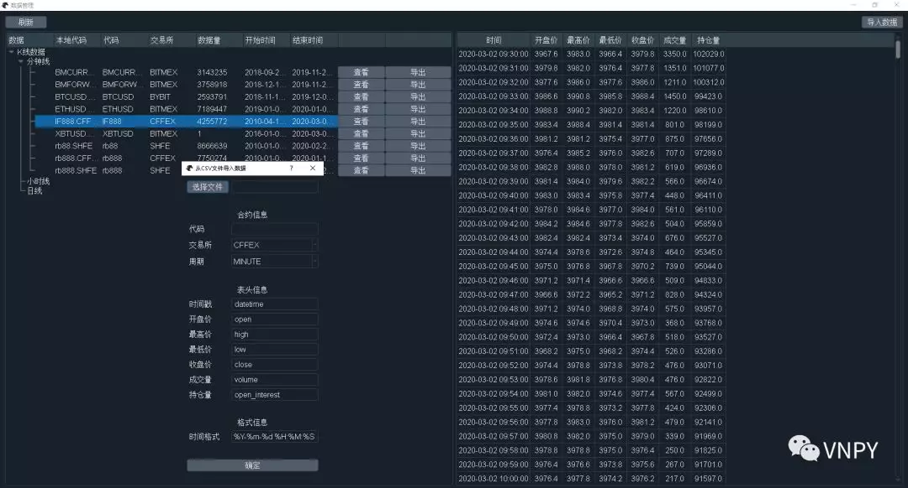
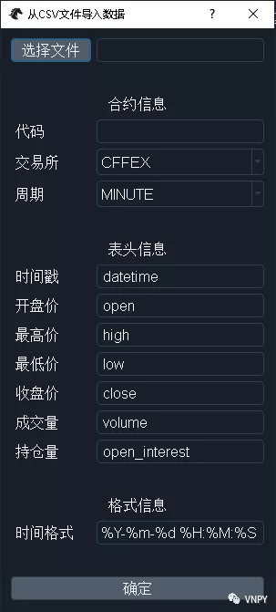
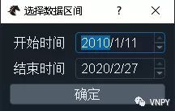
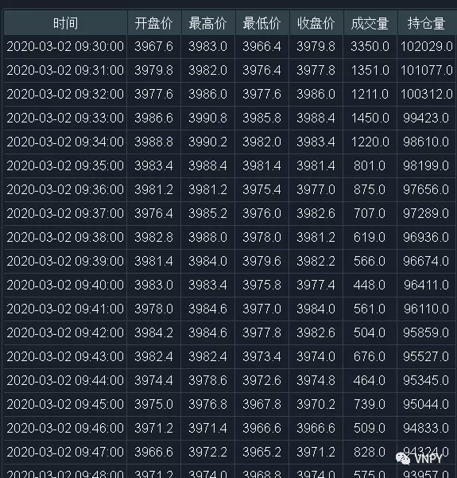

## DataManager模块

DataManger模块，是VN Trader内部针对历史数据的全功能管理工具。

&nbsp;
### 数据导入

打开DataManager模块的界面后，点击右上角的【导入数据】按钮，即可看到如下图所示的对话框：

该对话框复用了CsvLoader组件中的功能：

1.点击顶部的【选择文件】按钮，来选择要加载的CSV文件路径；

2.在合约信息中，输入合约代码，选择对应的交易所和周期；

3.查看CSV文件的表头信息，并将对应的表头字符串输入在表头信息中，对于【持仓量】字段，如果CSV文件中不存在的话（比如股票数据）请留空即可

4.在格式信息中，配置时间戳的日期时间格式，用于后续的时间解析处理

5.点击【确定】按钮，开始从CSV文件导入数据到数据库中。

导入过程中界面会处于半卡住的情况，对于越大的CSV文件（数据量越多），卡住的时间也会越长。

最后需要注意的是，这里导入的合约代码（symbol）和交易所（exchange）两个字段组合起来，才能构成在CTA回测等模块中使用的本地代码（vt_symbol）。举例来说，合约代码为IF2003，交易所选择CFFEX（中金所），则在CtaBacktester中回测要用到的本地代码应为IF2003.CFFEX。

&nbsp;

### 数据查看

目前VN Trader中获取数据的方式一共有三种：

- 通过RQData下载

- 从CSV文件导入

- 使用DataRecorder模块录制

不管采用何种方法获取数据，点击左上角的【刷新】按钮，即可看到当前数据库中已有数据的统计情况，如下图所示：

&nbsp;

选择好要显示的数据范围后，点击【确定】按钮即可在右侧表格中看到每个时间点上具体的数据字段：

&nbsp;

### 数据导出

除了从CSV导入数据外，社区用户也提出了将数据库中的数据导出为CSV文件的需求。对于熟悉vn.py的用户可能20行代码就能解决问题，不过考虑到对于新用户的友好性，还是决定将导出功能集成到了图形界面上。

选择任意一个合约，点击该合约行数据右侧的【导出】按钮后，再次弹出对话框：

&nbsp;

选好要导出的数据区间范围点击【确定】后，会再次弹出对话框选择输出文件的位置，输入确定即可完成CSV文件的导出。

