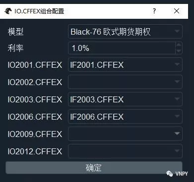
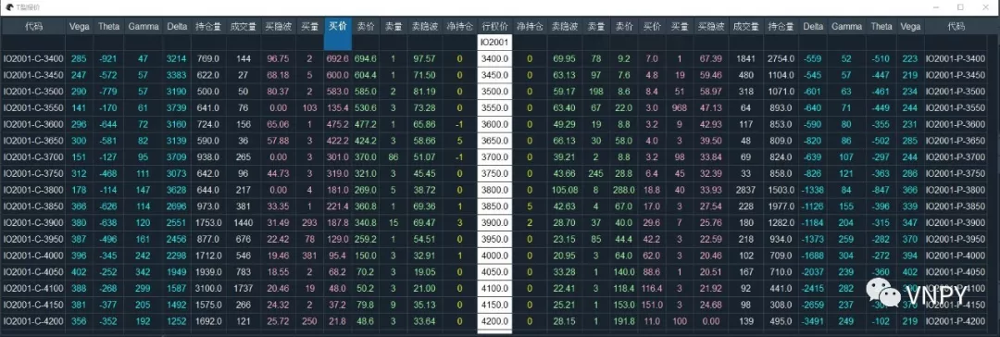
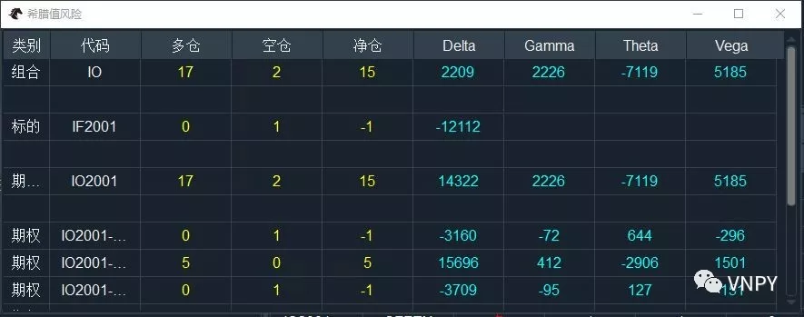
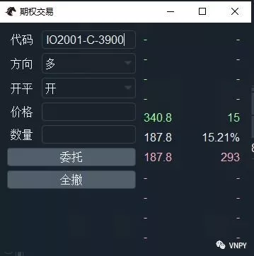
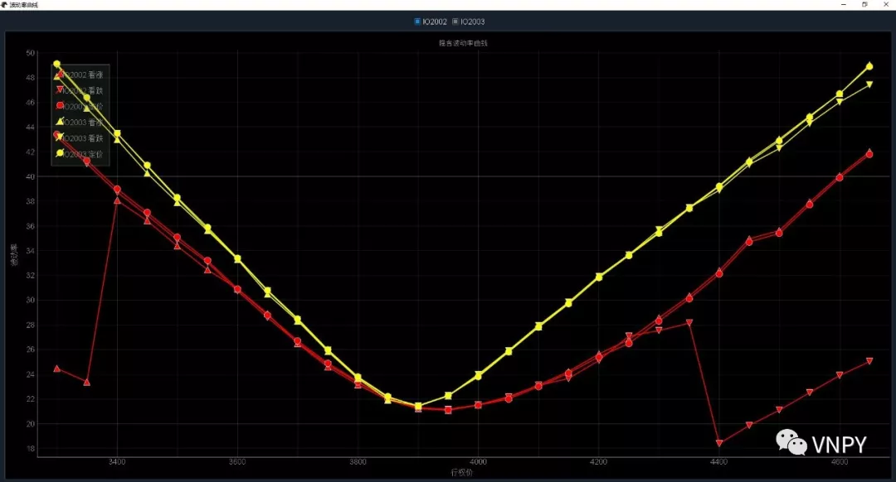
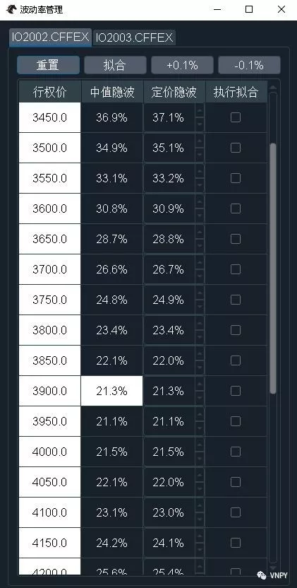
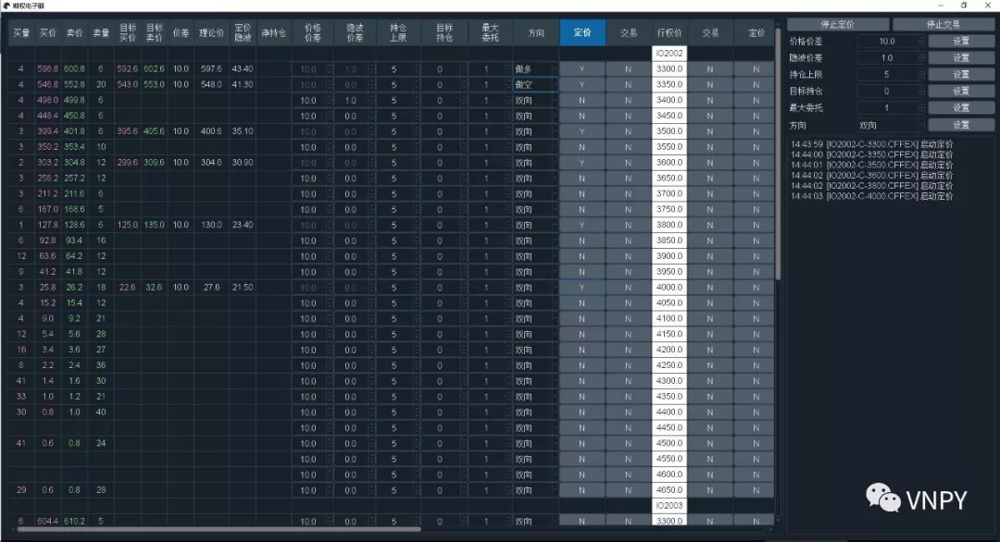
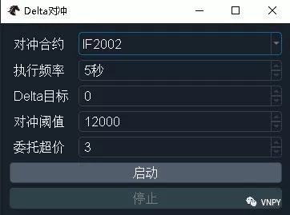

# OptionMaster模块

OptionMaster是vn.py框架内针对【期权波动率交易】专门设计的上层应用模块。

&nbsp;

## 初始化配置

&nbsp;

打开OptionMaster后，会看到上图中的长条形组件。【期权产品】下拉框中会显示当前已连接的交易接口上可选的期权产品组合。

注意底层接口必须支持期权合约的交易，这里才会有对应期权产品的显示，否则是不会有任何信息的（比如连接SimNow的CTP测试环境就没有）。

&nbsp;

点击【配置】按钮后，弹出上图所示的组合配置对话框，在这里选择要用的期权定价模型，设置期权定价中用到的无风险利率，以及每个期权链定价所用的标的物合约。

注意期权链的标的物可以选择留空，此时该期权链在后续的交易中将不会被添加到期权组合中，可以降低一部分定价相关的计算延时。

&nbsp;

## 期权定价

做期权交易，第一步总是离不开正确的定价，针对国内的期权类型，OptionMaster模块中内置了三大定价模型：

- Black-76模型：针对欧式期货期权（股指期权）
- Black-Scholes模型：针对欧式股票期权（ETF期权）
- Binomial-Tree模型：针对美式期货期权（商品期权）

每个定价模型中，从计算方向来区分，又可以分为：

1.从定价波动率来计算期权价格：calculate_price相关函数，包括希腊值相关的计算函数calculate_greeks；

2.从期权价格来返推隐含波动率：calculate_impv函数，使用Newton-Raphson method（牛顿迭代法）来计算。

所有模型中都包含了输入数值的边界检查功能，避免计算出某些异常数值。

&nbsp;

## 数据模型

期权相关的量化交易，和CTA策略等单标的量化交易相比，最大的区别之一就在于会同时交易大量的合约，包括不同行权价的期权、不同行权月份的期权以及标的物期货和股票（线性资产）。

同时以上合约之间的价格、成交、持仓等情况变化还会互相影响。在任意时间点结合当前最新行情数据的情况下，期权交易员需要能够实时跟踪整个期权交易组合的波动率曲面和希腊值风险情况。

OptionMaster中专门构建了多层嵌套式的立体数据结构，来解决以上多合约数据计算中的复杂性问题：

- UnderlyingData：标的物合约（线性资产）
- OptionData：期权合约（非线性资产）
- ChainData：期权链（某一行权月份的所有期权合约）
- PortfolioData：期权组合（某一品种的所有期权合约，以及标的物合约）

当以上数据结构中的任意一个数据发生变化时，会同时触发与之相关的所有计算，保证整体数据结构的一致性。

&nbsp;

## T型报价

T型报价是期权交易中最常用的行情显示方式，中间白色的一列为行权价，左侧为看涨期权，右侧为看跌期权。

&nbsp;

上图中，除了由交易接口层推送过来的原始行情数据外（买卖价格、挂单数量、成交量、持仓量等），还包含了实时计算的买卖价隐含波动率和每个期权的现金希腊值。

传统意义上的理论希腊值，直接基于期权定价模型计算，衡量的是当某一变量发生变化时期权价格的变化情况。这种方法从数学的角度容易理解，但是从交易员的实盘使用来说却十分麻烦。

假设某个50ETF期权合约的Delta数值，使用Black-Scholes期权定价公式计算出来的结果为0.5482，意味着每当ETF价格上涨1元时，该期权的价格应该上涨0.5482元。

而50ETF当前的价格大约是3元，上涨1元是足足超过30%的涨幅，对交易员来说，知道【标的物价格上涨30%期权能赚0.5482元】不能说完全没有参考价值，但效果可能也就跟【每天喝10瓶可乐一定会胖】差不多。

所以在实践中，专业期权交易员更多使用的是现金希腊值，衡量的是当某一变量发生1%变化时该期权对应的现金盈亏情况。还是用上面的这个50ETF期权合约，其现金Delta为：

0.5484（理论Delta）x 3（标的价格）x 10000 （合约乘数）x 1% = 165

这里的165，意味着每当ETF价格上涨1%时，持有1手该期权合约的盈利金额是165元，实盘交易中用来判断某个合约当前的风险水平无疑要方便得多。

除了Delta数据外，理论Gamma/Theta/Vega等希腊值也可以同样转化为更加直观的现金希腊值。

&nbsp;

## 希腊值风险

&nbsp;

有了现金希腊值，可以在交易前方便直观的了解某一期权合约的风险水平。但在交易完成后，手头持有一堆期权和标的物持仓时，我们更需要持仓希腊值来跟踪当前整个账户的期权风险暴露：

持仓希腊值 = 现金希腊值 x 合约持仓

上图中的持仓希腊值的风险，分为单合约、期权链、期权组合三个层次统计，方便交易员结合各种不同类型的波动率交易策略使用（如做多近月波动率、做空远月波动率）。

&nbsp;

## 快速交易

&nbsp;

和VN Trader主界面的交易下单组件使用类似，在上图中的【代码】编辑框中输入合约代码后回车，即可显示该合约的行情盘口数据。或者在T型报价组件上，寻找到好的交易机会后，双击单元格即可完成合约代码的自动填充和行情显示。

选好方向、开平，输入价格、数量后，点击【委托】按钮即可立即发出交易委托，点击【全撤】按钮则可一次性将当前处于活动状态的委托（未成交、部分成交）全部撤单。

&nbsp;

## 期权电子眼

期权领域的量化交易主要集中在波动率交易策略上。而期权的波动率无法从其价格上直接反应出来，需要通过定价公式来实时反推隐含波动率。

通过上图中的波动率曲线图表，交易员可以直观的看到波动率曲线（面）的形状，并且作出相应的判断分析，每个月份的波动率曲线采用不同的颜色显示：

- 向上三角形：市场上看涨期权的买卖价隐含波动率中值

- 向下三角形：市场上看跌期权的买卖价隐含波动率中值

- 圆形曲线：当前系统内的定价参考波动率

用户可以通过顶部的勾选框来选择当前要显示波动率曲线的月份，方便根据自己的需求来详细分析单一月份的形状或者多月份的曲面形态。

对当前市场的隐含波动率曲线形态有所了解后，交易员需要根据自己的判断，使用下图中的波动率管理组件，来设置定价参考波动率，作为后续电子眼交易算法的定价依据：

定价参考波动率的设置需要比较多的期权定价原理知识，以及一定的波动率交易经验，对于单一月份波动率曲线拟合的流程如下：

1.点击【重置】按钮，将每个行权价的期权定价波动率，初始化为该行权价虚值期权（OTM）的中值波动率；

2.观察图表中的曲线形态，对于波动率异常的行权价，勾选【执行拟合】列的勾选框；

3.全部勾选好后，点击顶部的【拟合】按钮，基于Cubic Spline算法来对勾选了的行权价的波动率执行拟合计算；

4.拟合完成后，再次检查图表中的曲线形态，并通过【定价隐波】列的调节器进行细微调整。

&nbsp;

完成定价参考波动率曲线的拟合后，就可以通过上图中的期权电子眼算法（英文名Electronic Eye），来自动扫描市场上的最优交易机会（max price edge），并在Tick级的时间级别上瞬时完成交易。

在波动率交易过程中，无论是期权开平仓本身引入的Delta，或者是由于持仓Gamma随着市场波动带来的Delta，都必须根据交易需求及时处理：

- 做多Gamma时锁定波动利润

- 做空Gamma时对冲额外风险

&nbsp;

使用上图中的Delta对冲算法，交易员可以根据自己的需求选择任意定价标的物作为对冲合约，并灵活设置对冲检查执行的频率、Delta对冲目标、对冲触发阈值，以及下单时采用的委托超价等参数，来实现Delta自动实时对冲的功能。

&nbsp;

