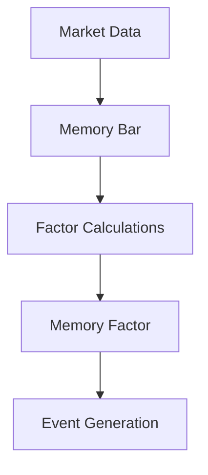

# Factor Maker Engine Documentation

## Architecture Overview

The Factor Maker Engine implements a directed acyclic graph (DAG) based calculation system using Dask for parallel processing. This design enables efficient handling of complex factor dependencies and large-scale computations.

## Computational Graph System

### 1. Factor Dependency Resolution

The system builds a computational graph in three phases:

```python
# Phase 1: Initial factor loading
factors = {
    "RSI": RSIFactor(params={'period': 14}),
    "MACD": MACDFactor(params={'fast': 12, 'slow': 26}),
    "Custom": CustomFactor(dependencies=['RSI', 'MACD'])
}

# Phase 2: Dependency resolution
resolved_factors = engine.complete_factor_tree(factors)
# Results in a flattened dictionary with all dependencies

# Phase 3: Topological sorting
sorted_factors = engine._topological_sort(dependency_graph)
# Ensures factors are calculated in correct order
```

### 2. Dask Task Creation

Each factor becomes a Dask task with its dependencies:

```python
# Basic factor without dependencies
task = dask.delayed(factor.calculate)(
    input_data=memory_bar,
    memory=None
).persist()

# Factor with dependencies
task = dask.delayed(factor.calculate)(
    input_data={
        'dep1': dep1_task,
        'dep2': dep2_task
    },
    memory=historical_data
).persist()
```

### 3. Memory Management System

The engine maintains two types of memory structures:

```python
# Market data memory
memory_bar = {
    'open': pl.DataFrame(...),  # Datetime indexed price data
    'high': pl.DataFrame(...),
    'low': pl.DataFrame(...),
    'close': pl.DataFrame(...),
    'volume': pl.DataFrame(...)
}

# Factor calculation results
memory_factor = {
    'factor_name': pl.DataFrame(...)  # Calculated factor values
}
```

## Calculation Process

### 1. Data Flow



### 2. Execution Pipeline

```python
def execute_calculation(dt: datetime):
    """Main calculation pipeline"""
    with calculation_lock:
        # 1. Configure Dask
        dask.config.set({
            'distributed.worker.memory.target': 0.6,
            'distributed.worker.memory.spill': 0.7,
            'distributed.worker.memory.pause': 0.8,
            'distributed.worker.memory.terminate': 0.95
        })
        
        # 2. Execute graph
        results = dask.compute(*tasks.values(), optimize_graph=True)
        
        # 3. Update memory
        for factor_name, result in zip(tasks.keys(), results):
            memory_factor[factor_name] = result
```

## Factor Implementation Guide

### 1. Basic Factor Template

```python
from vnpy.app.factor_maker import FactorTemplate

class MyFactor(FactorTemplate):
    """Simple factor without dependencies"""
    
    def __init__(self, **kwargs):
        super().__init__()
        self.period = kwargs.get('period', 14)
    
    def calculate(self, input_data: Dict[str, pl.DataFrame], 
                 memory: Optional[pl.DataFrame] = None) -> pl.DataFrame:
        close = input_data['close']
        return my_calculation(close, self.period)
```

### 2. Factor with Dependencies

```python
class ComplexFactor(FactorTemplate):
    """Factor with dependencies"""
    
    dependencies_factor = [
        {'RSI': {'class_name': 'RSIFactor', 'params': {'period': 14}}},
        {'MACD': {'class_name': 'MACDFactor', 'params': {'fast': 12, 'slow': 26}}}
    ]
    
    def calculate(self, input_data: Dict[str, Union[pl.DataFrame, Delayed]], 
                 memory: Optional[pl.DataFrame] = None) -> pl.DataFrame:
        rsi_data = input_data['RSI']
        macd_data = input_data['MACD']
        return complex_calculation(rsi_data, macd_data)
```

## Performance Optimization

### 1. Memory Management

```python
# Configure chunk size based on CPU cores
chunk_size = max(1000, len(memory_bar["close"]) // cpu_count())

# Monitor memory usage
if psutil.Process().memory_percent() > 80:
    _cached_calculation.cache_clear()
```

### 2. Caching Strategy

```python
@lru_cache(maxsize=1000)
def _cached_calculation(factor_key: str, input_data_hash: str) -> pl.DataFrame:
    """Cache frequent calculations"""
    return calculate(factor_key, input_data)
```

## Error Handling

### 1. Circuit Breaker Pattern

```python
if consecutive_errors >= error_threshold:
    stop_all_factors()
    raise RuntimeError("Critical error threshold exceeded")
```

### 2. Resource Monitoring

```python
def _monitor_resources():
    return {
        "memory_percent": psutil.Process().memory_percent(),
        "cpu_percent": psutil.Process().cpu_percent()
    }
```

## Best Practices

1. **Factor Design**
   - Keep factors atomic and focused
   - Minimize dependencies
   - Implement proper validation
   - Handle missing data cases

2. **Performance**
   - Use appropriate chunk sizes
   - Monitor memory usage
   - Implement caching where beneficial
   - Profile heavy calculations

3. **Error Handling**
   - Validate inputs
   - Handle edge cases
   - Implement timeouts
   - Monitor resource usage

4. **Testing**
   - Unit test individual factors
   - Test dependency chains
   - Verify memory management
   - Profile performance

## Runtime Metrics

Monitor factor performance using built-in metrics:

```python
metrics = engine.get_factor_metrics("my_factor")
print(f"Calculation time: {metrics.calculation_time:.2f}s")
print(f"Memory usage: {metrics.memory_usage:.1f}%")
print(f"Cache hits: {metrics.cache_hits}")
```

This documentation should provide a comprehensive understanding of the Factor Maker Engine's architecture, implementation details, and best practices for factor development.